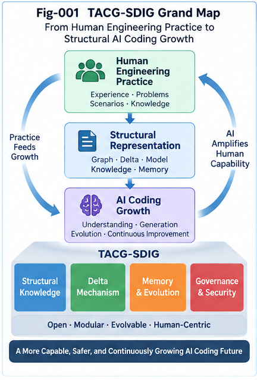

# FIGURE INDEX — TACG-SDIG

## Task–Action CallingGraph Structural Delta Intelligence and Growth

This file provides the canonical index, placement guidance, and recommended captions for the eight TACG-SDIG figures.

---

# Figure Overview

| Figure  | File                                                               | Primary Article | Core Purpose                                                |
| ------- | ------------------------------------------------------------------ | --------------- | ----------------------------------------------------------- |
| Fig-001 | `Fig-001-TACG-SDIG-Grand-Map.png`                                  | TACG-SDIG-001   | Overall framework and closed-loop architecture              |
| Fig-002 | `Fig-002-Four-Structural-Planes-and-1A-1N-Knowledge-Model.png`     | TACG-SDIG-002   | Four Structural Planes and canonical 1A–1N model            |
| Fig-003 | `Fig-003-Graph-Minus-and-Task-Action-Delta-Pair.png`               | TACG-SDIG-003   | Graph Minus, Delta isolation, and TADP                      |
| Fig-004 | `Fig-004-Two-Way-Delta-Search-and-Growth-Runtime.png`              | TACG-SDIG-004   | Two-Way Delta Search and candidate-growth runtime           |
| Fig-005 | `Fig-005-Delta-Memory-and-Structural-Evolution-Trajectory.png`     | TACG-SDIG-005   | Delta Memory, folding, CCC/DNA, and trajectories            |
| Fig-006 | `Fig-006-Delta-Scoped-Governance-and-Security.png`                 | TACG-SDIG-006   | Delta-scoped governance, reachability, and security         |
| Fig-007 | `Fig-007-Human-Engineering-Experience-to-Structural-AI-Coding.png` | TACG-SDIG-007   | Human engineering practice translated into AI coding growth |
| Fig-008 | `Fig-008-Delta-Intelligence-and-Per-Node-Intelligence.png`         | TACG-SDIG-008   | Delta-Intelligence and Per-Node-Intelligence in the framework |
---

# Fig-001 — TACG-SDIG Grand Map

## File

```text
figures/Fig-001-TACG-SDIG-Grand-Map.png
```

## Primary Article

```text
docs/TACG-SDIG-001-From-CallingGraph-Knowledge-to-Structural-Delta-Intelligence.md
```

## Secondary Placement

Also suitable for:

```text
README.md
START-HERE.md
docs/TACG-SDIG-007-From-Human-Engineering-Practice-to-AI-Coding-Growth.md
```

## Recommended Placement in TACG-SDIG-001

Insert after the first high-level framework section, preferably after the article introduces the canonical loop:

```text
Folded Knowledge
      ↓
Localization
      ↓
Graph Minus
      ↓
Delta
      ↓
Two-Way Search
      ↓
Validation
      ↓
Growth
      ↓
Fold Back
```

A good insertion point is immediately after the first section that establishes the complete TACG-SDIG architecture and before deeper discussion of the Four Structural Planes.

## Core Message

Fig-001 should communicate the whole framework in one visual:

```text
Task / Action Structural Knowledge
        ↓
Localization
        ↓
Graph Minus
        ↓
Structural Delta
        ↓
Two-Way Delta Search
        ↓
Candidate Reconstruction
        ↓
Validation / Governance
        ↓
Growth
        ↓
Fold Back
```

It should also expose the three major engineering values:

```text
Engineering Experience Evolution

AI Coding Intelligence

Structural Governance
```

## Recommended Caption

> **Fig-001 — TACG-SDIG Grand Map.** The complete Task–Action CallingGraph Structural Delta Intelligence and Growth framework, connecting folded structural knowledge, localization, Graph Minus, Two-Way Delta Search, candidate reconstruction, validation, governance, structural growth, and Fold Back into a closed-loop AI coding architecture.

## README Use

Recommended placement:

After the opening overview and before the detailed explanation of the Four Structural Planes.

Suggested Markdown:

```markdown


*Fig-001 — TACG-SDIG Grand Map. The complete closed-loop framework from folded structural experience to localization, Delta Intelligence, validated growth, and Fold Back.*
```

---

# Fig-002 — Four Structural Planes and 1A–1N Knowledge Model

## File

```text
figures/Fig-002-Four-Structural-Planes-and-1A-1N-Knowledge-Model.png
```

## Primary Article

```text
docs/TACG-SDIG-002-Four-Structural-Planes-and-the-Canonical-Knowledge-Model.md
```

## Secondary Placement

Also suitable for:

```text
README.md
START-HERE.md
```

## Recommended Placement in TACG-SDIG-002

Insert after the article introduces all four planes and the complete `1A–1N` model.

The best position is after the section that establishes:

```text
Task Structural Plane

Mapping Plane

Action Structural Plane

Delta Structural Plane
```

and before the article begins the deeper discussion of Delta hierarchy, memories, and runtime interactions.

## Core Message

The figure should make the canonical knowledge architecture immediately visible.

### Task Structural Plane

```text
1A — Task CG
1B — Known Task / Job CGs
1C — One-Step Task / Job Primitives
```

### Action Structural Plane

```text
1D — Action / Code CG
1E — Known Action / Code CGs
1F — Feasible Action / Code Primitives
```

### Mapping Plane

```text
1G — Task ↔ Action Mapping
```

### Delta Structural Plane

```text
1H — Task Delta
1I — Action Delta
1J — Task–Action Delta Pair
1K — Known Delta Collection
1L — Delta CCC / DNA
1M — Delta Trajectory
1N — Evidence / Outcome / Governance
```

## Recommended Caption

> **Fig-002 — Four Structural Planes and the 1A–1N Knowledge Model.** The canonical TACG-SDIG knowledge architecture, organizing Task, Action, Mapping, and Delta structures into four interacting planes. The original 1A–1G CallingGraph knowledge structures are extended by 1H–1N to make structural change, Delta Memory, trajectory, evidence, and governance first-class knowledge objects.

## Key Reader Takeaway

> **Task and Action describe two structural views of the system; Mapping connects intent and implementation; Delta describes how those structures change.**

---

# Fig-003 — Graph Minus and Task–Action Delta Pair

## File

```text
figures/Fig-003-Graph-Minus-and-Task-Action-Delta-Pair.png
```

## Primary Article

```text
docs/TACG-SDIG-003-Graph-Minus-and-Task-Action-Delta-Isolation.md
```

## Recommended Placement in TACG-SDIG-003

Insert after the formal introduction of:

```text
ΔT = TargetTaskCG ⊖ ReferenceTaskCG

ΔA = TargetActionCG ⊖ ReferenceActionCG
```

and after the article makes clear that Graph Minus is not ordinary set subtraction.

The figure should appear before the detailed Delta taxonomy.

## Core Message

The figure should visualize:

```text
Reference TaskCG
        ↓
      ALIGN
        ↑
Target TaskCG
        ↓
   Graph Minus
        ↓
       ΔT

        ↕
       TADP

       ΔA
        ↑
   Graph Minus
        ↑
Reference ActionCG
        ↔
Target ActionCG
```

It should also highlight:

```text
Delta Core

Delta Halo

Entry Boundary

Exit Boundary
```

## Recommended Caption

> **Fig-003 — Graph Minus and the Task–Action Delta Pair.** Structural alignment and Graph Minus isolate meaningful Task-side and Action-side differences as `ΔT` and `ΔA`. The two deltas are correlated through Task–Action Mapping to form a reusable Task–Action Delta Pair (TADP), preserving both why the system changes and how the implementation changes.

## Key Reader Takeaway

> **Localization finds the comparable structural neighborhood; Graph Minus identifies the meaningful difference; TADP connects Task-side change with Action-side change.**

---

# Fig-004 — Two-Way Delta Search and Growth Runtime

## File

```text
figures/Fig-004-Two-Way-Delta-Search-and-Growth-Runtime.png
```

## Primary Article

```text
docs/TACG-SDIG-004-Two-Way-Delta-Localization-Search-and-Candidate-Reconstruction.md
```

## Secondary Placement

Also suitable for:

```text
docs/TACG-SDIG-007-From-Human-Engineering-Practice-to-AI-Coding-Growth.md
```

## Recommended Placement in TACG-SDIG-004

Insert after the article introduces the core Two-Way Search architecture and before the detailed discussion of individual ranking and validation stages.

The figure should appear near the first full runtime sequence:

```text
ΔT / ΔA
    ↓
Delta DNA Dispatch
    ↓
Task-Side Search
    ↕
Action-Side Search
    ↓
Historical TADP
    ↓
Candidate Reconstruction
    ↓
Counter-Evidence
    ↓
Reachability / Feasibility / Policy
    ↓
Residual Delta
    ↓
Primitive Forward Walking
    ↓
Validated Growth
```

## Core Message

Fig-004 should emphasize that the runtime does not jump directly from requirement to code generation.

Instead:

```text
Delta
  ↓
Two-Way Search
  ↓
Historical TADP
  ↓
Candidate Reconstruction
  ↓
Validation
  ↓
Residual Delta
  ↓
Primitive Walking
  ↓
Growth
```

It should also show that both Task and Action memories participate.

## Recommended Caption

> **Fig-004 — Two-Way Delta Search and Growth Runtime.** The TACG-SDIG runtime searches both Task-side and Action-side Delta Memory, retrieves historical TADPs and Delta patterns, reconstructs candidate changes, evaluates counter-evidence, reachability, feasibility, policy, and residual gaps, and falls back to primitive-level constrained forward walking only when historical structural experience is incomplete.

## Key Reader Takeaway

> **Search before generation: retrieve and adapt historical structural change before opening a broader candidate space.**

---

# Fig-005 — Delta Memory and Structural Evolution Trajectory

## File

```text
figures/Fig-005-Delta-Memory-and-Structural-Evolution-Trajectory.png
```

## Primary Article

```text
docs/TACG-SDIG-005-Delta-Memory-Folding-and-Structural-Evolution-Trajectories.md
```

## Recommended Placement in TACG-SDIG-005

Insert after the article introduces the four memory systems:

```text
Structure Memory
Mapping Memory
Delta Memory
Trajectory Memory
```

and before the deeper sections on Delta CCC, Delta DNA, and trajectory decision intelligence.

A second acceptable position is immediately after the canonical progression:

```text
Historical Deltas
      ↓
Delta Cluster
      ↓
Delta CCC
      ↓
Delta DNA
      ↓
Delta Trajectory
```

## Core Message

The figure should show both the memory stack and temporal evolution.

### Memory Dimension

```text
Structure Memory
Mapping Memory
Delta Memory
Trajectory Memory
```

### Folding Dimension

```text
Raw Delta
   ↓
Delta Cluster
   ↓
Delta CCC
   ↓
Delta DNA
```

### Evolution Dimension

```text
S0 --Δ1--> S1 --Δ2--> S2 --Δ3--> S3
```

## Recommended Caption

> **Fig-005 — Delta Memory and Structural Evolution Trajectory.** TACG-SDIG extends structural memory from states to transformations and ordered histories. Historical deltas are stored as Delta Knowledge Units, clustered and folded into Delta CCC/DNA structures, while ordered validated or observed deltas form Structural Evolution Trajectories.

## Key Reader Takeaway

> **Structures describe states; deltas describe change; trajectories describe evolution.**

---

# Fig-006 — Delta-Scoped Governance and Security

## File

```text
figures/Fig-006-Delta-Scoped-Governance-and-Security.png
```

## Primary Article

```text
docs/TACG-SDIG-006-Delta-Scoped-Structural-Governance-and-Security.md
```

## Recommended Placement in TACG-SDIG-006

Insert after the article introduces:

```text
Reviewed Baseline
      ↓
Graph Minus
      ↓
Structural Change Frontier
```

and before the detailed taxonomy of governance deltas.

This placement allows the figure to establish the complete governance runtime before the article dives into specific security cases.

## Core Message

The figure should show:

```text
Reviewed / Certified Baseline
        ↓
New TaskCG / ActionCG
        ↓
Graph Minus
        ↓
Delta Core
        ↓
Risk-Conditioned Delta Halo
        ↓
Changed Reachability
        ↓
Task ↔ Action Cross-Audit
        ↓
Policy / Security Localization
        ↓
Counter-Evidence
        ↓
Risk Dispatch
        ↓
Validation / Review
        ↓
Governance Outcome
```

It should also make the adaptive-scope principle visible:

```text
Local Delta Review
      ↓
Extended Subgraph Review
      ↓
System-Wide Review
```

when risk or uncertainty requires escalation.

## Recommended Caption

> **Fig-006 — Delta-Scoped Structural Governance and Security.** Governance begins from a reviewed baseline, isolates the structural change frontier with Graph Minus, expands from the Delta Core through a risk-conditioned Delta Halo and changed reachability, cross-audits Task intent against Action implementation, and applies policy, security, counter-evidence, and adaptive review before accepting structural growth.

## Key Reader Takeaway

> **Governance should begin from structural change, but expand as far as structural consequences require.**

---

# Fig-007 — Human Engineering Experience to Structural AI Coding

## File

```text
figures/Fig-007-Human-Engineering-Experience-to-Structural-AI-Coding.png
```

## Primary Article

```text
docs/TACG-SDIG-007-From-Human-Engineering-Practice-to-AI-Coding-Growth.md
```

## Secondary Placement

Also suitable for:

```text
README.md
START-HERE.md
```

## Recommended Placement in TACG-SDIG-007

Insert after the article maps human engineering behavior to TACG-SDIG runtime operations.

A particularly good location is immediately after the section containing a mapping similar to:

```text
"Where is the relevant code?"
→ Localization

"What is different?"
→ Graph Minus

"Have we solved this before?"
→ Delta Search

"Will it work here?"
→ Feasibility

"One piece is still missing."
→ Residual Delta

"Let's add one step."
→ Primitive Forward Walking

"Let's test it."
→ Validation

"Remember what happened."
→ Fold Back
```

## Core Message

The figure should show the translation from expert practice to AI structural mechanisms.

```text
Human Engineering Experience
        ↓
Recognize Familiar Structure
        ↓
Identify Difference
        ↓
Recall Similar Change
        ↓
Adapt Historical Solution
        ↓
Check Risk / Feasibility
        ↓
Fill Residual Gap
        ↓
Validate
        ↓
Remember Outcome
```

mapped to:

```text
Localization
→ Graph Minus
→ Delta Search
→ Candidate Reconstruction
→ Counter-Evidence
→ Primitive Walking
→ Validation
→ Fold Back
```

## Recommended Caption

> **Fig-007 — From Human Engineering Experience to Structural AI Coding.** TACG-SDIG translates recurring senior-engineering practice into explicit structural AI operations: localization, Graph Minus, Delta Search, historical candidate adaptation, companion-delta and counter-evidence analysis, primitive forward walking, validation, growth, and Fold Back.

## Key Reader Takeaway

> **The value of engineering experience lies not only in remembering solutions, but in recognizing what is different and knowing how similar differences were crossed before.**

---

# Canonical Article-to-Figure Mapping

```text
TACG-SDIG-001
    ↓
Fig-001
TACG-SDIG Grand Map
```

```text
TACG-SDIG-002
    ↓
Fig-002
Four Structural Planes
and 1A–1N Knowledge Model
```

```text
TACG-SDIG-003
    ↓
Fig-003
Graph Minus
and Task–Action Delta Pair
```

```text
TACG-SDIG-004
    ↓
Fig-004
Two-Way Delta Search
and Growth Runtime
```

```text
TACG-SDIG-005
    ↓
Fig-005
Delta Memory
and Structural Evolution Trajectory
```

```text
TACG-SDIG-006
    ↓
Fig-006
Delta-Scoped Governance
and Security
```

```text
TACG-SDIG-007
    ↓
Fig-007
Human Engineering Experience
to Structural AI Coding
```

---

# Recommended Figure Reading Sequence

For readers who want to understand the repository visually before reading all eight articles:

```text
Fig-001
Grand Map
    ↓
Fig-002
Knowledge Model
    ↓
Fig-003
Graph Minus
    ↓
Fig-004
Runtime
    ↓
Fig-005
Memory / Trajectory
    ↓
Fig-006
Governance
    ↓
Fig-007
Human Engineering Synthesis
```

This visual sequence mirrors the article sequence.

---

# Recommended README Figure Strategy

For a concise README, use only:

```text
Fig-001
```

as the primary overview figure.

Optionally add:

```text
Fig-002
```

for the knowledge model and:

```text
Fig-007
```

near the final Human Engineering / AI Growth synthesis.

Avoid embedding all eight figures in the README unless a visual-heavy version is intentionally desired.

The full eight-figure sequence is better preserved in the core articles and this Figure Index.

---

# Canonical Markdown Pattern

Use the following pattern in the article files:

```markdown


*Fig-XXX — Figure Title. Recommended concise caption describing the structural role of the figure.*
```

For root-level files such as `README.md`:

```markdown


*Fig-XXX — Figure Title. Recommended concise caption describing the structural role of the figure.*
```

---

# Figure Design Principles

The eight TACG-SDIG figures should preserve a consistent visual language.

## 1. Structure Before Decoration

Each figure should make the computational relationship visible before visual embellishment.

---

## 2. Stable Structural Vocabulary

Use the same terms across figures:

```text
TaskCG

ActionCG

Mapping

Graph Minus

Delta

TADP

Delta Core

Delta Halo

Delta CCC

Delta DNA

Trajectory

Governance

Fold Back
```

---

## 3. Preserve Directionality

Arrows should reflect actual structural or runtime direction.

Avoid decorative arrows without semantic meaning.

---

## 4. Keep Task and Action Distinct

Task-side intent and Action-side implementation should remain visually distinguishable.

---

## 5. Make Delta Visually Central

Delta is the unifying object of the repository and should remain visually prominent across the figure set.

---

## 6. Distinguish State from Change

Where possible:

```text
State
```

and:

```text
Delta
```

should be represented differently enough for readers to immediately understand the distinction.

---

## 7. Show Fold Back

Where runtime closure is relevant, the figure should show:

```text
Outcome
→ Fold Back
→ Memory
```

rather than ending at code generation.

---

# Eight-Figure Narrative

The eight figures together tell one continuous story.

```text
Fig-001
What is the complete TACG-SDIG framework?

        ↓

Fig-002
What structural knowledge does it require?

        ↓

Fig-003
How is meaningful change isolated?

        ↓

Fig-004
How is the change searched,
reconstructed, and grown?

        ↓

Fig-005
How does change become memory
and evolution knowledge?

        ↓

Fig-006
How does change become a
governance and security object?

        ↓

Fig-007
How does the entire framework
map back to human engineering practice
and AI coding growth?
```

---

# Final Figure Summary

The eight TACG-SDIG figures correspond to seven conceptual layers:

```text
Fig-001
Framework

Fig-002
Knowledge

Fig-003
Difference

Fig-004
Runtime

Fig-005
Memory and Evolution

Fig-006
Governance

Fig-007
Human Engineering and Growth
```

Together:

```text
KNOWLEDGE
   ↓
LOCALIZATION
   ↓
DELTA
   ↓
SEARCH
   ↓
GROWTH
   ↓
MEMORY
   ↓
GOVERNANCE
   ↓
EVOLUTION
```

---

## TACG-SDIG

**Task–Action CallingGraph Structural Delta Intelligence and Growth**

> **From known structure, to meaningful difference, to validated growth.**
