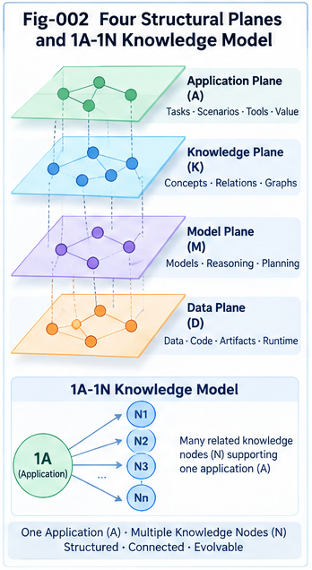

# TACG-SDIG-002 — Four Structural Planes and the Canonical Knowledge Model

## Task–Action CallingGraph Structural Delta Intelligence and Growth

**TACG-SDIG**

---

## Abstract

Structural Delta Intelligence requires more than a single CallingGraph representation.

To reason about software growth, an intelligent system must distinguish:

1. what is required,
2. what is implemented,
3. how requirement and implementation correspond,
4. and how both sides change over time.

This article defines the canonical knowledge model of **Task–Action CallingGraph Structural Delta Intelligence and Growth (TACG-SDIG)**.

The model contains four interacting structural planes:

```text
Task Structural Plane
        ↕

Task–Action Mapping Plane
        ↕

Action Structural Plane
        ↕

Delta Structural Plane
```

These planes contain fourteen canonical knowledge structures, labeled **1A–1N**:

```text
1A–1C  Task structural knowledge
1D–1F  Action structural knowledge
1G     Task–Action two-way structural mapping
1H–1N  Delta intelligence knowledge
```

The central design decision is that **Delta is treated as a first-class structural knowledge object** rather than as a temporary result of comparison.

This enables:

* reusable change knowledge,
* Task–Action Delta Pairs,
* delta retrieval,
* delta clustering,
* Delta CCC and Delta DNA,
* delta trajectory analysis,
* cross-plane consistency checks,
* delta-scoped governance,
* and continual structural growth.

The canonical TACG-SDIG knowledge model therefore represents not only what systems are, but also how systems change and how those changes become reusable engineering experience.

---

# 1. Why a Multi-Plane Knowledge Model Is Necessary

A software system cannot be adequately understood from only one structural perspective.

A requirement may state:

```text
Only authorized users may modify a resource.
```

An implementation may contain:

```text
authenticate
    ↓
loadResource
    ↓
updateResource
```

The code may execute correctly.

The CallingGraph may be internally reachable.

But the implementation still fails to realize the requirement because authorization is absent.

This illustrates a central problem:

> **Task correctness and Action correctness are not the same thing.**

A second problem appears during change.

Suppose authorization is added:

```text
authenticate
    ↓
authorize
    ↓
loadResource
    ↓
updateResource
```

Now a meaningful structural change has occurred.

If the system stores only the final graph, it knows the new state.

If it also stores the transformation, it knows:

> **how the system moved from the old state to the new state.**

That transformation may later become reusable engineering knowledge.

TACG-SDIG therefore requires four structural viewpoints:

```text
What should happen?
        ↓
Task Plane

What does happen?
        ↓
Action Plane

How do the two correspond?
        ↓
Mapping Plane

How do they change?
        ↓
Delta Plane
```

---

# 2. The Four Structural Planes

The canonical TACG-SDIG model is organized into four planes.

```text
┌───────────────────────────────────────────────┐
│             TASK STRUCTURAL PLANE             │
│                                               │
│ 1A  Task CG                                   │
│ 1B  Known Task / Job CG Collection            │
│ 1C  One-Step Task / Job CG Primitives         │
└──────────────────────┬────────────────────────┘
                       │
                       ↕
┌───────────────────────────────────────────────┐
│        TASK–ACTION MAPPING PLANE              │
│                                               │
│ 1G  Two-Way Task–Action Structural Mapping    │
└──────────────────────┬────────────────────────┘
                       │
                       ↕
┌───────────────────────────────────────────────┐
│            ACTION STRUCTURAL PLANE            │
│                                               │
│ 1D  Action / Code CG                          │
│ 1E  Known Action / Code CG Collection         │
│ 1F  Feasible Action / Code Primitives         │
└──────────────────────┬────────────────────────┘
                       │
                       ↕
┌───────────────────────────────────────────────┐
│             DELTA STRUCTURAL PLANE            │
│                                               │
│ 1H  Task Structural Delta                     │
│ 1I  Action Structural Delta                   │
│ 1J  Task–Action Delta Pair                    │
│ 1K  Known Structural Delta Collection         │
│ 1L  Delta CCC / Delta DNA                     │
│ 1M  Delta Trajectory                          │
│ 1N  Delta Evidence / Outcome / Governance     │
└───────────────────────────────────────────────┘
```

These planes are logically distinct but operationally coupled.

A TACG-SDIG runtime may move between them repeatedly during localization, search, validation, growth, and fold-back.

---



---

# 3. Plane I — Task Structural Plane

The Task Structural Plane represents desired work.

It captures:

* requirements,
* goals,
* workflows,
* plans,
* jobs,
* conditions,
* dependencies,
* expected transitions,
* and intent.

It answers:

> **What should the system achieve?**

The Task Plane contains three canonical structures.

---

# 4. 1A — Task CallingGraph

A **Task CallingGraph** represents a task or requirement as a structured graph.

For example:

```text
Process Purchase
    ↓
Validate Order
    ↓
Check Inventory
    ↓
Authorize Payment
    ↓
Create Shipment
```

A TaskCG may contain:

```text
Task Nodes
Task Edges
Dependencies
Conditions
Branches
Subtasks
Paths
Constraints
States
Roles
Preconditions
Postconditions
```

A TaskCG should not be interpreted as executable code.

It is a structural representation of:

> **what needs to happen and how task elements depend on one another.**

---

# 5. TaskCG Granularity

A TaskCG may exist at multiple levels.

For example:

```text
Level 1
Process Purchase

Level 2
Validate Order
Authorize Payment
Create Shipment

Level 3
Check Customer
Check Inventory
Validate Address
Select Payment Method

Level 4
Atomic or near-atomic task transitions
```

This means TaskCG knowledge can support:

* high-level planning,
* subgraph localization,
* local delta isolation,
* and cross-granularity comparison.

Granularity therefore becomes an important property of structural search.

---

# 6. 1B — Collection of Known Task / Job CGs

The second canonical structure is a collection of previously known TaskCGs.

This may include:

```text
Historical Requirements
Past Workflows
Known Job Structures
Validated Planning Structures
Reusable Task Templates
Domain-Specific Task Patterns
```

This collection represents **folded task-side experience**.

Conceptually:

```text
Historical Task Experience
        ↓
Task Structural Folding
        ↓
Known TaskCG Collection
```

A new TaskCG can be localized against this collection.

The system can ask:

```text
Have we seen this exact task before?

What is the nearest known task structure?

Which subgraph is already known?

Which path is novel?

Which historical task is structurally closest?
```

This is the task-side foundation of localization.

---

# 7. 1C — Common-Sense One-Step Task / Job CGs

Large TaskCGs alone are insufficient for fine-grained delta reconstruction.

TACG-SDIG therefore explicitly separates:

> **Common-Sense One-Step Task / Job CGs**

Examples may include:

```text
validate input
check identity
verify permission
confirm ownership
reserve resource
notify user
retry operation
record event
approve request
reject request
escalate failure
restore previous state
```

These structures are intentionally small.

Their role is to support:

* better delta isolation,
* local repair,
* primitive composition,
* constrained forward walking,
* and bridge construction.

For example:

```text
Known TaskCG
      ↓
Missing local transition
      ↓
Search 1C Task Primitives
      ↓
Candidate one-step bridge
      ↓
Extended TaskCG
```

Thus 1C forms a **task-side primitive structural vocabulary**.

---

# 8. Why 1C Must Be Explicit

Without 1C, the runtime may be forced into an undesirable choice:

```text
Use a large historical TaskCG
        OR
Generate freely
```

With 1C:

```text
Large Known TaskCG
        ↓
Local Delta
        ↓
Small Task Primitive
        ↓
Controlled Extension
```

This creates an intermediate structural resolution.

That resolution is important for scalable delta reasoning.

---

# 9. Plane II — Action Structural Plane

The Action Structural Plane represents what the system actually does or can do.

It includes:

* actions,
* functions,
* code statements,
* API calls,
* method calls,
* control flow,
* data flow,
* state transitions,
* and executable dependencies.

It answers:

> **What implementation behavior realizes the system?**

---

# 10. 1D — Action / Code CallingGraph

An Action/Code CG represents implementation behavior structurally.

For example:

```text
handleRequest
    ↓
authenticateUser
    ↓
loadResource
    ↓
updateResource
    ↓
persist
    ↓
returnResponse
```

The graph may represent:

```text
Functions
Methods
Statements
API Calls
Service Calls
Control Edges
Data Dependencies
Conditions
Exception Paths
Resource Lifecycles
State Transitions
```

An ActionCG is not limited to source code.

It may also represent:

* robotic actions,
* operational procedures,
* infrastructure actions,
* workflow execution,
* or other feasible action systems.

---

# 11. 1E — Collection of Known Action / Code CGs

The Action Plane also contains folded historical implementation knowledge.

This includes:

```text
Known Code Structures
Known Calling Paths
Reusable Implementation Patterns
Historical Fixes
Validated Execution Structures
Known Service Interaction Patterns
Known Recovery Structures
```

A new ActionCG can be localized against this collection.

Questions include:

```text
Where has this code structure appeared before?

What is the closest known implementation?

Which historical ActionCG contains this subgraph?

What task did that implementation serve?

What implementation path previously solved a similar problem?
```

This forms the action-side structural memory.

---

# 12. 1F — Common-Sense Feasible Action / Code Statements / CGs

Like TaskCGs, large ActionCGs may not be granular enough to repair a small structural gap.

TACG-SDIG therefore maintains a primitive action layer.

Examples include:

```text
parse input
validate input
authenticate
authorize
check state
load object
transform data
call API
write record
retry
rollback
emit event
log audit record
close resource
return result
```

These are not arbitrary text completions.

They represent:

> **known feasible local action structures.**

1F supports:

```text
Action Delta
      ↓
No complete historical match
      ↓
Search feasible primitives
      ↓
Compose local candidate
      ↓
Reachability / Feasibility Validation
```

This forms the basis of **primitive-level constrained forward walking**.

---

# 13. Symmetry Between 1C and 1F

The Task and Action primitive layers are intentionally symmetric.

```text
TASK SIDE                     ACTION SIDE

1C Task Primitive            1F Action Primitive

verify ownership       ↔      checkOwner(resource, user)

record transaction     ↔      audit.log(...)

retry operation        ↔      retry(call)

restore prior state    ↔      rollback()
```

This symmetry enables local cross-plane reconstruction.

A missing task primitive may suggest a missing implementation primitive.

A newly observed action primitive may reveal a task-side intent that should be made explicit.

---

# 14. Plane III — Task–Action Mapping Plane

The Task and Action planes are related but not identical.

The Mapping Plane provides the structural bridge.

It answers:

> **How does task intent correspond to implementation behavior?**

The canonical mapping structure is 1G.

---

# 15. 1G — Two-Way Task–Action Structural Mapping

The mapping should not be restricted to:

```text
Task Node → Action Node
```

Real systems are often many-to-many.

A single task may require several actions.

A single action may support multiple tasks.

Therefore the mapping can operate across multiple granularities.

```text
Task Node       ↔ Action Node
Task Edge       ↔ Action Edge
Task Subgraph   ↔ Action Subgraph
Task Path       ↔ Action Path
Task CCC        ↔ Action CCC
Task DNA        ↔ Action DNA
```

The mapping is fundamentally **two-way**.

---

# 16. Task-to-Action Mapping

Task-to-Action mapping supports implementation discovery.

For example:

```text
Task:
Authenticate User
```

may map to:

```text
parseToken
    ↓
verifySignature
    ↓
checkExpiry
    ↓
loadIdentity
```

Thus:

```text
One Task Node
      ↓
Many Action Nodes
```

Similarly:

```text
Task:
Process Payment
```

may map to an entire ActionCG containing:

```text
validate request
tokenize card
call gateway
record result
emit event
handle failure
```

---

# 17. Action-to-Task Mapping

Reverse mapping is equally important.

Given:

```text
cache.get(key)
```

the system may need to infer that the action contributes to:

```text
session lookup
permission lookup
performance optimization
deduplication
```

Thus the mapping supports:

> **Code → Task Explanation**

This is essential for:

* explainability,
* legacy system analysis,
* reverse engineering,
* governance,
* and unmapped-action detection.

---

# 18. Mapping as a Structural Graph

The Mapping Plane should itself be represented structurally.

A conceptual mapping unit may contain:

```text
Task Object
Action Object
Relation Type
Granularity
Context
Constraint
Confidence
Evidence
Source
Version
```

For example:

```text
Mapping Unit
{
    taskSubgraph:
        "Authorize Modification",

    actionSubgraph:
        "checkPermission → updateResource",

    relation:
        "implements",

    context:
        "resource editing",

    constraint:
        "owner or admin",

    evidence:
        "validated historical implementation"
}
```

Thus 1G is not merely a lookup table.

It is a **two-way semantic-structural mapping graph**.

---

# 19. Cross-Plane Consistency

Because mapping is explicit, Task and Action can audit each other.

Suppose:

```text
TaskCG:
Authenticate
→ Authorize
→ Modify Resource
```

but:

```text
ActionCG:
authenticate
→ updateResource
```

Then the mapping exposes:

```text
Task Element:
Authorize

Expected Action Mapping:
permission check

Observed Mapping:
missing
```

This produces a structural inconsistency.

The reverse is also possible.

Suppose the ActionCG contains:

```text
sendDataToExternalService
```

but no TaskCG element, policy, or infrastructure requirement explains it.

Then:

```text
Action Structure
      ↓
No Task Mapping
      ↓
Unmapped Action
```

This is an important governance signal.

---

# 20. Plane IV — Delta Structural Plane

The Delta Plane represents meaningful structural transformation.

It answers:

> **What changed?**

and:

> **How did one structure become another?**

This plane is the defining addition of TACG-SDIG.

---

# 21. Delta as a First-Class Knowledge Object

A traditional comparison system may perform:

```text
Structure A
   compare
Structure B
   ↓
Difference
```

and discard the result after use.

TACG-SDIG instead treats the difference as reusable knowledge.

> **A delta is not merely the result of comparison; it is a reusable unit of structural knowledge.**

This enables:

```text
Delta Search
Delta Clustering
Delta Ranking
Delta Composition
Delta Governance
Delta Folding
Delta Trajectory Analysis
```

The Delta Plane contains seven canonical structures.

---

# 22. 1H — Task Structural Delta

A Task Structural Delta describes a meaningful change in task structure.

Examples:

```text
Add Authorization Step

Add Approval Branch

Change Sequential Process
to Parallel Process

Introduce Manual Review

Remove Recovery Task

Add Ownership Constraint

Change Completion Condition
```

Denote it:

```text
ΔT
```

Conceptually:

```text
TaskCG_before
      +
ΔT
      ↓
TaskCG_after
```

---

# 23. 1I — Action Structural Delta

An Action Structural Delta describes a meaningful change in implementation structure.

Examples:

```text
add permission check

insert retry loop

add rollback path

replace direct DB access
with service API

add audit logging

remove unsafe call

add cache

change sync call
to async event flow
```

Denote it:

```text
ΔA
```

Conceptually:

```text
ActionCG_before
      +
ΔA
      ↓
ActionCG_after
```

---

# 24. Delta Is More Than Missing Structure

A structural delta should not be defined only as a missing piece.

Canonical delta classes may include:

```text
Missing Delta
Extra Delta
Changed Delta
Conflicting Delta
Unsafe Delta
Unmapped Delta
Unreachable Delta
Redundant Delta
```

These classes support both engineering growth and governance.

---

# 25. Missing Delta

Example:

```text
Task requires:
Authorization

Action contains:
Authentication only
```

Then:

```text
Missing Action Delta:
Authorization Check
```

---

# 26. Extra Delta

Example:

```text
Task:
Read Local Data

Action:
Read Local Data
→ Send Data Externally
```

The external transmission may be an:

```text
Extra Action Delta
```

and may require review.

---

# 27. Conflicting Delta

Example:

```text
Task:
Read-Only Operation

Action:
updateRecord()
```

The ActionCG conflicts with the TaskCG.

This is more than a missing element.

It is a semantic structural contradiction.

---

# 28. Unsafe Delta

A newly added path may create:

```text
External Input
    ↓
Privileged Function
```

without an expected guard.

The delta may be structurally feasible but unsafe.

This distinction is important:

```text
Feasible ≠ Safe
```

---

# 29. Unmapped Delta

A new ActionCG branch may have no Task-side explanation.

This raises:

> **Why does this code exist?**

Such an unmapped structural addition may indicate:

* legacy residue,
* accidental behavior,
* hidden requirement,
* unauthorized behavior,
* instrumentation,
* infrastructure logic,
* or a modeling gap.

The important point is that it becomes a focused structural review target.

---

# 30. 1J — Task–Action Delta Pair

Task and Action deltas are often coupled.

A Task-side requirement change may require an Action-side implementation change.

For example:

```text
ΔT:
Require Ownership Verification

        ↕

ΔA:
Add checkOwner(resource, user)
```

This coupled structure is called a:

> **Task–Action Delta Pair (TADP)**

A conceptual TADP can be represented as:

```text
TADP
{
    taskDelta,
    actionDelta,

    taskBefore,
    taskAfter,

    actionBefore,
    actionAfter,

    mapping,

    context,
    constraints,

    evidence,
    counterEvidence,

    validation,
    outcome
}
```

TADP is one of the central reusable knowledge objects of TACG-SDIG.

---

# 31. Why TADP Matters

If the system stores only Action deltas, it may know:

```text
add authorization check
```

but not why.

If it stores only Task deltas, it may know:

```text
require ownership verification
```

but not how that requirement was implemented.

TADP preserves both.

```text
Why the system changed
        ↕
How the system changed
```

This makes it highly suitable for:

* AI coding,
* explanation,
* migration,
* governance,
* repair,
* and structural learning.

---

# 32. 1K — Collection of Known Structural Deltas

Historical structural changes should form a dedicated Delta Memory.

Examples:

```text
Add Authentication
Add Authorization
Add Retry
Add Validation
Add Audit
Add Cache
Add Transaction
Add Recovery
Split Service
Merge Services
Migrate API
Introduce Queue
Replace Polling with Eventing
Remove Privileged Shortcut
Add Ownership Check
```

The Delta Memory answers questions different from ordinary code search.

Ordinary structural search asks:

> **Where does this structure exist?**

Delta search asks:

> **Where has this kind of structural change occurred before?**

This distinction is foundational.

---

# 33. Delta Memory Organization

Delta Memory may be indexed by:

```text
Task Meaning
Action Meaning
Structural Shape
Before State
After State
Domain
Granularity
Constraint
Risk
Outcome
Policy Status
Time
Version
Context
```

This enables queries such as:

```text
Find historical deltas that added
authorization to a resource update path.

Find deltas that converted
sync communication to async communication.

Find deltas that introduced
rollback after partial failure.

Find security deltas that removed
an unsafe privileged path.
```

---

# 34. 1L — Delta CCC / Delta DNA

Repeated deltas can themselves be folded.

Suppose many systems contain:

```text
Open Endpoint
      ↓
Add Authentication
      ↓
Authenticated Endpoint
```

These instances may form:

```text
Delta Instances
      ↓
Delta Cluster
      ↓
Delta CCC
```

A compact identity can then support:

```text
Delta DNA
```

for fast localization and dispatch.

Conceptually:

```text
Raw Historical Deltas
        ↓
Structural Similarity
        ↓
Delta Cluster
        ↓
Delta CCC
        ↓
Delta DNA
        ↓
Runtime Localization
```

Thus Structural Folding applies not only to system states, but also to system transformations.

---

# 35. 1M — Delta Trajectory

A system rarely changes only once.

Suppose:

```text
S0
 --Δ1-->
S1
 --Δ2-->
S2
 --Δ3-->
S3
 --Δ4-->
S4
```

Then the ordered delta sequence:

```text
T = <Δ1, Δ2, Δ3, Δ4>
```

forms a **Delta Trajectory**.

This supports a central proposition:

> **Structures describe states.**
> **Deltas describe change.**
> **Trajectories describe evolution.**

---

# 36. Delta Trajectory as Engineering History

A software system may evolve through:

```text
Open Endpoint
    ↓
Authenticated Endpoint
    ↓
Authorized Endpoint
    ↓
Audited Endpoint
    ↓
Rate-Limited Endpoint
```

This is more than a sequence of versions.

It expresses an engineering evolution trajectory.

Similarly:

```text
Monolith
    ↓
Module Separation
    ↓
Service Extraction
    ↓
API Gateway
    ↓
Policy Layer
```

The trajectory can itself become searchable experience.

---

# 37. 1N — Delta Evidence, Outcome, and Governance

A structural change should not be considered complete knowledge without context.

A Delta Knowledge Unit may preserve:

```text
Before Structure
Delta
After Structure

Task Context
Action Context
Mapping

Constraints
Policy

Supporting Evidence
Counter-Evidence

Reachability
Feasibility

Risk
Security Status

Test Evidence
Runtime Evidence
Outcome

Rollback Status
Version
Timestamp
```

This makes Delta Memory useful for decision support rather than only historical lookup.

---

# 38. Delta Outcome Matters

Two structurally similar changes may have very different outcomes.

For example:

```text
Delta:
Add Cache
```

may produce:

```text
Case A:
Latency reduced
No consistency issue
Successful

Case B:
Stale data
Policy violation
Rolled back
```

Therefore a good Delta Knowledge Unit should retain:

> **what happened after the change.**

This allows future search to distinguish:

```text
structurally similar
```

from:

```text
structurally successful under similar context
```

---

# 39. Four Memory Systems

The Four Structural Planes imply four major memory classes.

```text
Structure Memory
    What systems are.

Mapping Memory
    How Task and Action correspond.

Delta Memory
    How systems change.

Trajectory Memory
    How changes evolve over time.
```

These memory classes interact.

For example:

```text
Current TaskCG
      ↓
Structure Memory
      ↓
Closest TaskCG
      ↓
Graph Minus
      ↓
Delta Memory
      ↓
Candidate TADP
      ↓
Mapping Memory
      ↓
Action Candidate
      ↓
Trajectory Memory
      ↓
Historical evolution context
```

---

# 40. Canonical Relationships Between 1A–1N

The canonical knowledge model can be summarized as:

```text
1A Task CG
      ↓ localized against
1B Known Task CGs
      ↓ repaired / extended by
1C Task Primitives

              ↕

1G Task–Action Mapping

              ↕

1D Action CG
      ↓ localized against
1E Known Action CGs
      ↓ repaired / extended by
1F Action Primitives

              ↓

1H Task Delta
              ↕
1J Task–Action Delta Pair
              ↕
1I Action Delta

              ↓

1K Delta Memory
      ↓
1L Delta CCC / DNA
      ↓
1M Delta Trajectory
      ↓
1N Evidence / Outcome / Governance
```

This is the canonical TACG-SDIG structural knowledge stack.

---

# 41. Representation of a Canonical TACG-SDIG Knowledge Unit

A practical knowledge unit may combine multiple planes.

Conceptually:

```text
TACGSDIGKnowledgeUnit
{
    task:
    {
        taskCG,
        knownTaskReferences,
        taskPrimitives
    },

    action:
    {
        actionCG,
        knownActionReferences,
        actionPrimitives
    },

    mapping:
    {
        taskActionMappings
    },

    delta:
    {
        taskDelta,
        actionDelta,
        taskActionDeltaPair,

        deltaCluster,
        deltaCCC,
        deltaDNA,

        trajectory,

        evidence,
        counterEvidence,
        governance,
        outcome
    }
}
```

The exact implementation may vary.

The conceptual separation should remain.

---

# 42. Why the Four Planes Should Not Be Collapsed

It may appear simpler to put all information into one giant graph.

That approach has disadvantages.

## 42.1 Different Semantics

Task nodes represent intent.

Action nodes represent implementation.

Delta objects represent transformation.

These are different semantic categories.

## 42.2 Different Search Behavior

Task localization may use requirement semantics.

Action localization may use implementation feasibility.

Delta localization may compare structural transformations.

## 42.3 Different Governance Roles

A TaskCG can define expected behavior.

An ActionCG can expose actual behavior.

Their difference can reveal compliance gaps.

## 42.4 Different Learning Objects

A system may learn:

```text
a new structure,
a new mapping,
a new delta,
or a new trajectory.
```

These should remain distinguishable.

Therefore separation increases analytical clarity.

---

# 43. Multi-Granularity Structural Objects

Every plane should support multiple granularities.

For example:

```text
Node
Edge
Subgraph
Path
Cluster
CCC
DNA
Composite Structure
```

This applies to:

```text
Task Objects
Action Objects
Mapping Objects
Delta Objects
```

A delta may therefore exist at several levels.

```text
Atomic Delta
    node / edge / attribute

Local Structural Delta
    small subgraph

Path Delta
    calling-path change

Composite Delta
    coordinated subgraphs

System Delta
    large structural migration
```

This multi-granularity model is important for scalability.

---

# 44. Atomic Delta

An Atomic Delta may be:

```text
add node
remove node
add edge
remove edge
change condition
change attribute
change role
change dependency
```

Atomic deltas are useful for precise representation.

But they may be too low-level for engineering reasoning.

---

# 45. Structural Delta

A Structural Delta groups atomic changes into a meaningful engineering transformation.

For example:

```text
Add Authorization Guard
```

may internally contain:

```text
add permission lookup node
add condition edge
add rejection branch
add audit event
reconnect privileged path
```

The meaningful unit is not necessarily each atomic operation.

The meaningful unit is:

> **the structural transformation recognized by engineering practice.**

---

# 46. Composite Delta

Some changes require several coordinated transformations.

For example:

```text
Convert Direct Service Call
to Asynchronous Messaging
```

may require:

```text
remove direct call
add queue publication
add event schema
add consumer
add retry
add dead-letter path
add idempotency logic
add monitoring
```

This is a Composite Delta.

Composite Delta representation is important because large engineering changes are rarely single-edge modifications.

---

# 47. Delta Episode

A Delta Episode represents one bounded engineering change event.

Examples:

```text
a patch
a feature addition
a security fix
a migration
a release modification
a refactoring episode
```

It may contain one or more Structural Deltas.

```text
Delta Episode
{
    beforeState,
    oneOrMoreDeltas,
    afterState,
    reason,
    validation,
    outcome
}
```

Delta Episodes become natural units for historical analysis.

---

# 48. Delta Trajectory

Multiple Delta Episodes ordered through time form a trajectory.

```text
Episode 1
   ↓
Episode 2
   ↓
Episode 3
   ↓
Episode 4
```

This provides a structural history of evolution.

The history can support:

```text
prediction
comparison
decision support
risk analysis
pattern discovery
policy evolution
engineering education
```

---

# 49. The Knowledge Model Supports Both Forward and Reverse Intelligence

The Four Structural Planes support forward reasoning:

```text
Task Requirement
      ↓
Task Localization
      ↓
Task Delta
      ↓
Task–Action Mapping
      ↓
Action Delta
      ↓
Candidate Implementation
```

They also support reverse reasoning:

```text
Observed ActionCG
      ↓
Action Localization
      ↓
Action Delta
      ↓
Task–Action Mapping
      ↓
Task Explanation
      ↓
Requirement / Policy Check
```

This two-way property is one of the core strengths of the model.

---

# 50. Forward Intelligence

Forward intelligence asks:

> **How should the system grow to satisfy a new task?**

Typical path:

```text
Planning TaskCG
      ↓
Known TaskCG
      ↓
Graph Minus
      ↓
ΔT
      ↓
Delta Search
      ↓
TADP
      ↓
ΔA
      ↓
Action Growth
```

---

# 51. Reverse Intelligence

Reverse intelligence asks:

> **What task, requirement, or prior engineering experience explains this implementation?**

Typical path:

```text
Observed ActionCG
      ↓
Known ActionCG
      ↓
Action Localization
      ↓
Mapping
      ↓
Task Structure
      ↓
Task Explanation
```

This is important for legacy systems.

---

# 52. Cross-Plane Intelligence

Cross-plane intelligence asks:

```text
Does the TaskCG require something
that the ActionCG does not implement?

Does the ActionCG do something
that the TaskCG does not justify?

Does a Delta on one side
have a corresponding Delta on the other side?
```

These questions create a structural basis for:

* requirement consistency,
* implementation completeness,
* governance,
* security,
* and explainability.

---

# 53. The Canonical Runtime View

The Four Structural Planes are not only storage categories.

They participate in a runtime loop.

```text
INPUT
  ↓
TaskCG or ActionCG
  ↓
Relevant Structural Plane
  ↓
Localization
  ↓
Known Neighborhood
  ↓
Graph Minus
  ↓
Delta Plane
  ↓
Delta Search
  ↓
Mapping Plane
  ↓
Cross-Side Candidate
  ↓
Feasibility / Reachability
  ↓
Governance
  ↓
Growth
  ↓
Fold Back
```

The runtime may move between planes multiple times.

---

# 54. Example — Adding Ownership Verification

Consider an existing requirement:

```text
Authenticated users may update resources.
```

A new requirement becomes:

```text
Authenticated users may update
only resources they own.
```

## Task Plane

Before:

```text
Authenticate
    ↓
Update Resource
```

After:

```text
Authenticate
    ↓
Verify Ownership
    ↓
Update Resource
```

Thus:

```text
ΔT =
Add Verify Ownership
```

## Action Plane

Before:

```text
authenticate()
    ↓
updateResource()
```

Candidate after:

```text
authenticate()
    ↓
checkOwner()
    ↓
updateResource()
```

Thus:

```text
ΔA =
Add checkOwner()
```

## Mapping Plane

```text
Verify Ownership
        ↕
checkOwner()
```

## Delta Plane

```text
TADP
{
    ΔT = Add ownership verification,
    ΔA = Add checkOwner(),
    context = resource update,
    policy = owner-only write
}
```

This entire transformation can be stored as reusable experience.

---

# 55. Example — Security Hardening

Suppose:

```text
Current ActionCG:

External Input
    ↓
Authenticate
    ↓
Privileged Operation
```

A known safe pattern is:

```text
External Input
    ↓
Validate
    ↓
Authenticate
    ↓
Authorize
    ↓
Privileged Operation
    ↓
Audit
```

The Delta Plane can represent:

```text
Missing:
Validation

Missing:
Authorization

Missing:
Audit
```

These may correspond to Task-side deltas:

```text
Require input validation

Require permission verification

Require accountability
```

This creates a multi-delta TADP or Composite Delta Episode.

---

# 56. Example — Unmapped Action

Suppose an ActionCG adds:

```text
uploadCustomerDataToExternalService()
```

The Mapping Plane finds no corresponding TaskCG requirement.

This creates:

```text
Action Delta:
External Data Transfer

Mapping:
None

Classification:
Unmapped Action Delta
```

The system can dispatch this delta for:

```text
policy review
privacy review
security review
requirement clarification
```

This illustrates why Mapping and Delta must remain explicit planes.

---

# 57. Canonical Delta Hierarchy

The Delta Plane should support the following hierarchy.

```text
Level 1 — Atomic Delta

Level 2 — Structural Delta

Level 3 — Task–Action Delta Pair

Level 4 — Composite Delta

Level 5 — Delta Episode

Level 6 — Delta Trajectory

Level 7 — Delta Pattern / Delta CCC

Level 8 — Delta DNA
```

Each level supports a different form of reasoning.

---

# 58. Level 1 — Atomic Delta

Used for precise graph transformation.

```text
add edge
remove edge
change condition
```

---

# 59. Level 2 — Structural Delta

Used for engineering meaning.

```text
Add Authorization
Add Recovery
Split Service
```

---

# 60. Level 3 — Task–Action Delta Pair

Used to connect requirement change with implementation change.

```text
ΔT ↔ ΔA
```

---

# 61. Level 4 — Composite Delta

Used for coordinated multi-part changes.

```text
Migrate to Event-Driven Architecture
```

---

# 62. Level 5 — Delta Episode

Used for one bounded historical engineering event.

```text
Security Patch 2026-09
```

---

# 63. Level 6 — Delta Trajectory

Used for ordered structural evolution.

```text
Δ1 → Δ2 → Δ3 → Δ4
```

---

# 64. Level 7 — Delta Pattern / CCC

Used for folded recurring transformation knowledge.

```text
Security Hardening Delta CCC
```

---

# 65. Level 8 — Delta DNA

Used for compact runtime dispatch and localization.

```text
Delta DNA
      ↓
Direct structural routing
```

---

# 66. The Knowledge Model Supports Structural Search-Space Reduction

The Four Structural Planes are designed not merely for descriptive completeness.

They support search-space reduction.

Without structural localization:

```text
Requirement
      ↓
Huge Candidate Program Space
```

With the canonical model:

```text
Requirement
      ↓
Task Plane Localization
      ↓
Known Task Neighborhood
      ↓
Graph Minus
      ↓
Delta Plane
      ↓
Known Delta Neighborhood
      ↓
Mapping Plane
      ↓
Relevant Action Delta Candidates
```

Thus the system moves from:

```text
Whole Program Space
```

toward:

```text
Local Structural Delta Space
```

This is a central intelligence advantage of the model.

---

# 67. The Knowledge Model Supports Scalable Governance

The same structure supports focused governance.

Given:

```text
Reviewed Baseline
      ↓
New Release
```

the system can isolate:

```text
Task Delta
Action Delta
Mapping Delta
Reachability Delta
Policy Delta
```

Review can then concentrate on:

> **the structural change frontier.**

This avoids treating every unchanged structural region as equally novel.

The approach does not replace full assurance methods.

It adds a focused structural layer.

---

# 68. The Knowledge Model Supports Trajectory Intelligence

Because structural deltas are persistent objects, time becomes explicit.

```text
State
  ↓
Delta
  ↓
State
  ↓
Delta
  ↓
State
```

This supports:

```text
Historical Pattern Discovery
Evolution Analysis
Next-Delta Prediction
Risk Trajectory Detection
Policy Evolution
Architectural Evolution
Decision Support
```

Thus the Delta Plane forms a bridge from CallingGraph representation to trajectory intelligence.

---

# 69. From Static Knowledge to Transformation Knowledge

Traditional structural knowledge may be summarized as:

```text
What structures exist?
```

TACG-SDIG expands this to:

```text
What structures exist?

How do they correspond?

How do they differ?

How have they changed?

Which changes succeeded?

Which changes failed?

Which changes should be reused?

Which trajectories are emerging?
```

This is the conceptual shift from:

> **Structural Knowledge**

to:

> **Structural Transformation Knowledge**

---

# 70. Canonical TACG-SDIG Knowledge Model

The complete model can now be summarized.

```text
========================================================
                  TASK STRUCTURAL PLANE
========================================================

1A  Task CG
1B  Collection of Known Task / Job CGs
1C  Common-Sense One-Step Task / Job CGs


========================================================
               TASK–ACTION MAPPING PLANE
========================================================

1G  Two-Way Task–Action Structural Mapping Graph


========================================================
                 ACTION STRUCTURAL PLANE
========================================================

1D  Action / Code CG
1E  Collection of Known Action / Code CGs
1F  Common-Sense Feasible Action / Code Statements / CGs


========================================================
                 DELTA STRUCTURAL PLANE
========================================================

1H  Task Structural Delta

1I  Action Structural Delta

1J  Task–Action Delta Pair

1K  Collection of Known Structural Deltas

1L  Delta CCC / Delta DNA

1M  Delta Trajectory

1N  Delta Evidence / Outcome / Governance
```

This **1A–1N model** is the canonical structural foundation of TACG-SDIG.

---

# 71. Canonical Principles of the Knowledge Model

The model follows several design principles.

## Principle 1 — Preserve Task and Action Distinction

Intent and implementation should not be collapsed.

## Principle 2 — Make Mapping Explicit

Task–Action correspondence should be searchable and auditable.

## Principle 3 — Promote Delta to First-Class Knowledge

Structural transformation should be retained and reused.

## Principle 4 — Preserve Multi-Granularity Structure

Nodes, paths, subgraphs, CCC, DNA, and composite structures all matter.

## Principle 5 — Preserve History

Delta order creates trajectory information.

## Principle 6 — Preserve Outcome

A change without evidence or outcome is incomplete engineering knowledge.

## Principle 7 — Support Both Forward and Reverse Search

Task → Action and Action → Task should both be first-class operations.

---

# 72. Canonical Statements

The Four Structural Planes can be summarized through four questions:

> **Task Plane:** What should happen?

> **Action Plane:** What does happen?

> **Mapping Plane:** How do the two correspond?

> **Delta Plane:** How do they change?

And through four memory types:

> **Structure Memory:** What systems are.

> **Mapping Memory:** How intent and implementation correspond.

> **Delta Memory:** How systems change.

> **Trajectory Memory:** How changes evolve.

---

# 73. Why This Model Matters for AI Coding

AI coding systems often operate over:

* natural-language requirements,
* source code,
* embeddings,
* tests,
* and generated candidate code.

TACG-SDIG adds an explicit structural layer.

The system can reason over:

```text
Task Structure
        ↕
Implementation Structure
        ↕
Historical Structural Changes
        ↕
Evolution Trajectories
```

This allows the AI to ask questions closer to those asked by experienced engineers:

```text
What is already known?

Where is the closest prior structure?

What exactly changed?

Has this change occurred before?

What implementation realized it?

Did it succeed?

What constraints mattered?

What else had to change?
```

The knowledge model is designed to make these questions operational.

---

# 74. Conclusion

Task–Action CallingGraph Structural Delta Intelligence requires a knowledge model capable of representing:

* intent,
* implementation,
* correspondence,
* change,
* history,
* and outcome.

The canonical TACG-SDIG model therefore defines four structural planes:

```text
Task
Action
Mapping
Delta
```

and fourteen canonical knowledge structures:

```text
1A–1N
```

The key addition is the Delta Structural Plane.

Once Delta becomes first-class knowledge, the system can move beyond static CallingGraph storage toward:

```text
Delta Search
Delta Folding
Delta Governance
Delta Trajectory Analysis
Task–Action Consistency Checking
Structural Growth
Continual Engineering Learning
```

The resulting model supports a broader transition:

> **CallingGraphs describe structured system knowledge.**

> **Task–Action mappings connect intent and implementation.**

> **Structural deltas describe how those systems change.**

> **Delta trajectories describe how engineering structures evolve.**

This canonical knowledge model provides the foundation for the next TACG-SDIG problem:

> **How should meaningful structural difference actually be computed?**

That question leads directly to **Graph Minus**.

---

## Next Article

**TACG-SDIG-003 — Graph Minus and Task–Action Delta Isolation**

The next article defines Graph Minus as a structural difference operation and develops a taxonomy for missing, extra, changed, conflicting, unsafe, unmapped, unreachable, and composite Task/Action deltas.
