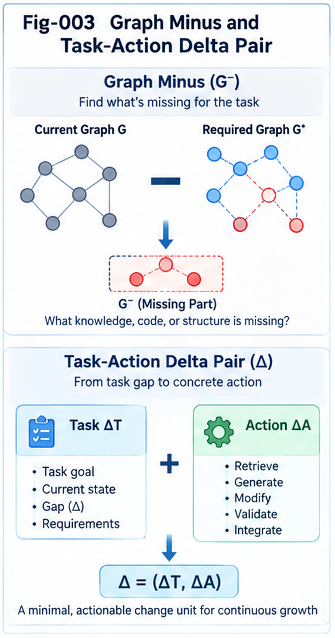

# TACG-SDIG-003 — Graph Minus and Task–Action Delta Isolation

## Task–Action CallingGraph Structural Delta Intelligence and Growth

**TACG-SDIG**

---

## Abstract

Structural Delta Intelligence requires a precise mechanism for answering a deceptively simple engineering question:

> **What is meaningfully different between the structure we know and the structure we need, observe, or expect?**

A conventional graph difference can identify added or removed nodes and edges. That is useful, but insufficient for Task–Action CallingGraph intelligence.

Engineering change may involve:

* missing paths,
* changed ordering,
* modified conditions,
* altered dependencies,
* new reachability,
* removed guards,
* task–action inconsistencies,
* semantic conflicts,
* unmapped implementation behavior,
* policy-sensitive changes,
* or coordinated multi-subgraph transformations.

This article introduces **Graph Minus** as the core structural difference operation of TACG-SDIG.

Conceptually:

```text
Target Structure
      ⊖
Reference Structure
      ↓
Meaningful Structural Delta
```

For Task and Action CallingGraphs:

```text
ΔT = TargetTaskCG ⊖ ReferenceTaskCG

ΔA = TargetActionCG ⊖ ReferenceActionCG
```

The resulting Task and Action deltas can then be correlated through the Task–Action Mapping Plane to form a **Task–Action Delta Pair (TADP)**.

Graph Minus is therefore not merely a graph-edit calculation.

It is a structured process for isolating the smallest useful engineering transformation between two structural states.

The central proposition is:

> **Localization tells us where we are; Graph Minus tells us what changed or what is missing.**

That isolated delta becomes the search key for the next stage of Structural Delta Intelligence.

---

# 1. Why Graph Minus Is Needed

Suppose an AI coding system receives a new requirement.

A generation-first approach may attempt:

```text
Requirement
    ↓
Generate Implementation
```

TACG-SDIG instead begins from known structural experience:

```text
New Requirement
      ↓
TaskCG
      ↓
Localization
      ↓
Closest Known TaskCG
```

Once the closest structural neighborhood has been found, the central question changes.

It is no longer:

> **How do we generate the entire solution?**

It becomes:

> **What separates this known structure from the required structure?**

That is the role of Graph Minus.

```text
Required Structure
       ⊖
Closest Known Structure
       ↓
Structural Delta
```

The operation reduces a potentially large engineering problem into a smaller transformation problem.

---

# 2. From Whole-System Search to Delta Isolation

Consider:

```text
Known TaskCG K

A
↓
B
↓
C
↓
D
```

and:

```text
Required TaskCG R

A
↓
B
↓
X
↓
C
↓
D
```

The entire requirement contains five nodes.

But most of the structure is already known.

The meaningful change is:

```text
B
↓
X
↓
C
```

relative to:

```text
B
↓
C
```

Graph Minus attempts to isolate:

```text
ΔT:
Insert X between B and C
```

The engineering search problem is therefore reduced from:

```text
Find implementation for A → B → X → C → D
```

to:

```text
Find implementation for:

B → X → C
```

or even:

```text
Find implementation for X
under structural context B → ? → C
```

This is the first major computational motivation for Graph Minus.

---

# 3. Graph Minus Is Not Ordinary Set Subtraction

Let a graph be represented abstractly as:

```text
G = (V, E)
```

A naive difference might calculate:

```text
V_delta = V_target - V_reference

E_delta = E_target - E_reference
```

This can identify raw additions.

But it cannot fully capture engineering meaning.

Consider:

```text
Reference:

A
↓
B
↓
C
```

and:

```text
Target:

A
↓
C
↓
B
```

The node sets are identical.

Yet the structures are different.

Similarly:

```text
Reference:

if authenticated
    ↓
update
```

versus:

```text
Target:

if authenticated AND authorized
    ↓
update
```

The principal change may be a condition rather than a node.

Therefore:

> **Structural difference is not equivalent to node-set difference or edge-set difference.**

Graph Minus must preserve structural semantics.

---

# 4. Canonical Definition

Let:

```text
T = target structure

R = reference structure
```

Then TACG-SDIG defines conceptually:

```text
Δ = T ⊖ R
```

where `⊖` is the **Graph Minus operator**.

The result is not necessarily one graph fragment.

It may be a structured Delta Object containing:

```text
Delta
{
    matchedContext,
    changedRegion,

    additions,
    removals,
    substitutions,

    changedEdges,
    changedConditions,
    changedDependencies,
    changedOrdering,

    reachabilityChanges,
    mappingChanges,

    semanticClassification,

    structuralBoundary,
    confidence
}
```

The objective is:

> **Isolate the smallest structurally meaningful transformation that explains the difference between the target and reference structures.**

---

# 5. Graph Minus Depends on Prior Localization

Graph Minus should normally not compare arbitrary unrelated graphs.

The preferred runtime is:

```text
Target CG
    ↓
Structural Localization
    ↓
Closest Known CG
    ↓
Aligned Structural Neighborhood
    ↓
Graph Minus
```

Localization supplies correspondence.

Graph Minus operates inside that correspondence.

This distinction matters.

Without localization:

```text
Graph A ⊖ Graph B
```

may contain a large amount of irrelevant difference.

With localization:

```text
Target Neighborhood
       ⊖
Known Neighborhood
       ↓
Focused Delta
```

Thus:

> **Localization reduces comparison scope before Graph Minus reduces transformation scope.**

---

# 6. Structural Alignment Before Subtraction

Graph Minus therefore begins with an alignment stage.

Conceptually:

```text
Target CG                 Reference CG

A                          A
↓                          ↓
B                          B
↓                          ↓
X                          C
↓                          ↓
C                          D
↓
D

          ↓ ALIGN ↓

A  ↔  A
B  ↔  B
X  ↔  ?
C  ↔  C
D  ↔  D
```

The unmatched or differently connected region becomes a candidate delta.

But structural alignment may involve more than exact names.

For example:

```text
Task:
Verify Ownership
```

may align with:

```text
Task:
Check Resource Owner
```

based on semantic and structural similarity.

Likewise:

```text
Action:
checkOwner()
```

may align with:

```text
Action:
validateResourceOwnership()
```

Therefore alignment may use:

* identity,
* type,
* structural position,
* semantic meaning,
* neighborhood,
* CCC,
* DNA,
* mapping context,
* and historical evidence.

---

# 7. Context Must Be Preserved Around the Delta

A delta without context may be ambiguous.

For example:

```text
Δ:
Add retry
```

is incomplete knowledge.

The same retry may be appropriate after:

```text
remote network call
```

but inappropriate around:

```text
non-idempotent payment operation
```

Therefore Graph Minus should preserve a **structural boundary** around the isolated delta.

Conceptually:

```text
Left Context
     ↓
[ DELTA ]
     ↓
Right Context
```

For graph structures:

```text
Entry Boundary
      ↓
Delta Subgraph
      ↓
Exit Boundary
```

A useful Delta Object therefore contains not only the changed structure but also its attachment context.

---

# 8. Contextual Delta Representation

A contextual delta can be represented conceptually as:

```text
ContextualDelta
{
    beforeBoundary,
    deltaStructure,
    afterBoundary,

    predecessorContext,
    successorContext,

    conditions,
    constraints
}
```

For example:

```text
Before:

Authenticate
    ↓
Update Resource
```

After:

```text
Authenticate
    ↓
Authorize
    ↓
Update Resource
```

The isolated delta should preserve:

```text
Predecessor:
Authenticate

Delta:
Authorize

Successor:
Update Resource
```

This makes later Delta Search substantially more precise.

---

# 9. Task-Side Graph Minus

For TaskCG:

```text
ΔT =
TargetTaskCG
    ⊖
ReferenceTaskCG
```

The target may represent:

* a new requirement,
* a new plan,
* a changed workflow,
* an expected safe structure,
* or a desired future state.

The reference may represent:

* the current requirement,
* the closest known TaskCG,
* a historical task structure,
* a policy baseline,
* or an earlier system version.

---

# 10. Example — Task Delta Isolation

Reference TaskCG:

```text
Receive Update Request
        ↓
Authenticate User
        ↓
Update Resource
        ↓
Return Result
```

Target TaskCG:

```text
Receive Update Request
        ↓
Authenticate User
        ↓
Verify Ownership
        ↓
Update Resource
        ↓
Return Result
```

Graph Minus:

```text
Target ⊖ Reference
```

produces:

```text
ΔT:

Predecessor:
Authenticate User

Added Task:
Verify Ownership

Successor:
Update Resource
```

Engineering interpretation:

> **Add an ownership-verification task before resource modification.**

This interpretation is more useful than simply reporting:

```text
Added node:
Verify Ownership
```

---

# 11. Action-Side Graph Minus

The same operation applies to ActionCG.

```text
ΔA =
TargetActionCG
    ⊖
ReferenceActionCG
```

For example:

Reference:

```text
authenticate()
    ↓
updateResource()
```

Target:

```text
authenticate()
    ↓
checkOwner()
    ↓
updateResource()
```

Graph Minus isolates:

```text
ΔA:

Predecessor:
authenticate()

Added Action:
checkOwner()

Successor:
updateResource()
```

This can then be correlated with:

```text
ΔT:
Verify Ownership
```

through the Mapping Plane.

---

# 12. From ΔT and ΔA to TADP

Once both sides are available:

```text
ΔT
↕
ΔA
```

the system can form a:

> **Task–Action Delta Pair**

For example:

```text
TADP
{
    taskDelta:
        Add Verify Ownership,

    actionDelta:
        Add checkOwner(),

    mapping:
        Verify Ownership
        ↔
        checkOwner(),

    context:
        Resource Update,

    constraint:
        Owner-Only Modification
}
```

This is substantially richer than a code diff.

It preserves:

```text
WHY
↕
HOW
```

of the engineering change.

---



---

# 13. Canonical Delta Taxonomy

Graph Minus should classify structural differences rather than returning one undifferentiated change list.

A first TACG-SDIG taxonomy contains:

```text
1. Missing Delta
2. Extra Delta
3. Changed Delta
4. Conflicting Delta
5. Unsafe Delta
6. Unmapped Delta
7. Unreachable Delta
8. Redundant Delta
9. Composite Delta
```

These categories are not necessarily mutually exclusive.

One structural change may carry several classifications.

---

# 14. Missing Delta

A Missing Delta exists when the target or expected structure contains something absent from the observed or reference structure.

Example:

```text
Expected:

Authenticate
    ↓
Authorize
    ↓
Update
```

Observed:

```text
Authenticate
    ↓
Update
```

Graph Minus identifies:

```text
Missing Delta:
Authorize
```

This is one of the most important delta types for AI coding and compliance analysis.

---

# 15. Missing Node Delta

The simplest case:

```text
Target:
A → X → B

Reference:
A → B
```

Result:

```text
Missing Node:
X
```

But even here, the contextual representation should preserve:

```text
A → [X] → B
```

rather than only:

```text
X
```

---

# 16. Missing Edge Delta

The nodes may already exist while a required relation does not.

Reference:

```text
A    B
```

Target:

```text
A → B
```

Result:

```text
Missing Edge:
A → B
```

In engineering terms, this may represent:

* missing dependency,
* missing invocation,
* missing sequencing,
* missing data propagation,
* or missing control transfer.

---

# 17. Missing Path Delta

A more meaningful unit may be an entire path.

Reference:

```text
Input
  ↓
Process
```

Expected:

```text
Input
  ↓
Validate
  ↓
Sanitize
  ↓
Process
```

Graph Minus may isolate:

```text
Missing Path:

Validate
   ↓
Sanitize
```

This is more useful than two independent missing-node reports.

---

# 18. Extra Delta

An Extra Delta exists when the observed structure contains behavior not present in the expected or reference structure.

Example:

TaskCG:

```text
Load Customer Record
    ↓
Display Customer Record
```

ActionCG:

```text
loadCustomer()
    ↓
sendToExternalService()
    ↓
displayCustomer()
```

The additional action may be classified as:

```text
Extra Action Delta:
sendToExternalService()
```

If no task or policy mapping explains it, it may additionally become an:

```text
Unmapped Delta
```

---

# 19. Changed Delta

A structure may exist on both sides but with altered properties.

Examples include:

```text
Changed Condition
Changed Role
Changed Parameter
Changed Constraint
Changed Dependency
Changed Ordering
Changed Cardinality
Changed State Transition
Changed Data Destination
```

For example:

Reference:

```text
Role:
admin
```

Target:

```text
Role:
admin OR owner
```

The node may be identical.

The structural condition has changed.

---

# 20. Ordering Delta

Consider:

Reference:

```text
Validate
    ↓
Persist
    ↓
Audit
```

Target:

```text
Validate
    ↓
Audit
    ↓
Persist
```

No nodes were added or removed.

Yet the execution semantics may differ.

Graph Minus should identify:

```text
Ordering Delta:

Persist ↔ Audit ordering changed
```

This illustrates again why Graph Minus cannot be reduced to set subtraction.

---

# 21. Dependency Delta

Reference:

```text
A → C
B → C
```

Target:

```text
A → B → C
```

The same nodes exist.

But dependency semantics have changed.

Graph Minus should isolate:

```text
Dependency Delta
```

rather than report only raw edge edits.

---

# 22. Condition Delta

Reference:

```text
if authenticated
    ↓
update
```

Target:

```text
if authenticated AND authorized
    ↓
update
```

Graph Minus:

```text
Condition Delta:

authenticated
    ↓
authenticated AND authorized
```

The semantic interpretation may be:

> **Strengthened access condition.**

This interpretation can later support Delta CCC folding.

---

# 23. Conflicting Delta

A Conflicting Delta exists when Task and Action structures express incompatible behavior.

Example:

Task:

```text
Read-Only Access
```

Action:

```text
updateRecord()
```

The issue is not merely that something is missing.

The implementation contradicts the task intent.

Graph Minus and cross-plane comparison should classify:

```text
Conflicting Task–Action Delta
```

This is especially important for governance.

---

# 24. Unsafe Delta

A structural change may be executable yet create a risky path.

Before:

```text
External Input
    ↓
Validate
    ↓
Privileged Operation
```

After:

```text
External Input
    ↓
Privileged Operation
```

The raw delta is:

```text
Removed:
Validate
```

The engineering classification is:

```text
Unsafe Delta:
Removed Validation Guard
```

This distinction demonstrates that Graph Minus may have two layers:

```text
Structural Difference
        ↓
Engineering Classification
```

---

# 25. Unmapped Delta

Suppose a new ActionCG contains:

```text
exportUserData()
```

but the Mapping Plane finds no corresponding:

* Task requirement,
* policy requirement,
* infrastructure requirement,
* or known operational justification.

Then the delta can be classified:

```text
Unmapped Action Delta
```

This does not automatically prove that the code is wrong.

It means:

> **The structural behavior lacks an explicit explanation in the current Task–Action knowledge model.**

That is sufficient reason for focused inspection.

---

# 26. Unreachable Delta

A new structural component may exist but cannot be reached from any valid entry path.

Example:

```text
A → B → C

X → Y
```

Suppose `X → Y` was intended as part of the new feature but has no connection to the executable path.

Graph Minus may identify the added structure.

Reachability analysis then classifies it as:

```text
Unreachable Delta
```

This matters because:

> **Presence does not imply operational integration.**

---

# 27. Redundant Delta

A change may add behavior already supplied elsewhere.

Example:

```text
Validate Input
    ↓
Validate Input Again
    ↓
Process
```

Depending on context, the second validation may be intentional defense-in-depth or unnecessary duplication.

Therefore:

```text
Potential Redundant Delta
```

should normally trigger contextual analysis rather than automatic deletion.

---

# 28. Composite Delta

Many engineering changes consist of several coordinated sub-deltas.

Example:

> Add authorization to a privileged operation.

This may require:

```text
Δ1:
Load permissions

Δ2:
Check required permission

Δ3:
Add rejection branch

Δ4:
Add audit event

Δ5:
Reconnect privileged operation
through authorization gate
```

Together these form:

```text
Composite Delta:
Authorization Guard
```

This distinction is crucial.

Engineering intelligence should not necessarily treat every graph edit as an independent solution unit.

---

# 29. Atomic Delta vs Engineering Delta

TACG-SDIG therefore distinguishes:

```text
Atomic Graph Delta
        ↓
Engineering Structural Delta
```

Atomic deltas include:

```text
add node
remove node
add edge
remove edge
change attribute
```

Engineering deltas include:

```text
Add Authentication
Add Authorization
Introduce Retry
Add Recovery
Split Service
Migrate API
Add Auditability
```

The mapping from atomic changes to meaningful engineering deltas is itself a folding problem.

---

# 30. Delta Boundary Detection

One of the hardest Graph Minus problems is deciding:

> **Where does the delta begin and end?**

Suppose:

```text
Reference:

A → B → C → D → E
```

Target:

```text
A → B → X → Y → C → D → E
```

The obvious delta is:

```text
B → X → Y → C
```

with:

```text
Entry Boundary:
B

Exit Boundary:
C

Delta Interior:
X → Y
```

This boundary representation is useful because candidate historical deltas can be matched by compatible attachment points.

---

# 31. Boundary-Aware Delta Search Key

Instead of searching only for:

```text
X → Y
```

the system can search for:

```text
Predecessor Type:
B-like structure

Delta:
X → Y

Successor Type:
C-like structure
```

Thus a Graph Minus result becomes a richer search key:

```text
DeltaSearchKey
{
    entryBoundary,
    internalDelta,
    exitBoundary,
    context,
    constraints
}
```

This can significantly improve structural retrieval precision.

---

# 32. Equal-Length and Unequal-Length Structures

Graph Minus should distinguish between relatively aligned structures and strongly unequal structures.

For similar-length structures:

```text
A → B → C → D

A → B → X → D
```

alignment may be straightforward.

For unequal structures:

```text
A → B → C

A → X → Y → Z → B → C
```

the system may need:

* multi-node alignment,
* subgraph clustering,
* sequence matching,
* CCC localization,
* or hierarchical comparison.

The principle remains:

> **Prefer the smallest meaningful aligned neighborhood before performing structural subtraction.**

---

# 33. Multi-Granularity Graph Minus

Graph Minus should operate at several granularities.

```text
Node Minus
Edge Minus
Path Minus
Subgraph Minus
CCC Minus
Composite Structure Minus
```

For example, two implementations may differ heavily at statement level but realize the same higher-level Action CCC.

In such a case:

```text
Statement-Level Delta:
large
```

while:

```text
Engineering-Level Delta:
small
```

Therefore delta analysis should not assume that the finest granularity is always the most informative.

---

# 34. Perspective-Dependent Delta

The same two structures may have different deltas under different analytical perspectives.

For example:

```text
Perspective:
Security
```

may focus on:

```text
authorization
validation
privilege
external calls
```

while:

```text
Perspective:
Performance
```

may focus on:

```text
cache
batching
parallelism
I/O
```

and:

```text
Perspective:
Reliability
```

may focus on:

```text
retry
timeout
rollback
recovery
```

Thus Graph Minus may support:

```text
Δ_p = Target ⊖_p Reference
```

where `p` represents an analytical perspective.

This does not require multiple physical graphs.

It means that structural comparison can be weighted or filtered by the purpose of the analysis.

---

# 35. Policy-Conditioned Graph Minus

A particularly important perspective is policy.

Suppose two ActionCGs differ by:

```text
Add external API call
```

Under a generic code perspective, this may be an ordinary Action Delta.

Under a data-governance policy:

```text
No customer data may leave
the approved processing boundary.
```

the same delta becomes highly significant.

Thus:

```text
Structural Delta
        +
Policy Context
        ↓
Governance-Relevant Delta
```

Graph Minus should preserve enough information for downstream policy classification.

---

# 36. Task–Action Cross-Plane Minus

Graph Minus can also operate across planes.

The question becomes:

> **What does the TaskCG require that the ActionCG does not realize?**

Conceptually:

```text
Task Requirement Structure
        ⊖
Mapped Action Realization
        ↓
Task–Action Consistency Delta
```

This is not literal subtraction between heterogeneous node types.

It requires the Mapping Plane.

---

# 37. Mapping-Normalized Cross-Plane Comparison

Suppose:

```text
Task:
Verify Ownership
```

maps to:

```text
Action:
checkOwner()
```

The comparison proceeds conceptually:

```text
TaskCG
   ↓
1G Mapping
   ↓
Expected Action-Side Structural Form
   ↓
Compare with Observed ActionCG
   ↓
Consistency Delta
```

Likewise in reverse:

```text
Observed ActionCG
   ↓
1G Mapping
   ↓
Expected Task Explanation
   ↓
Compare with TaskCG
   ↓
Unmapped / Conflicting Delta
```

Thus cross-plane Graph Minus is mediated by structural mapping.

---

# 38. Forward Graph Minus

Forward Graph Minus begins from desired change.

```text
Desired TaskCG
      ⊖
Current TaskCG
      ↓
ΔT
```

Then:

```text
ΔT
   ↓
Mapping / Delta Search
   ↓
Candidate ΔA
```

This supports AI coding growth.

---

# 39. Reverse Graph Minus

Reverse Graph Minus begins from observed implementation change.

```text
New ActionCG
      ⊖
Previous ActionCG
      ↓
ΔA
```

Then:

```text
ΔA
   ↓
Task Mapping
   ↓
Expected ΔT
```

The system can ask:

> **What requirement explains this code change?**

If no corresponding Task Delta exists, the change becomes an audit target.

---

# 40. Bidirectional Delta Isolation

The strongest mode uses both sides.

```text
Old TaskCG ───────→ New TaskCG
      │                │
      │    Graph Minus │
      │                │
      └────── ΔT ──────┘

             ↕
        Task–Action
          Mapping

Old ActionCG ─────→ New ActionCG
      │                │
      │    Graph Minus │
      │                │
      └────── ΔA ──────┘
```

The system then evaluates:

```text
Does ΔT explain ΔA?

Does ΔA fully implement ΔT?

Does ΔA contain unexplained additions?

Does ΔT contain unimplemented requirements?
```

This is a major source of structural intelligence.

---

# 41. Delta Isolation as Search-Space Compression

Suppose a target program contains:

```text
1000 structural units
```

and the closest known implementation already explains:

```text
970 structural units
```

The useful problem may be concentrated in roughly:

```text
30 changed structural units
```

The exact computational savings depend on representation, search algorithm, and graph topology.

But the conceptual advantage is clear:

```text
Whole Target
      ↓
Localization
      ↓
Known Structural Coverage
      ↓
Graph Minus
      ↓
Change Frontier
```

Search can focus on the change frontier rather than repeatedly reasoning over the entire system.

---

# 42. Delta Isolation and AI Coding Intelligence

This suggests a broader principle:

> **Do not ask AI to solve what structural memory already knows.**

Instead:

```text
Known Region
    ↓
Reuse

Changed Region
    ↓
Reason

Unknown Region
    ↓
Search / Generate
```

Graph Minus creates the boundary between these regions.

That makes it one of the central mechanisms for reducing unnecessary AI search and generation.

---

# 43. Delta Isolation and Compliance Scaling

The same mechanism supports incremental governance.

Suppose:

```text
Version N
```

has already been reviewed.

Version N+1 arrives.

Instead of starting with:

```text
Review entire Version N+1
```

the system can calculate:

```text
ΔVersion =
Version N+1
    ⊖
Version N
```

and focus structural governance on:

```text
new paths
removed guards
new privileges
new external calls
changed mappings
changed conditions
new reachability
policy-sensitive deltas
```

This creates:

> **Delta-Scoped Structural Governance**

The approach does not imply that unchanged regions can never matter.

A delta can interact with unchanged structures.

Therefore the delta boundary may need to expand through dependency and reachability analysis.

---

# 44. Delta Impact Expansion

A small local edit can have non-local consequences.

Example:

```text
Change:
Permission Function
```

may affect:

```text
Caller A
Caller B
Caller C
Admin Workflow
Batch Workflow
External API
```

Therefore Graph Minus should distinguish:

```text
Direct Delta
```

from:

```text
Impact Neighborhood
```

Conceptually:

```text
Direct Structural Delta
        ↓
Dependency Expansion
        ↓
Reachability Expansion
        ↓
Affected Structural Neighborhood
```

This prevents delta-scoped analysis from becoming artificially narrow.

---

# 45. Delta Core and Delta Halo

A useful conceptual distinction is:

```text
DELTA CORE
    exact changed structure

DELTA HALO
    structurally affected neighborhood
```

For example:

```text
         ┌────────────────────┐
         │     DELTA HALO     │
         │                    │
Caller →│ [DELTA CORE] → Next│
         │                    │
         └────────────────────┘
```

The Core is used for precise structural identity.

The Halo is used for:

* context,
* impact,
* feasibility,
* governance,
* and search.

This can improve both localization and safety analysis.

---

# 46. Delta Isolation and Counter-Evidence

Once Graph Minus isolates:

```text
Δ
```

the delta becomes a query object.

The system can search:

```text
Where has Δ appeared successfully?
```

but also:

```text
Where has Δ caused failure?

Where was Δ rejected?

Where did Δ require additional changes?

Where was Δ rolled back?
```

Thus Graph Minus is the gateway to:

> **Counter-Evidence Search**

Without explicit delta isolation, historical change evidence is much harder to query systematically.

---

# 47. Delta Isolation and Trajectory

Suppose successive Graph Minus operations produce:

```text
Δ1 = S1 ⊖ S0

Δ2 = S2 ⊖ S1

Δ3 = S3 ⊖ S2
```

Then:

```text
T = <Δ1, Δ2, Δ3>
```

forms a Delta Trajectory.

Therefore Graph Minus is also the basic extraction operation for structural evolution history.

```text
Version History
      ↓
Repeated Graph Minus
      ↓
Delta History
      ↓
Trajectory
```

This connects code evolution with Trajectory Intelligence.

---

# 48. Historical Reconstruction

Even when a system did not originally store Delta Objects, versioned structural states may allow reconstruction.

Given:

```text
S0
S1
S2
S3
```

calculate:

```text
Δ1 = S1 ⊖ S0
Δ2 = S2 ⊖ S1
Δ3 = S3 ⊖ S2
```

Then enrich each delta with:

```text
commit reason
task change
test evidence
incident evidence
runtime outcome
policy status
```

This can transform ordinary version history into structured engineering evolution memory.

---

# 49. Delta Folding Begins with Good Isolation

Delta CCC and Delta DNA depend on consistent Delta Objects.

Poor isolation may produce:

```text
Huge noisy graph fragments
```

that are difficult to cluster.

Good isolation produces:

```text
Contextual Engineering Deltas
```

such as:

```text
Add Authorization Before Privileged Operation

Add Retry Around Idempotent Remote Call

Add Audit After Sensitive State Change
```

These are much easier to:

* compare,
* cluster,
* fold,
* index,
* retrieve,
* and reuse.

Thus:

> **Delta Folding quality depends heavily on Delta Isolation quality.**

---

# 50. A Canonical Graph Minus Pipeline

A first canonical TACG-SDIG Graph Minus pipeline can be expressed as:

```text
INPUT
Target CG
Reference CG
Context
Perspective
Policy
        ↓
STEP 1
Structural Normalization
        ↓
STEP 2
Localization / Alignment
        ↓
STEP 3
Matched Region Detection
        ↓
STEP 4
Raw Graph Difference
        ↓
STEP 5
Structural Boundary Detection
        ↓
STEP 6
Delta Core Isolation
        ↓
STEP 7
Delta Halo Expansion
        ↓
STEP 8
Engineering Delta Classification
        ↓
STEP 9
Task–Action Mapping Check
        ↓
STEP 10
Reachability / Feasibility Annotation
        ↓
OUTPUT
Contextual Structural Delta
```

This is not intended as the only possible implementation.

It defines the conceptual stages required by TACG-SDIG.

---

# 51. Step 1 — Structural Normalization

Before comparison, representations should be made sufficiently comparable.

Possible normalization includes:

```text
canonical naming
type normalization
equivalent action grouping
granularity alignment
sequence normalization
context normalization
```

The goal is to avoid false deltas caused purely by representation differences.

---

# 52. Step 2 — Localization and Alignment

Find:

```text
exact matches
nearest matches
shared subgraphs
shared paths
shared CCC
shared DNA
```

Then establish candidate correspondence.

---

# 53. Step 3 — Matched Region Detection

Partition the structures conceptually into:

```text
Known / Matched Region
Changed Region
Unknown Region
```

This provides the initial change frontier.

---

# 54. Step 4 — Raw Graph Difference

Identify low-level changes:

```text
added nodes
removed nodes
added edges
removed edges
changed attributes
changed conditions
```

These form raw delta material.

---

# 55. Step 5 — Structural Boundary Detection

Determine the attachment points around the changed region.

```text
Entry Boundary
      ↓
Changed Region
      ↓
Exit Boundary
```

This converts raw edits into contextual transformations.

---

# 56. Step 6 — Delta Core Isolation

Identify the smallest coherent changed structure that retains engineering meaning.

Avoid:

```text
too small:
meaningless atomic fragments
```

and:

```text
too large:
entire surrounding system
```

The target is:

> **minimal meaningful structural change.**

---

# 57. Step 7 — Delta Halo Expansion

Expand around the Delta Core where necessary to include:

```text
dependencies
callers
callees
guards
state dependencies
data dependencies
policy boundaries
reachability effects
```

This provides impact context.

---

# 58. Step 8 — Engineering Delta Classification

Translate raw graph edits into meaningful classes:

```text
Missing
Extra
Changed
Conflicting
Unsafe
Unmapped
Unreachable
Redundant
Composite
```

Potential domain-specific classifications may later be added.

---

# 59. Step 9 — Task–Action Mapping Check

Ask:

```text
Does ΔT map to ΔA?

Does ΔA implement ΔT?

Does ΔA contain extra unmapped behavior?

Does ΔT remain partially unimplemented?
```

This stage begins formation of a TADP.

---

# 60. Step 10 — Reachability and Feasibility Annotation

Graph Minus itself identifies difference.

But downstream search benefits if the delta is annotated with:

```text
reachable?
feasible?
connected?
constraint-compatible?
policy-sensitive?
```

This prepares the object for candidate search and ranking.

---

# 61. Canonical Delta Object

A conceptual TACG-SDIG Delta Object may therefore contain:

```text
StructuralDelta
{
    deltaId,

    plane:
        Task | Action | Mapping,

    referenceStructure,
    targetStructure,

    matchedContext,

    deltaCore,
    deltaHalo,

    entryBoundary,
    exitBoundary,

    rawChanges,

    semanticClass,

    granularity,
    perspective,

    constraints,
    policyContext,

    reachability,

    mappingStatus,

    evidence,

    confidence
}
```

The exact software representation is implementation-dependent.

The important point is that a Delta Object is much richer than a line diff.

---

# 62. Canonical TADP Seed

When Task and Action deltas are available, Graph Minus can output a preliminary pair:

```text
TADPSeed
{
    taskDelta,
    actionDelta,

    taskActionMapping,

    sharedContext,

    constraints,

    consistencyStatus
}
```

Later stages can enrich this with:

```text
candidate history
counter-evidence
feasibility
policy
validation
outcome
```

Thus Graph Minus creates the seed for Two-Way Delta Intelligence.

---

# 63. Example — Add Authorization

## Reference TaskCG

```text
Authenticate User
      ↓
Modify Resource
```

## Target TaskCG

```text
Authenticate User
      ↓
Authorize Modification
      ↓
Modify Resource
```

## Task Graph Minus

```text
ΔT:

Entry:
Authenticate User

Core:
Authorize Modification

Exit:
Modify Resource
```

## Reference ActionCG

```text
authenticate()
      ↓
updateResource()
```

## Target ActionCG

```text
authenticate()
      ↓
checkPermission()
      ↓
updateResource()
```

## Action Graph Minus

```text
ΔA:

Entry:
authenticate()

Core:
checkPermission()

Exit:
updateResource()
```

## TADP Seed

```text
ΔT:
Authorize Modification

        ↕

ΔA:
checkPermission()
```

This becomes a reusable structural transformation.

---

# 64. Example — Add Retry and Recovery

Reference ActionCG:

```text
prepareRequest()
      ↓
remoteCall()
      ↓
processResponse()
```

Target:

```text
prepareRequest()
      ↓
remoteCall()
      ↓
success?
 ┌────┴────┐
yes        no
 ↓          ↓
process    retry
            ↓
        remoteCall()
            ↓
        exhausted?
         ┌──┴──┐
        no    yes
        │       ↓
        └──→ rollback
```

The raw graph difference may be large.

But engineering classification may identify:

```text
Composite Delta:

Add Retry and Recovery
```

with sub-deltas:

```text
Retry Branch
Retry Counter
Repeated Remote Call
Exhaustion Condition
Rollback Path
```

This is the appropriate unit for later Delta Memory.

---

# 65. Example — Requirement–Implementation Conflict

TaskCG:

```text
Generate Read-Only Report
```

ActionCG:

```text
loadData()
    ↓
normalizeData()
    ↓
updateSourceRecord()
    ↓
generateReport()
```

Mapping analysis finds:

```text
updateSourceRecord()
```

has no valid realization in the read-only TaskCG.

Classification:

```text
Extra Action Delta
+
Unmapped Action Delta
+
Potential Conflicting Delta
```

The same structural object can therefore carry multiple semantic classifications.

---

# 66. Example — Security Guard Removal

Version N:

```text
Input
 ↓
Validate
 ↓
Authorize
 ↓
Privileged Action
```

Version N+1:

```text
Input
 ↓
Authorize
 ↓
Privileged Action
```

Graph Minus identifies:

```text
Removed Node:
Validate
```

Contextual classification:

```text
Delta Core:
Remove Validation Guard

Delta Halo:
Input → Privileged Path

Classification:
Potential Unsafe Delta

Governance Priority:
High
```

This demonstrates how Graph Minus supports focused structural governance.

---

# 67. Graph Minus and Human Engineering Practice

Experienced engineers often perform Graph Minus mentally.

They compare:

```text
What exists
```

with:

```text
What is needed
```

and rapidly isolate:

```text
what must change
```

They then search their experience:

```text
Have I made this kind of change before?
```

Graph Minus makes this implicit human practice explicit and structurally representable.

The MET translation is:

```text
Human:
"What's different?"

TACG-SDIG:
Graph Minus

Human:
"Where have I fixed this before?"

TACG-SDIG:
Delta Search

Human:
"Will that fix work here?"

TACG-SDIG:
Feasibility / Reachability /
Counter-Evidence / Policy
```

This is one reason Graph Minus is central to Structural Delta Intelligence.

---

# 68. Graph Minus as the Bridge Between Localization and Growth

The TACG-SDIG runtime can now be expressed as:

```text
Folded Knowledge
      ↓
Localization
      ↓
Closest Structural Neighborhood
      ↓
GRAPH MINUS
      ↓
Structural Delta
      ↓
Delta Search
      ↓
Candidate Delta
      ↓
Validation
      ↓
Growth
```

Without Graph Minus, localization finds a neighborhood but does not identify the transformation.

Without localization, Graph Minus may compare the wrong structures.

Together:

> **Localization finds where we are.**

> **Graph Minus identifies what separates where we are from where we need to be.**

---

# 69. Graph Minus as a Trajectory Extraction Operator

Graph Minus also has a historical role.

Given:

```text
S0
S1
S2
S3
```

calculate:

```text
Δ1 = S1 ⊖ S0
Δ2 = S2 ⊖ S1
Δ3 = S3 ⊖ S2
```

Then:

```text
Trajectory =
<Δ1, Δ2, Δ3>
```

Thus Graph Minus transforms:

```text
Version History
```

into:

```text
Structural Evolution History
```

This creates the raw material for Delta Trajectory Intelligence.

---

# 70. Graph Minus as a Folding Preparation Operator

Historical source code repositories may contain many versions but no explicit Structural Delta Memory.

Graph Minus can reconstruct deltas.

Then:

```text
Version Pairs
     ↓
Graph Minus
     ↓
Contextual Deltas
     ↓
Delta Clustering
     ↓
Delta CCC
     ↓
Delta DNA
```

Therefore Graph Minus is not only a runtime comparison operator.

It can also become an **offline structural folding operator**.

---

# 71. Graph Minus and Structural Learning

As more deltas are extracted and validated, the system can learn:

```text
which graph edits belong together,

which contexts matter,

which boundaries predict success,

which deltas recur,

which deltas require companion changes,

which deltas create risk,

which delta trajectories are stable.
```

Over time, Graph Minus itself may improve through learned structural alignment and delta classification.

This creates a feedback loop:

```text
Graph Minus
    ↓
Delta Memory
    ↓
Delta Folding
    ↓
Better Delta Patterns
    ↓
Better Alignment
    ↓
Better Graph Minus
```

---

# 72. Graph Minus Does Not Solve the Whole Problem

Graph Minus should have a clear boundary.

It does not by itself determine:

```text
the best repair,
the best implementation,
complete software correctness,
complete security,
complete policy compliance,
or runtime success.
```

Its job is narrower and foundational:

> **isolate and structure meaningful difference.**

The resulting Delta Object is then passed to:

```text
Delta Localization
Two-Way Delta Search
Candidate Reconstruction
Counter-Evidence Search
Reachability Analysis
Feasibility Analysis
Policy Evaluation
Runtime Validation
```

This separation keeps the architecture modular.

---

# 73. Core Principles of Graph Minus

## Principle 1 — Localize Before Subtracting

Compare structurally related neighborhoods whenever possible.

## Principle 2 — Preserve Context

A delta without boundaries may be too ambiguous to reuse.

## Principle 3 — Prefer Meaningful Structural Units

Do not confuse raw graph edits with engineering transformations.

## Principle 4 — Support Multiple Granularities

Node, edge, path, subgraph, CCC, and composite differences may all matter.

## Principle 5 — Separate Core from Impact

Use Delta Core for identity and Delta Halo for context and consequence.

## Principle 6 — Preserve Task–Action Correspondence

Task-side and Action-side changes should be correlated whenever possible.

## Principle 7 — Make Delta Reusable

The output should be suitable for search, folding, trajectory analysis, and governance.

---

# 74. Canonical Graph Minus Summary

The core operation is:

```text
Target
   ⊖
Reference
   ↓
Raw Difference
   ↓
Structural Alignment
   ↓
Boundary Detection
   ↓
Delta Core
   ↓
Delta Halo
   ↓
Engineering Classification
   ↓
Contextual Structural Delta
```

For TACG-SDIG:

```text
Target TaskCG
      ⊖
Known TaskCG
      ↓
     ΔT

      ↕
     TADP

Target ActionCG
      ⊖
Known ActionCG
      ↓
     ΔA
```

The resulting deltas become first-class search objects.

---

# 75. From Difference to Intelligence

The importance of Graph Minus lies not merely in detecting change.

Its value comes from what happens after change has been isolated.

```text
Difference
    ↓
Structural Delta
    ↓
Searchable Delta
    ↓
Comparable Delta
    ↓
Foldable Delta
    ↓
Governable Delta
    ↓
Trajectory Element
    ↓
Reusable Engineering Experience
```

This is the transformation from ordinary difference analysis to **Structural Delta Intelligence**.

---

# 76. Conclusion

Task–Action CallingGraph intelligence requires a structural mechanism for identifying the meaningful difference between known, observed, and desired system states.

Graph Minus provides that mechanism.

Its conceptual form is simple:

```text
Δ = Target ⊖ Reference
```

but its engineering role is richer.

Graph Minus must:

* align structures,
* preserve context,
* isolate boundaries,
* distinguish raw edits from meaningful transformations,
* classify delta types,
* correlate Task and Action changes,
* preserve impact neighborhoods,
* and produce reusable Delta Objects.

This enables a fundamental transition:

```text
Whole-System Problem
        ↓
Localization
        ↓
Known Structural Neighborhood
        ↓
Graph Minus
        ↓
Local Structural Delta Problem
```

That local delta can then be searched against historical structural experience.

Thus:

> **Localization tells us where we are.**

> **Graph Minus tells us what changed or what is missing.**

> **Delta Search asks how similar structural gaps were crossed before.**

And this leads directly to the next stage of TACG-SDIG:

> **Two-Way Delta Localization, Search, and Candidate Reconstruction.**

---

## Next Article

**TACG-SDIG-004 — Two-Way Delta Localization, Search, and Candidate Reconstruction**

The next article develops the runtime that takes isolated Task and Action deltas, searches folded Delta Memory through both structural planes, constructs candidate Task–Action Delta Pairs, applies counter-evidence, reachability, feasibility, and policy filters, and uses primitive-level constrained forward walking when historical structural experience remains incomplete.
