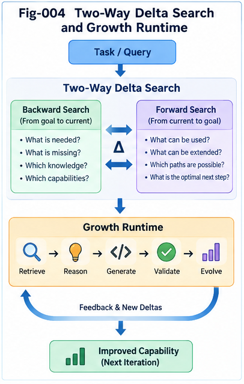

# TACG-SDIG-004 — Two-Way Delta Localization, Search, and Candidate Reconstruction

## Task–Action CallingGraph Structural Delta Intelligence and Growth

**TACG-SDIG**

---

## Abstract

Graph Minus isolates meaningful structural differences between known, observed, and desired CallingGraph states. The next problem is operational:

> **What should an intelligent system do with an isolated structural delta?**

TACG-SDIG answers this through **Two-Way Delta Localization and Search**.

Given a Task-side delta, the system searches both Task structural memory and corresponding Action structural memory.

Given an Action-side delta, it searches both Action structural memory and corresponding Task structural memory.

The two directions interact through the Task–Action Mapping Plane and the Delta Structural Plane.

The runtime therefore supports:

```text
ΔTask
  ↓
Task Delta Localization
  ↓
Known Task-Side Transformations
  ↓
Task–Action Mapping
  ↓
Candidate Action Deltas
```

and:

```text
ΔAction
  ↓
Action Delta Localization
  ↓
Known Action-Side Transformations
  ↓
Action–Task Mapping
  ↓
Candidate Task Deltas
```

These paths converge into candidate **Task–Action Delta Pairs (TADPs)**.

Candidates are then evaluated through:

* structural similarity,
* boundary compatibility,
* reachability,
* feasibility,
* constraints,
* counter-evidence,
* policy,
* security sensitivity,
* historical outcome,
* and runtime compatibility.

When historical delta knowledge remains incomplete, TACG-SDIG can extend candidate structures through **primitive-level constrained forward walking** using one-step Task primitives and feasible Action primitives.

The resulting process transforms an isolated structural gap into a ranked, explainable, and structurally validated growth candidate.

The central proposition is:

> **Delta isolation identifies the gap; Two-Way Delta Search identifies how similar gaps were crossed; candidate reconstruction determines whether those historical transformations can be adapted to the current system.**

---

# 1. From Delta Isolation to Delta Intelligence

The previous stage of TACG-SDIG produces one or more contextual deltas.

For example:

```text
ΔT:
Add Ownership Verification
```

and:

```text
ΔA:
Add checkOwner()
```

These are useful, but they do not yet solve the engineering problem.

The next questions are:

```text
Have similar Task deltas appeared before?

Have similar Action deltas appeared before?

Did they occur together?

Under what structural context?

Which version succeeded?

Which version failed?

What companion changes were required?

Can the historical transformation fit the current CG?
```

These questions define **Delta Intelligence** at runtime.

---

# 2. Search Before Generation

The canonical TACG-SDIG runtime prefers the following order:

```text
Known exact solution
        ↓
Known close solution
        ↓
Known delta
        ↓
Known composite delta
        ↓
Known delta trajectory
        ↓
Primitive structural extension
        ↓
Open generation
```

The system therefore attempts to exploit increasingly local structural knowledge before entering a broad candidate space.

This principle can be summarized as:

> **Search before generation.**

A second principle follows:

> **Use the narrowest validated structural knowledge that can solve the current gap.**

---

# 3. Two-Way Search as the Core Runtime Pattern

Task and Action deltas should not be searched independently.

The two-way architecture is:

```text
                    ΔT
                 ↙      ↘
        Task Delta        Action-Side
          Search            Search
                 ↘      ↙
                    ↕
                  Mapping
                    ↕
                 ΔA
                 ↙      ↘
       Action Delta        Task-Side
          Search             Search
```

This creates four useful search modes:

```text
1. ΔT → Task Delta Memory

2. ΔT → Action Delta Memory

3. ΔA → Action Delta Memory

4. ΔA → Task Delta Memory
```

The Mapping Plane connects these modes.

---

# 4. Why Two-Way Search Matters

Suppose the Task-side delta is:

```text
Require auditability
```

The Action-side realization may vary:

```text
append audit record

emit immutable event

write structured log

store change history

call centralized audit service
```

Task-side search alone may identify the conceptual requirement.

Action-side search contributes implementation precedent.

Conversely, suppose the observed code delta is:

```text
add retry wrapper
```

Task-side search may reveal that historically it corresponds to:

```text
improve fault tolerance

support transient failure recovery

meet availability requirement
```

Thus:

> **Task-side structure contributes intent; Action-side structure contributes implementation feasibility.**

Two-way search lets one side explain and constrain the other.

---



---

# 5. Canonical Runtime Inputs

The runtime may begin from several input configurations.

## Case A — Task-First

```text
Planning TaskCG
      ↓
Localization
      ↓
Reference TaskCG
      ↓
Graph Minus
      ↓
ΔT
```

The Action-side delta is initially unknown.

---

## Case B — Action-First

```text
Observed / New ActionCG
      ↓
Localization
      ↓
Reference ActionCG
      ↓
Graph Minus
      ↓
ΔA
```

The Task-side explanation may initially be unknown.

---

## Case C — Dual-Side

Both exist:

```text
ΔT ↔ ΔA
```

The system checks their consistency.

---

## Case D — Partial TADP Seed

One side has a strong candidate mapping:

```text
ΔT
 ↕
partial mapping
 ↕
Candidate ΔA
```

The runtime must complete or validate the pair.

---

# 6. Task-First Two-Way Delta Search

The Task-first path begins from:

```text
ΔT
```

For example:

```text
ΔT:
Add ownership verification
```

The runtime may proceed:

```text
ΔT
 ↓
Task Delta Exact Match
 ↓
Task Delta Near Match
 ↓
Task Delta CCC
 ↓
Task Delta DNA
 ↓
Historical Task Delta Episodes
 ↓
Associated TADPs
 ↓
Historical Action Deltas
```

This is the direct route.

A cross-side route also exists:

```text
ΔT
 ↓
Task–Action Mapping
 ↓
Expected Action Meaning
 ↓
Action Delta Search
 ↓
Candidate ΔA
```

Together they create stronger evidence.

---

# 7. Action-First Two-Way Delta Search

Given:

```text
ΔA:
Insert permission check
```

the runtime can search:

```text
ΔA
 ↓
Action Delta Exact Match
 ↓
Action Delta Near Match
 ↓
Action Delta CCC
 ↓
Action Delta DNA
 ↓
Historical Action Episodes
 ↓
Associated TADPs
 ↓
Task-Side Intent
```

This is particularly useful for:

* reverse engineering,
* code explanation,
* legacy code analysis,
* review of commits,
* and change auditing.

---

# 8. Boundary-Aware Delta Localization

A delta should not be searched as an isolated object.

Consider:

```text
Δ:
Add retry
```

This is too broad.

Better:

```text
Entry Boundary:
Idempotent Remote Call

Delta:
Retry With Backoff

Exit Boundary:
Response Processing
```

The search key therefore includes:

```text
Boundary-Aware Delta Search Key
{
    predecessorContext,
    deltaCore,
    successorContext,
    constraints,
    taskMeaning,
    actionMeaning
}
```

This helps distinguish structurally similar but operationally different deltas.

---

# 9. Delta Core and Delta Halo in Search

Recall:

```text
Delta Core
    = exact changed structure

Delta Halo
    = affected structural neighborhood
```

The Core helps identity matching.

The Halo helps compatibility matching.

A candidate may have an excellent Core match but a poor Halo match.

For example:

```text
Historical Delta:
Add retry around idempotent read
```

Current context:

```text
non-idempotent money transfer
```

Core similarity:

```text
high
```

Halo compatibility:

```text
poor
```

Therefore:

> **Delta Core similarity is necessary but not sufficient.**

---

# 10. Exact Delta Match

The simplest search mode asks:

```text
Have we seen this same structural transformation before?
```

Example:

```text
Before:
Authenticate → Update

After:
Authenticate → Authorize → Update
```

If an identical contextual delta exists, it becomes a high-value candidate.

But even exact structural similarity does not guarantee applicability.

The runtime still checks:

```text
constraints
policy
domain context
reachability
historical outcome
```

---

# 11. Nearest Delta Match

Exact matches may be rare.

The runtime therefore searches for nearby transformations.

For example:

```text
Current:
Add authorization before delete
```

Historical:

```text
Add authorization before update
```

The exact endpoint differs.

But the transformation pattern may be strongly related.

Thus the system can retrieve:

```text
Authorization Guard Delta CCC
```

rather than requiring an exact statement-level match.

---

# 12. Delta CCC Localization

Repeated related transformations can be folded into a Delta CCC.

For example:

```text
Add authorization before update

Add authorization before delete

Add authorization before export

Add authorization before administrative action
```

may fold into:

```text
Delta CCC:
Insert authorization gate
before privileged operation
```

Then runtime search becomes:

```text
Δ
 ↓
Delta CCC Localization
 ↓
Relevant Historical Instances
```

This is more scalable than scanning every raw historical delta.

---

# 13. Delta DNA Dispatch

Delta DNA provides a compact runtime identity.

Conceptually:

```text
Delta
 ↓
Structural Features
 ↓
Delta DNA
 ↓
Dispatch
 ↓
Relevant Delta CCC / Cluster
```

The purpose is not to replace detailed comparison.

It narrows the search region.

This supports a two-phase pattern:

```text
Phase 1:
Fast Delta Dispatch

Phase 2:
Detailed Structural Comparison
```

---

# 14. Two-Phase Delta Search

The canonical pattern is:

```text
PHASE 1
Delta DNA / Coarse Structural Dispatch
        ↓
Candidate Delta Neighborhood

PHASE 2
Boundary / Context / Mapping /
Constraint / Outcome Comparison
        ↓
Ranked Candidate Deltas
```

This reduces broad enumeration.

The principle is:

> **Dispatch broadly enough to avoid missing useful neighborhoods, then compare narrowly enough to preserve engineering meaning.**

---

# 15. Candidate TADP Retrieval

Historical delta knowledge may already contain complete Task–Action Delta Pairs.

Example:

```text
TADP-H17

ΔT:
Require authorization before update

ΔA:
Insert checkPermission()

Context:
Privileged resource modification

Outcome:
Validated
```

Given a new `ΔT`, the runtime can retrieve `TADP-H17` directly.

This is stronger than retrieving only a Task or Action fragment because it preserves:

```text
Requirement Change
        ↕
Implementation Change
```

---

# 16. Candidate Reconstruction

Historical TADPs may not fit the new target exactly.

The runtime therefore reconstructs a candidate.

Conceptually:

```text
Historical TADP
       +
Current Structural Context
       ↓
Adaptation
       ↓
Candidate TADP
```

Adaptation may involve:

```text
rename structural roles

map equivalent nodes

replace implementation primitive

change boundary attachment

adjust conditions

add companion delta

remove irrelevant historical branch
```

Candidate reconstruction is therefore a structural transformation operation, not simple copy-paste.

---

# 17. Canonical Candidate TADP

A reconstructed candidate may contain:

```text
CandidateTADP
{
    targetTaskDelta,
    candidateActionDelta,

    taskBoundary,
    actionBoundary,

    mapping,

    sourceHistoricalDeltas,

    adaptationOperations,

    requiredCompanionDeltas,

    constraints,

    evidence,
    counterEvidence,

    reachabilityStatus,
    feasibilityStatus,

    policyStatus,
    riskStatus,

    score
}
```

---

# 18. Candidate Sources

A candidate may come from several sources.

```text
Source A:
Exact historical TADP

Source B:
Nearest historical TADP

Source C:
Delta CCC instance

Source D:
Composite historical deltas

Source E:
Delta trajectory fragment

Source F:
Task primitive composition

Source G:
Action primitive composition
```

This gives the runtime a structured hierarchy of confidence and openness.

---

# 19. Candidate Reconstruction from Multiple Deltas

One historical delta may be incomplete.

Suppose the target requires:

```text
Secure External API Call
```

Historical knowledge may contain separate deltas:

```text
Δ1:
Add authentication

Δ2:
Add timeout

Δ3:
Add retry

Δ4:
Add audit

Δ5:
Add circuit breaker
```

The runtime may compose:

```text
Candidate Composite Delta
=
Δ1 + Δ2 + Δ3 + Δ4 + Δ5
```

But composition must be structurally validated.

Not all individually valid deltas are jointly valid.

---

# 20. Delta Composition Compatibility

Before combining candidate deltas, check:

```text
Boundary Compatibility
Dependency Compatibility
Ordering Compatibility
State Compatibility
Constraint Compatibility
Policy Compatibility
```

For example:

```text
Retry
+
Non-Idempotent Action
```

may be unsafe without an idempotency delta.

Therefore composition may trigger:

```text
Required Companion Delta:
Add idempotency key
```

This is an important form of structural intelligence.

---

# 21. Companion Delta Discovery

A candidate delta may historically co-occur with another delta.

For example:

```text
Add async message delivery
```

may often co-occur with:

```text
Add idempotency
Add retry
Add dead-letter handling
Add monitoring
```

Historical trajectory and co-occurrence analysis can therefore identify:

> **Companion Deltas**

Conceptually:

```text
Primary Delta
      ↓
Historical Co-Occurrence
      ↓
Required / Recommended Companion Deltas
```

This helps avoid incomplete changes.

---

# 22. Candidate Ranking

The runtime may retrieve many candidate transformations.

Ranking should not rely on one similarity score.

A conceptual scoring model may include:

```text
Candidate Score
=
Structural Similarity
+
Boundary Compatibility
+
Task Compatibility
+
Action Compatibility
+
Reachability
+
Feasibility
+
Historical Success
+
Policy Compatibility
+
Evidence Support
-
Counter-Evidence
-
Risk
-
Adaptation Cost
```

The exact mathematical form is implementation-dependent.

The structural principle is more important:

> **Similarity proposes; validation disposes.**

---

# 23. Structural Similarity

Structural similarity may include:

```text
node-type similarity
edge-pattern similarity
path similarity
subgraph similarity
sequence similarity
CCC similarity
DNA similarity
```

But a candidate should not be selected solely because it "looks close."

---

# 24. Task Compatibility

Ask:

```text
Does the candidate satisfy the intended task delta?

Does it preserve required task constraints?

Does it introduce behavior outside the task scope?
```

A candidate can be implementation-valid yet task-invalid.

---

# 25. Action Compatibility

Ask:

```text
Can this action delta connect to the current ActionCG?

Are required functions or services available?

Are state assumptions satisfied?

Are input / output forms compatible?
```

A candidate can be task-correct but action-infeasible.

---

# 26. Reachability Check

A candidate may be structurally present but unreachable.

Therefore:

```text
Candidate Action Delta
        ↓
Entry Path Analysis
        ↓
Exit Path Analysis
        ↓
Reachability Check
```

Questions include:

```text
Can execution reach the delta?

Can execution leave the delta?

Does the new path reconnect correctly?

Does it introduce dead structure?
```

---

# 27. Feasibility Check

Reachability does not guarantee feasibility.

For example:

```text
Task:
Verify ownership
```

Candidate Action:

```text
checkOwner(resource, user)
```

But the current system may not have:

```text
resource owner data
user identity
permission service
```

Then the candidate may be conceptually valid but operationally incomplete.

Feasibility therefore checks whether required structural resources exist.

---

# 28. Constraint Satisfaction

Candidate deltas may be conditioned by:

```text
latency limits
resource limits
transaction boundaries
security rules
ordering requirements
consistency models
domain rules
deployment constraints
```

Thus a historically successful delta can still fail in a new environment.

---

# 29. Policy Evaluation

Policy is a separate filtering plane.

Examples:

```text
No external customer-data transfer

All privileged operations require authorization

Sensitive state changes require audit logging

Payment mutations must be idempotent
```

Candidate reconstruction must evaluate these policies explicitly.

---

# 30. Counter-Evidence Search

Every strong candidate should trigger a second question:

> **Where did similar deltas fail?**

The runtime searches:

```text
supporting precedent
        versus
counter-evidence
```

For example:

```text
Candidate:
Add cache
```

Supporting evidence:

```text
reduced latency
stable read workload
```

Counter-evidence:

```text
staleness bug
consistency violation
privacy leak
```

The result is not simply:

```text
good or bad
```

but:

```text
good under what context?
```

---

# 31. Negative Structural Memory

TACG-SDIG should preserve failed or rejected transformations.

Examples:

```text
Delta rejected by policy

Delta rolled back

Delta caused regression

Delta created unreachable branch

Delta increased risk

Delta violated consistency assumptions
```

This creates:

> **Negative Structural Memory**

which is as important as positive precedent.

---

# 32. Candidate Evidence Bundle

Each candidate may carry an evidence bundle:

```text
EvidenceBundle
{
    positiveHistoricalCases,
    negativeHistoricalCases,

    taskSimilarity,
    actionSimilarity,

    boundarySimilarity,
    constraintSimilarity,

    runtimeOutcomes,
    policyResults,

    rollbackHistory
}
```

This improves explainability.

---

# 33. Cross-Plane Consistency Check

For every candidate TADP:

```text
ΔT ↔ ΔA
```

the runtime asks:

```text
Does ΔA fully realize ΔT?

Does ΔA exceed ΔT?

Does ΔT require additional ΔA?

Does ΔA introduce unmapped behavior?
```

Possible outcomes:

```text
Consistent

Partially Implemented

Over-Implemented

Conflicting

Unmapped
```

---

# 34. Partial TADP

Suppose:

```text
ΔT:
Require secure write
```

Candidate Action:

```text
authenticate
→ write
```

The candidate may only partially implement the Task Delta.

Missing:

```text
authorization
audit
```

The runtime should not reject the whole candidate immediately.

Instead it can produce:

```text
Partial TADP
      ↓
Residual Delta
```

---

# 35. Residual Delta

Define conceptually:

```text
Residual Delta
=
Target Delta
⊖
Candidate Coverage
```

For example:

```text
Target:
Authentication + Authorization + Audit

Candidate:
Authentication
```

Residual:

```text
Authorization + Audit
```

This creates a recursive runtime.

---

# 36. Recursive Delta Search

The residual can itself become a new search query:

```text
Target Δ
   ↓
Candidate covers part
   ↓
Residual Δ
   ↓
Search again
```

Thus candidate reconstruction can proceed incrementally.

This is important when no single historical delta solves the whole gap.

---

# 37. Recursive TADP Growth

A candidate may grow as:

```text
TADP0
  +
Residual Delta 1
  ↓
TADP1
  +
Residual Delta 2
  ↓
TADP2
```

until:

```text
Residual ≈ empty
```

or no acceptable structural continuation exists.

---

# 38. Primitive-Level Constrained Forward Walking

If historical Delta Memory cannot close the residual gap, TACG-SDIG uses:

```text
1C — One-Step Task Primitives
1F — Feasible Action Primitives
```

The runtime becomes:

```text
Residual Delta
      ↓
Primitive Candidate Set
      ↓
Local Feasibility Filter
      ↓
Add One Step
      ↓
Recompute Residual
      ↓
Repeat
```

This is **Primitive-Level Constrained Forward Walking**.

---

# 39. Why Forward Walking Is Not Free Generation

Free generation may search a broad possibility space.

Constrained forward walking operates inside:

```text
known feasible primitives
+
current structural boundaries
+
task constraints
+
action constraints
+
policy constraints
```

Thus:

```text
Current CG
   ↓
Allowed Next Structural Step
   ↓
Next CG
```

The system advances through a restricted local neighborhood.

---

# 40. Task-Side Forward Walking

Suppose the TaskCG has:

```text
Authenticate
      ↓
?
      ↓
Modify Resource
```

Available Task primitives include:

```text
Verify Ownership
Check Permission
Request Approval
Record Audit
```

The runtime evaluates which primitive best closes the residual Task Delta.

---

# 41. Action-Side Forward Walking

Once a Task primitive is selected:

```text
Verify Ownership
```

the Mapping Plane may identify Action primitives:

```text
checkOwner()
loadOwner()
compareIdentity()
```

Then the runtime evaluates feasibility.

---

# 42. Two-Way Forward Walking

The strongest form alternates:

```text
Task Primitive
     ↓
Action Primitive
     ↓
Task Consistency
     ↓
Action Feasibility
     ↓
Next Task Primitive
```

This prevents one plane from drifting too far from the other.

---

# 43. Structural Walking as Search

Forward walking can be represented as a local graph search problem.

```text
State:
Current TaskCG + ActionCG

Move:
Feasible structural delta

Goal:
Close residual target delta

Constraints:
Task / Action / Policy / Reachability
```

In this sense:

> **A candidate coding step is a feasible structural move.**

---

# 44. Chess / Go Analogy

The analogy can be formalized conceptually:

```text
Game State
    ↔
Current Structural State

Move
    ↔
Candidate Delta

Legal Move
    ↔
Feasible Delta

Position Evaluation
    ↔
Structural / Policy / Outcome Evaluation

Move Sequence
    ↔
Delta Trajectory
```

This does not imply software engineering is equivalent to board games.

The useful shared pattern is:

> **Intelligence operates by evaluating structured transitions between states.**

---

# 45. Candidate Search Ladder

The full search ladder can be summarized:

```text
Level 1
Exact TADP

Level 2
Nearest TADP

Level 3
Delta CCC / DNA

Level 4
Historical Composite Delta

Level 5
Trajectory Fragment

Level 6
Compatible Delta Composition

Level 7
Task Primitive

Level 8
Action Primitive

Level 9
Constrained Forward Walking

Level 10
Open Generation
```

The system prefers lower-numbered, more grounded levels when they are sufficient.

---

# 46. Candidate Reconstruction Ladder

The reconstruction process similarly progresses:

```text
Reuse
 ↓
Adapt
 ↓
Compose
 ↓
Extend
 ↓
Generate
```

This gives TACG-SDIG a graduated rather than binary approach.

---

# 47. Avoiding Over-Enumeration

A major goal is to avoid generating many candidates unnecessarily.

Instead of:

```text
Generate 1000 programs
        ↓
test all
```

the runtime attempts:

```text
Localize
  ↓
Isolate Delta
  ↓
Dispatch to Delta Neighborhood
  ↓
Retrieve 5 relevant candidates
  ↓
Validate 2
```

The exact numbers are workload-dependent.

The structural objective is:

> **Reduce candidate count through better localization and representation.**

---

# 48. Candidate Confidence Is Not One Number

TACG-SDIG should avoid treating confidence as one opaque scalar.

A candidate may have separate confidence dimensions:

```text
Structural Match Confidence

Task Mapping Confidence

Action Feasibility Confidence

Policy Confidence

Historical Outcome Confidence

Boundary Compatibility Confidence
```

This preserves uncertainty structure.

---

# 49. Candidate Comparison Table

A runtime may compare candidates conceptually as:

```text
Candidate A
Structural Match: High
Task Fit: High
Action Fit: High
Policy Risk: Low
Counter-Evidence: Low

Candidate B
Structural Match: Very High
Task Fit: High
Action Fit: Medium
Policy Risk: High
Counter-Evidence: Medium

Candidate C
Structural Match: Medium
Task Fit: High
Action Fit: High
Policy Risk: Low
Counter-Evidence: Low
```

The top structural match is not automatically the best engineering candidate.

---

# 50. Historical Outcome as a Ranking Feature

Two similar deltas may differ greatly in observed history.

Candidate A:

```text
used 200 times
few regressions
```

Candidate B:

```text
used 5 times
3 rollbacks
```

Historical outcome can therefore influence ranking.

This converts Delta Memory from a pattern repository into an experience repository.

---

# 51. Trajectory-Aware Candidate Search

A current delta may be better interpreted as part of a sequence.

Suppose the current system is at:

```text
Authenticated
```

and historical trajectories commonly evolve:

```text
Authenticated
→ Authorized
→ Audited
```

Then:

```text
Add Authorization
```

may not only be a valid immediate delta.

It may also imply a likely next structural step:

```text
Add Audit
```

Trajectory Memory therefore supports forward recommendation.

---

# 52. Trajectory Fragment Retrieval

The runtime can search:

```text
Current State
+
Current Delta
        ↓
Historical Trajectory Prefix Match
        ↓
Likely Next Deltas
```

This can support:

* engineering planning,
* migration,
* compliance hardening,
* and architecture evolution.

---

# 53. Candidate Delta vs Candidate Trajectory

Some problems are not well solved by one delta.

For example:

```text
Monolith
→ Service Architecture
```

may require a trajectory:

```text
Define boundary
→ Extract interface
→ Split state
→ Add service call
→ Add observability
→ Add resilience
```

The runtime may therefore reconstruct:

```text
Candidate Delta Trajectory
```

rather than a single delta.

---

# 54. Growth Path Reconstruction

A candidate trajectory can be represented as:

```text
S0
 --Δ1-->
S1
 --Δ2-->
S2
 --Δ3-->
S3
```

Each transition must remain locally feasible.

This prevents the system from proposing a valid final structure through an impossible intermediate state.

---

# 55. Reachability Over a Delta Trajectory

A multi-step growth plan should satisfy:

```text
S0 reachable
Δ1 applicable

S1 valid
Δ2 applicable

S2 valid
Δ3 applicable
```

Thus trajectory validation is stronger than final-state validation.

---

# 56. Policy Over a Delta Trajectory

Intermediate steps may also matter for policy.

A migration plan may end in a compliant system but temporarily create:

```text
unprotected data path
```

Therefore:

> **Every meaningful intermediate structural state may require governance evaluation.**

---

# 57. Security-Sensitive Candidate Reconstruction

Security-related deltas should trigger stronger filtering.

Examples:

```text
privilege expansion
guard removal
external data transfer
authentication change
authorization change
credential handling
```

These candidates may require:

```text
broader Delta Halo
stronger counter-evidence search
policy review
higher validation depth
```

This is an example of Delta-based governance dispatch.

---

# 58. Delta Risk as Dispatch

A candidate can be assigned a structural risk category:

```text
Low
Medium
High
Critical
```

The category can influence:

```text
search depth
validation depth
human review requirement
policy checks
runtime testing
```

Thus the delta becomes a **dispatch unit** for governance effort.

---

# 59. Canonical Runtime Pipeline

The full TACG-SDIG Two-Way Delta runtime can be expressed as:

```text
INPUT
Target TaskCG and/or ActionCG
        ↓
1. Structural Localization
        ↓
2. Reference Structure Selection
        ↓
3. Graph Minus
        ↓
4. ΔT / ΔA / TADP Seed
        ↓
5. Delta DNA Dispatch
        ↓
6. Task-Side Delta Search
        ↕
7. Action-Side Delta Search
        ↓
8. Historical TADP Retrieval
        ↓
9. Candidate Reconstruction
        ↓
10. Companion Delta Discovery
        ↓
11. Counter-Evidence Search
        ↓
12. Reachability Check
        ↓
13. Feasibility Check
        ↓
14. Constraint / Policy Check
        ↓
15. Cross-Plane Consistency
        ↓
16. Residual Delta Calculation
        ↓
17. Primitive Forward Walking
        ↓
18. Candidate CG / Trajectory
        ↓
19. Runtime / Test Validation
        ↓
20. Validated Growth
        ↓
21. Fold Back
```

This is the canonical runtime skeleton for TACG-SDIG.

---

# 60. Stage 1 — Structural Localization

Find the closest known TaskCG and/or ActionCG neighborhood.

---

# 61. Stage 2 — Reference Selection

Choose the structural baseline against which the target should be compared.

Possible references:

```text
closest historical structure
current production structure
previous version
certified baseline
policy baseline
```

---

# 62. Stage 3 — Graph Minus

Compute:

```text
ΔT
ΔA
```

with Core, Halo, boundaries, and semantic classification.

---

# 63. Stage 4 — TADP Seed

Correlate available Task and Action deltas.

---

# 64. Stage 5 — Delta DNA Dispatch

Route the isolated delta into a relevant folded delta neighborhood.

---

# 65. Stage 6 — Task Delta Search

Retrieve exact and nearby Task-side transformations.

---

# 66. Stage 7 — Action Delta Search

Retrieve implementation-side transformations.

---

# 67. Stage 8 — Historical TADP Retrieval

Prefer complete historical Task–Action transformation pairs where available.

---

# 68. Stage 9 — Candidate Reconstruction

Adapt historical transformations to current boundaries and context.

---

# 69. Stage 10 — Companion Delta Discovery

Find historically associated or structurally required additional deltas.

---

# 70. Stage 11 — Counter-Evidence Search

Search failed, rejected, or risky precedents.

---

# 71. Stage 12 — Reachability

Check structural connection.

---

# 72. Stage 13 — Feasibility

Check whether the candidate can actually execute or be realized.

---

# 73. Stage 14 — Constraint and Policy

Evaluate explicit structural and governance constraints.

---

# 74. Stage 15 — Cross-Plane Consistency

Ensure:

```text
Task intent
     ↕
Action realization
```

remains aligned.

---

# 75. Stage 16 — Residual Delta

Compute what remains unresolved.

---

# 76. Stage 17 — Primitive Forward Walking

Use 1C and 1F primitives to close local residual gaps.

---

# 77. Stage 18 — Candidate Structure

Produce:

```text
Candidate TaskCG
Candidate ActionCG
Candidate TADP
or
Candidate Delta Trajectory
```

---

# 78. Stage 19 — Runtime Validation

Use available:

```text
tests
simulation
static validation
runtime checks
policy checks
human review
```

---

# 79. Stage 20 — Validated Growth

Apply or recommend the successful structural transformation.

---

# 80. Stage 21 — Fold Back

Store:

```text
before state
delta
after state
mapping
evidence
outcome
```

into structural memory.

---

# 81. Example — Add Ownership Verification

## Input Task Delta

```text
ΔT:
Require ownership verification
before resource update
```

## Search

Task Delta Memory finds:

```text
TADP-A:
Owner check before delete

TADP-B:
Owner check before update

TADP-C:
Role check before update
```

## Ranking

```text
TADP-B:
Task similarity high
Action similarity high
Boundary compatibility high
Policy fit high
```

## Candidate Reconstruction

Historical:

```text
authenticate
→ checkOwner
→ update
```

Current:

```text
authenticate
→ loadResource
→ update
```

Adapted:

```text
authenticate
→ loadResource
→ checkOwner
→ update
```

## Validation

Check:

```text
owner information available?
current user identity available?
checkOwner reachable?
failure branch defined?
```

## Growth

Candidate passes.

The new TADP is folded back.

---

# 82. Example — Retry Around Remote Call

## Input Action Delta

```text
ΔA:
Add retry around remote call
```

## Action Search

Historical matches:

```text
retry read API

retry object-store fetch

retry payment submission

retry message publish
```

## Counter-Evidence

Payment retry history shows:

```text
duplicate transaction risk
```

## Context

Current call:

```text
non-idempotent createPayment()
```

## Candidate Result

Direct retry is rejected.

Companion delta discovered:

```text
Add idempotency key
```

Candidate becomes:

```text
Add idempotency
+
Add retry
```

This is a stronger example of Delta Intelligence than simple similarity search.

---

# 83. Example — Code Explanation

Observed Action Delta:

```text
add audit.log(change)
```

The runtime searches Action Delta Memory.

Historical TADPs map similar actions to:

```text
Task Delta:
Require accountability for sensitive change
```

The system can therefore explain:

> This code delta most closely matches historical auditability requirements.

This is reverse structural localization.

---

# 84. Example — Unmapped External Call

Observed:

```text
New Action Delta:
sendCustomerData(externalService)
```

Action search finds:

```text
external analytics
external backup
external fraud scoring
```

But the Task Plane contains no matching requirement.

Cross-plane result:

```text
Unmapped Action Delta
```

Policy check:

```text
external customer-data transfer requires approval
```

Candidate status:

```text
Governance Review Required
```

This shows how search and governance share the same runtime.

---

# 85. Example — Partial Historical Solution

Target Task Delta:

```text
Improve reliability of remote operation
```

Historical candidate:

```text
Add retry
```

Residual Task Delta after reconstruction:

```text
Failure after retry exhaustion still unhandled
```

Search residual:

```text
Add fallback
Add rollback
Add alert
```

The runtime can grow the solution incrementally.

---

# 86. Search as Structural Narrowing

The complete narrowing process is:

```text
Whole System
    ↓
Structural Neighborhood
    ↓
Delta Core / Halo
    ↓
Delta CCC / DNA Neighborhood
    ↓
Historical TADPs
    ↓
Compatible Candidates
    ↓
Validated Candidate
```

Each stage removes irrelevant possibility space.

This is the operational meaning of:

> **Intelligence through structural localization.**

---

# 87. Candidate Reconstruction as Unfolding

Within the General Fold/Unfold perspective:

```text
Historical successful deltas
        ↓
Fold
        ↓
Delta CCC / DNA
```

At runtime:

```text
Target Delta
      ↓
Localization
      ↓
Relevant Folded Delta Knowledge
      ↓
Unfold
      ↓
Candidate TADP
```

Thus candidate reconstruction is a form of **localized structural unfolding**.

---

# 88. Validation Determines Whether Unfolding Is Real

A structurally plausible candidate is not enough.

Validation asks:

```text
Can it connect?

Can it execute?

Does it satisfy the task?

Does it violate policy?

Does history contain counter-evidence?

Does runtime evidence support it?
```

This supports the canonical statement:

> **Unfolding reconstructs a candidate path; validation decides whether that path is real for the target system.**

---

# 89. Growth as Validated Unfolding

When a candidate passes:

```text
Task fit
Action feasibility
Reachability
Policy
Counter-evidence
Runtime validation
```

the delta can be applied.

Then:

```text
Current Structure
      +
Validated Delta
      ↓
Grown Structure
```

Growth is therefore:

> **Validated structural unfolding into a new system state.**

---

# 90. Fold Back as Experience Accumulation

After runtime evidence becomes available:

```text
Before Structure
      ↓
Applied Delta
      ↓
After Structure
      ↓
Observed Outcome
```

the new episode can be folded back into:

```text
Structure Memory
Mapping Memory
Delta Memory
Trajectory Memory
```

The system can then use the new experience in future searches.

---

# 91. Continual Delta Intelligence Loop

The full learning loop becomes:

```text
Folded Experience
      ↓
Localization
      ↓
Graph Minus
      ↓
Delta Search
      ↓
Candidate Reconstruction
      ↓
Validation
      ↓
Growth
      ↓
Outcome
      ↓
Fold Back
      ↺
```

Each successful or failed episode makes future delta decisions better informed.

---

# 92. Human Engineering Analogy

An experienced engineer often performs:

```text
I have seen something like this.

This part is different.

That previous fix is close.

But this system has another constraint.

So I need one extra step.

This other historical case failed for that reason.

This adapted version should work.

Let's test it.
```

TACG-SDIG expresses the same process structurally:

```text
Localization

Graph Minus

Delta Retrieval

Candidate Adaptation

Companion Delta Discovery

Counter-Evidence

Feasibility

Validation
```

This is a practical MET-style engineering decomposition.

---

# 93. Canonical Principles of Two-Way Delta Search

## Principle 1 — Search Both Sides

Task and Action memories contain complementary information.

## Principle 2 — Preserve Delta Context

Search Core and Halo, not only isolated edits.

## Principle 3 — Prefer TADPs Over One-Sided Deltas

A Task–Action pair preserves both intent and implementation.

## Principle 4 — Use Two-Phase Search

Dispatch first, compare deeply second.

## Principle 5 — Similarity Is Not Validation

A close candidate may still be infeasible, unsafe, or policy-incompatible.

## Principle 6 — Search Counter-Evidence

Historical failure is first-class knowledge.

## Principle 7 — Compute Residual Delta

Partial solutions should be extended rather than discarded.

## Principle 8 — Walk Locally Before Generating Broadly

Use known primitives and local constraints before open generation.

---

# 94. Canonical Statements

The runtime can be summarized with several statements:

> **Delta isolation identifies the structural gap.**

> **Two-way search asks how similar gaps were crossed on both Task and Action sides.**

> **TADP retrieval preserves the link between why a system changed and how it changed.**

> **Counter-evidence asks where similar transformations failed.**

> **Reachability and feasibility determine whether a historical transformation can live in the current structure.**

> **Residual delta identifies what remains unresolved.**

> **Primitive forward walking extends only where structural memory is incomplete.**

> **Validated growth becomes new folded experience.**

---

# 95. Canonical Algorithm Ladder

The TACG-SDIG runtime from localization to growth can be summarized as:

```text
LEVEL 0
Input TaskCG / ActionCG

LEVEL 1
Localization

LEVEL 2
Graph Minus

LEVEL 3
ΔT / ΔA / TADP Seed

LEVEL 4
Delta DNA Dispatch

LEVEL 5
Two-Way Delta Search

LEVEL 6
Historical TADP Retrieval

LEVEL 7
Candidate Reconstruction

LEVEL 8
Companion Delta Discovery

LEVEL 9
Counter-Evidence

LEVEL 10
Reachability / Feasibility

LEVEL 11
Policy / Governance

LEVEL 12
Residual Delta

LEVEL 13
Primitive Forward Walking

LEVEL 14
Candidate CG / Trajectory

LEVEL 15
Runtime Validation

LEVEL 16
Growth

LEVEL 17
Fold Back
```

---

# 96. From Search to Structural Intelligence

Ordinary retrieval asks:

```text
What looks similar?
```

TACG-SDIG asks more:

```text
What changed similarly?

Why did it change?

How was it implemented?

What context surrounded it?

Did it succeed?

Where did it fail?

Can it connect here?

What else must change?

Does it satisfy current policy?

What residual gap remains?
```

This is the transition from search to **Structural Delta Intelligence**.

---

# 97. Conclusion

Once Graph Minus isolates a meaningful Task or Action delta, the central AI coding problem becomes much smaller.

The system no longer needs to reason over the entire program space.

It can instead ask:

> **Where has this structural change happened before?**

Then:

> **What Task-side and Action-side transformations were paired with it?**

Then:

> **Which historical transformation is compatible with the current structural boundaries, constraints, reachability, feasibility, and policy?**

When no historical candidate is complete:

> **What residual structural gap remains, and which feasible one-step primitives can close it?**

This produces the core runtime sequence:

```text
Localization
    ↓
Graph Minus
    ↓
Delta Search
    ↓
TADP Retrieval
    ↓
Candidate Reconstruction
    ↓
Counter-Evidence
    ↓
Reachability / Feasibility / Policy
    ↓
Residual Delta
    ↓
Primitive Forward Walking
    ↓
Validated Growth
    ↓
Fold Back
```

The deeper principle is:

> **Structural intelligence should exploit what is already known before expanding what must be generated.**

And:

> **A mature AI coding system should not only know similar code; it should know similar engineering transformations.**

That transformation knowledge is the operating core of **Task–Action CallingGraph Structural Delta Intelligence and Growth**.

---

## Next Article

**TACG-SDIG-005 — Delta Memory, Folding, and Structural Evolution Trajectories**

The next article develops Delta Memory as a persistent knowledge system, explains how historical deltas can be clustered into Delta CCC and Delta DNA, and shows how ordered delta histories become structural evolution trajectories for engineering analysis, prediction, and decision support.
