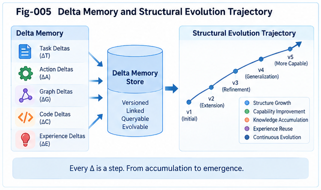

# TACG-SDIG-005 — Delta Memory, Folding, and Structural Evolution Trajectories

## Task–Action CallingGraph Structural Delta Intelligence and Growth

**TACG-SDIG**

---

## Abstract

A system that stores only structural states knows what systems looked like.

A system that also stores structural deltas can learn how systems changed.

A system that preserves ordered histories of those deltas can begin to reason about how systems evolve.

This article develops the persistent learning layer of **Task–Action CallingGraph Structural Delta Intelligence and Growth (TACG-SDIG)**.

The central progression is:

```text
Structural States
      ↓
Graph Minus
      ↓
Structural Deltas
      ↓
Delta Memory
      ↓
Delta Clustering
      ↓
Delta CCC
      ↓
Delta DNA
      ↓
Delta Trajectories
      ↓
Structural Evolution Intelligence
```

TACG-SDIG treats a validated structural delta as a first-class unit of engineering experience.

Historical deltas can be searched independently, clustered according to structural similarity, folded into reusable transformation patterns, and organized into ordered trajectories.

This produces four complementary memory systems:

```text
Structure Memory
Mapping Memory
Delta Memory
Trajectory Memory
```

Together they preserve:

* what systems are,
* how Task and Action structures correspond,
* how systems change,
* and how those changes evolve through time.

The resulting framework supports a broader proposition:

> **Code captures implementation states; structural deltas capture engineering change; delta trajectories capture engineering experience.**

---

# 1. From Structural State to Structural Experience

Traditional software repositories preserve many forms of state:

```text
source code
configuration
tests
documentation
version snapshots
```

Version-control systems also preserve textual differences.

But TACG-SDIG asks a different question:

> **Can engineering change itself become structured, searchable, foldable knowledge?**

Suppose a system evolves:

```text
S0
 ↓
S1
 ↓
S2
 ↓
S3
```

The states are useful.

But the transformations may contain more reusable intelligence:

```text
S0 --Δ1--> S1
S1 --Δ2--> S2
S2 --Δ3--> S3
```

Now the system can ask:

```text
What changed?

Why did it change?

How was the change implemented?

Was it successful?

What other changes accompanied it?

What happened next?
```

This is the foundation of Delta Memory.

---

# 2. The Four Memory Systems

The canonical TACG-SDIG knowledge model implies four major memory systems.

```text
┌──────────────────────────────────────┐
│          STRUCTURE MEMORY            │
│                                      │
│ What systems are                     │
│ Known TaskCGs / ActionCGs            │
└──────────────────────────────────────┘
                  ↓
┌──────────────────────────────────────┐
│           MAPPING MEMORY             │
│                                      │
│ How Task and Action correspond       │
│ Task ↔ Action mappings               │
└──────────────────────────────────────┘
                  ↓
┌──────────────────────────────────────┐
│            DELTA MEMORY              │
│                                      │
│ How systems change                   │
│ ΔT / ΔA / TADP                       │
└──────────────────────────────────────┘
                  ↓
┌──────────────────────────────────────┐
│         TRAJECTORY MEMORY            │
│                                      │
│ How changes evolve over time         │
│ Δ1 → Δ2 → Δ3 → ...                  │
└──────────────────────────────────────┘
```

These memories should not be viewed as isolated databases.

They form an interconnected structural experience system.

---

# 3. Structure Memory

Structure Memory stores reusable system states and structural patterns.

Examples include:

```text
TaskCG
ActionCG
Calling Paths
Subgraphs
CCC
DNA
Primitive Structures
Validated System States
```

It answers:

> **Where have we seen a structure like this before?**

This is the primary memory used by structural localization.

---

# 4. Mapping Memory

Mapping Memory preserves Task–Action correspondence.

Examples:

```text
Task Node ↔ Action Node

Task Path ↔ Action Path

Task Subgraph ↔ Action Subgraph

Task CCC ↔ Action CCC

Task DNA ↔ Action DNA
```

It answers:

> **How has this task intent historically been realized?**

and:

> **What task intent historically explains this implementation structure?**

Mapping Memory makes two-way reasoning possible.

---

# 5. Delta Memory

Delta Memory stores transformations rather than states.

Examples:

```text
Add Authorization

Add Retry

Add Audit

Introduce Rollback

Split Service

Migrate API

Remove Unsafe Path

Change Sync Call to Async Flow

Add Ownership Verification
```

It answers:

> **Where has this kind of structural change occurred before?**

This is a fundamentally different query from ordinary structure retrieval.

---

# 6. Trajectory Memory

Trajectory Memory stores ordered sequences of deltas.

For example:

```text
Open Endpoint
      ↓ Δ1
Authenticated Endpoint
      ↓ Δ2
Authorized Endpoint
      ↓ Δ3
Audited Endpoint
      ↓ Δ4
Rate-Limited Endpoint
```

It answers:

> **How have systems of this kind typically evolved?**

and potentially:

> **What structural change tends to come next?**

---



---

# 7. Delta as an Engineering Experience Unit

A raw graph edit is not necessarily a useful memory object.

Consider:

```text
add node X
remove edge A → B
add edge A → X
add edge X → B
```

These operations describe mechanics.

The engineering interpretation may be:

```text
Insert Authorization Guard
```

That interpretation is more reusable.

Therefore TACG-SDIG distinguishes:

```text
Raw Graph Edits
      ↓
Structural Delta
      ↓
Engineering Delta
```

The engineering delta is a candidate unit of reusable experience.

---

# 8. Canonical Delta Knowledge Unit

A persistent Delta Knowledge Unit should preserve more than the delta itself.

Conceptually:

```text
DeltaKnowledgeUnit
{
    deltaId,

    beforeStructure,
    delta,
    afterStructure,

    taskContext,
    actionContext,

    taskDelta,
    actionDelta,
    taskActionMapping,

    deltaCore,
    deltaHalo,

    entryBoundary,
    exitBoundary,

    constraints,
    policyContext,

    reason,
    evidence,
    counterEvidence,

    validation,
    runtimeOutcome,

    risk,
    rollbackStatus,

    version,
    timestamp
}
```

Not every implementation must store every field.

The principle is:

> **Preserve enough context to judge whether the historical transformation is reusable.**

---

# 9. Why Before and After States Matter

Suppose Delta Memory stores only:

```text
Add retry
```

Important information is lost.

The same delta may have been applied to:

```text
idempotent read
```

or:

```text
non-idempotent payment mutation
```

The outcomes may be radically different.

Therefore a Delta Knowledge Unit should ideally preserve:

```text
Before State
     ↓
Delta
     ↓
After State
```

This makes the transformation structurally interpretable.

---

# 10. Why Reason Matters

Engineering changes normally occur for a reason.

Examples:

```text
security hardening
performance optimization
bug repair
new requirement
compliance change
reliability improvement
migration
technical debt reduction
```

A delta without its reason knows:

```text
what changed
```

but may not know:

```text
why it changed
```

TaskCG and Task Delta are therefore important parts of Delta Memory.

---

# 11. Why Outcome Matters

A historical transformation may have been:

```text
successful
partially successful
revised
rejected
rolled back
superseded
```

Therefore:

> **Historical occurrence is not equivalent to historical endorsement.**

Delta Memory must preserve negative experience as well as positive experience.

---

# 12. Positive and Negative Delta Memory

Positive Delta Memory contains transformations with supporting outcomes.

Examples:

```text
validated fix
successful migration
stable security hardening
reusable architecture improvement
```

Negative Delta Memory contains:

```text
failed change
rejected change
rolled-back change
policy violation
security regression
performance regression
consistency failure
```

Both are valuable.

```text
Positive Memory
      +
Negative Memory
      ↓
Better Delta Decision
```

---

# 13. Counter-Evidence as Persistent Knowledge

Counter-evidence should not be searched only at runtime and then discarded.

Suppose:

```text
Delta:
Add Retry
```

Historical evidence may include:

```text
Case A:
Read API
Successful

Case B:
Object Store Fetch
Successful

Case C:
Payment Mutation
Duplicate Transaction Failure
```

The failed case becomes reusable counter-evidence.

Thus Delta Memory can preserve:

```text
supporting neighborhood
counter-evidence neighborhood
```

for future structural decisions.

---

# 14. Building Delta Memory from Historical Repositories

Existing repositories may not explicitly contain Delta Objects.

But they often contain:

```text
Version 1
Version 2
Version 3
...
```

TACG-SDIG can reconstruct structural change offline.

```text
Versioned States
      ↓
CallingGraph Extraction
      ↓
Structural Alignment
      ↓
Graph Minus
      ↓
Historical Delta Objects
```

This makes ordinary repository history a potential source of Delta Memory.

---

# 15. Historical Delta Reconstruction

Given:

```text
S0
S1
S2
S3
```

compute:

```text
Δ1 = S1 ⊖ S0

Δ2 = S2 ⊖ S1

Δ3 = S3 ⊖ S2
```

Then enrich the deltas using available information:

```text
requirements
commit descriptions
issues
tests
runtime results
review decisions
policy changes
incident reports
```

The result is:

```text
Version History
      ↓
Structural Delta History
```

---

# 16. Delta Extraction Is Not Enough

A large software history may produce enormous numbers of deltas.

Raw accumulation alone does not create intelligence.

The system therefore needs:

```text
Delta Representation
      ↓
Delta Similarity
      ↓
Delta Clustering
      ↓
Delta Folding
```

This is where Structural Folding becomes central.

---

# 17. Delta Structural Representation

To compare deltas, they must be represented structurally.

A delta representation may include:

```text
Delta Type

Before Pattern

After Pattern

Delta Core

Delta Halo

Entry Boundary

Exit Boundary

Task Meaning

Action Meaning

Constraints

Outcome
```

This allows two changes from different codebases to be recognized as structurally related.

---

# 18. Example — Surface Difference, Structural Similarity

Repository A:

```text
authenticateUser()
      ↓
checkProjectPermission()
      ↓
deleteProject()
```

Repository B:

```text
verifyIdentity()
      ↓
authorizeDocumentWrite()
      ↓
saveDocument()
```

At statement level these are different.

But both may instantiate:

```text
Delta CCC:
Insert Authorization Guard
before Privileged Operation
```

Structural folding aims to discover this shared transformation.

---

# 19. Delta Similarity Is Multi-Dimensional

Two deltas may be compared across several dimensions:

```text
Core Structural Similarity

Boundary Similarity

Task Semantic Similarity

Action Semantic Similarity

Constraint Similarity

Policy Similarity

Outcome Similarity

Trajectory Position Similarity
```

A single distance metric may combine several of these dimensions.

Alternatively, multiple perspectives may be maintained.

---

# 20. Delta Metric Space

Conceptually, each Delta Object can be represented as:

```text
D = {
    structural features,
    semantic features,
    contextual features,
    outcome features
}
```

Then:

```text
distance(D1, D2)
```

measures structural transformation similarity.

The exact metric is implementation-dependent.

The important idea is:

> **Delta itself becomes an object in a searchable metric space.**

---

# 21. Delta Clustering

Once deltas occupy a metric space, related transformations can be clustered.

For example:

```text
Δ1 Add permission check before update

Δ2 Add permission check before delete

Δ3 Add role check before export

Δ4 Add ownership check before write
```

may form:

```text
Authorization-Guard Delta Cluster
```

Another cluster may contain:

```text
Add retry around read API

Add retry around object-store fetch

Add retry around message publish
```

forming:

```text
Transient-Recovery Delta Cluster
```

---

# 22. Why Delta Clustering Matters

Without clustering:

```text
Delta Query
    ↓
Search millions of historical deltas
```

With clustering:

```text
Delta Query
    ↓
Relevant Delta Neighborhood
    ↓
Small Candidate Set
```

This provides the same broad structural-search advantage that CCC offers for other structural objects.

---

# 23. From Delta Cluster to Delta CCC

Repeated structural transformations can be folded into a reusable **Delta CCC**.

For example:

```text
Before:
Identity Known
      ↓
Privileged Action
```

repeatedly changes into:

```text
After:
Identity Known
      ↓
Authorization Gate
      ↓
Privileged Action
```

The common transformation becomes:

```text
Delta CCC:
Insert Authorization Gate
```

The CCC represents the recurring structural essence of the transformation.

---

# 24. Delta CCC as Transformation Knowledge

A conventional CCC may represent:

```text
recurring state structure
```

A Delta CCC represents:

```text
recurring transformation structure
```

This distinction is important.

```text
State CCC:
What repeatedly exists?

Delta CCC:
What repeatedly changes?
```

Thus structural folding expands from state knowledge into transformation knowledge.

---

# 25. Delta CCC Example — Security Hardening

Historical instances:

```text
Open Endpoint
→ Authenticated Endpoint

Unprotected Admin Call
→ Authenticated Admin Call

Anonymous Data Export
→ Authenticated Data Export
```

may fold into:

```text
Security Hardening Delta CCC:

Insert Identity Verification
before Protected Operation
```

A richer CCC may later include:

```text
Authentication
Authorization
Audit
```

as a composite security-hardening transformation.

---

# 26. Delta CCC Example — Reliability

Historical deltas:

```text
Remote Read
→ Retry Remote Read

Storage Fetch
→ Retry Storage Fetch

Message Publish
→ Retry Message Publish
```

may form:

```text
Transient Failure Recovery Delta CCC
```

But negative memory may reveal:

```text
Non-Idempotent Mutation
→ Blind Retry
```

as a counter-example.

Thus the Delta CCC should not erase contextual constraints.

---

# 27. Context-Preserving Delta Folding

Over-generalized folding is dangerous.

For example:

```text
Retry
```

should not be folded into:

```text
Always retry failures
```

Instead, the folded structure may preserve conditions such as:

```text
Transient Failure
+
Retryable Operation
+
Idempotent or Protected Mutation
```

leading to:

```text
Retry Delta CCC
{
    applicableContext,
    transformation,
    exclusions,
    companionDeltas
}
```

This is **context-preserving folding**.

---

# 28. Companion Delta Memory

Some deltas frequently require other deltas.

Example:

```text
Primary Delta:
Introduce asynchronous messaging
```

may frequently co-occur with:

```text
Add idempotency

Add retry

Add dead-letter handling

Add observability
```

The folded knowledge should preserve these relationships.

```text
Primary Delta CCC
      ↓
Companion Delta Set
```

This makes future reconstruction more complete.

---

# 29. Delta DNA

A Delta CCC may be assigned a compact structural identity:

```text
Delta DNA
```

The purpose is fast runtime localization and dispatch.

Conceptually:

```text
Raw Delta
    ↓
Structural Encoding
    ↓
Delta DNA
    ↓
Candidate Delta CCC
```

Delta DNA does not replace full structural comparison.

It narrows the search.

---

# 30. Two-Phase Delta Retrieval

Delta DNA naturally supports:

```text
PHASE 1
Fast DNA Dispatch
      ↓
Relevant Delta Cluster / CCC

PHASE 2
Detailed Comparison
      ↓
Boundary
Context
Task Meaning
Action Meaning
Constraints
Evidence
Outcome
```

This follows the broader TACG-SDIG principle:

> **Dispatch first; validate structurally second.**

---

# 31. Delta Memory Hierarchy

A useful hierarchy is:

```text
Raw Graph Edit
      ↓
Atomic Delta
      ↓
Structural Delta
      ↓
Task–Action Delta Pair
      ↓
Composite Delta
      ↓
Delta Episode
      ↓
Delta Cluster
      ↓
Delta CCC
      ↓
Delta DNA
```

Time then adds another dimension:

```text
Delta Episode
      ↓
Delta Trajectory
```

---

# 32. Delta Episode

A Delta Episode represents one bounded engineering event.

Examples:

```text
security patch
feature addition
migration step
bug repair
refactoring event
policy update
```

A Delta Episode may contain several coordinated deltas.

Conceptually:

```text
DeltaEpisode
{
    beforeState,

    taskDeltas,
    actionDeltas,
    mappings,

    compositeDelta,

    afterState,

    reason,
    evidence,
    outcome
}
```

This is a natural unit for engineering history.

---

# 33. From Delta Episodes to Trajectories

Suppose a service evolves through several episodes.

```text
Episode 1:
Add Authentication

Episode 2:
Add Authorization

Episode 3:
Add Audit

Episode 4:
Add Rate Limiting
```

The ordered sequence becomes:

```text
Security Evolution Trajectory
```

The order matters.

A trajectory is not merely a bag of deltas.

---

# 34. Canonical Definition of Delta Trajectory

Let:

```text
S0 --Δ1--> S1
S1 --Δ2--> S2
...
Sn-1 --Δn--> Sn
```

Then define:

```text
T = <Δ1, Δ2, ..., Δn>
```

as a **Structural Delta Trajectory**.

A canonical interpretation is:

> **A trajectory is an ordered history of validated or observed deltas over evolving structure.**

---

# 35. Structure History as Initial State Plus Delta Sequence

A structural history can therefore be represented as:

```text
History =
Initial Structure
+
Ordered Delta Sequence
```

or conceptually:

```text
H = S0 + <Δ1, Δ2, ..., Δn>
```

This is often more informative than storing isolated snapshots alone.

---

# 36. States and Deltas Are Complementary

It would be incorrect to argue that deltas make states unnecessary.

States answer:

```text
What is the system now?
```

Deltas answer:

```text
How did it become this?
```

Trajectories answer:

```text
How has the system evolved?
```

Therefore:

> **Structures describe states.**

> **Deltas describe change.**

> **Trajectories describe evolution.**

---

# 37. Delta History as Engineering Trajectory

Consider:

```text
V1
Open endpoint
```

then:

```text
Δ1:
Add authentication
```

then:

```text
Δ2:
Add authorization
```

then:

```text
Δ3:
Add audit
```

then:

```text
Δ4:
Add rate limiting
```

The final state is useful.

But the ordered sequence also reveals a recognizable engineering story:

```text
Exposure
→ Identity
→ Permission
→ Accountability
→ Abuse Control
```

This is structural engineering experience.

---

# 38. Architectural Evolution Trajectory

Another example:

```text
Monolithic Module
      ↓
Define Internal Boundary
      ↓
Extract Interface
      ↓
Separate State
      ↓
Extract Service
      ↓
Add Network Call
      ↓
Add Resilience
      ↓
Add Observability
```

This trajectory contains reusable migration knowledge.

A future system at:

```text
Define Internal Boundary
```

may search historical trajectories for likely next transformations.

---

# 39. Reliability Evolution Trajectory

Example:

```text
Direct Remote Call
      ↓
Timeout
      ↓
Retry
      ↓
Idempotency
      ↓
Circuit Breaker
      ↓
Fallback
      ↓
Observability
```

The trajectory may reveal not only individual improvements but common ordering relationships.

---

# 40. Trajectory Search

Trajectory Memory enables queries such as:

```text
Find systems that began with this structure
and evolved toward this target.

Find historical trajectories containing
this delta sequence.

Find trajectories where authorization
was followed by audit.

Find migrations similar to the
current architecture transition.
```

This is richer than single-delta retrieval.

---

# 41. Prefix Localization

Suppose the current system has evolved:

```text
Open
→ Authenticated
→ Authorized
```

Historical trajectories may contain:

```text
Open
→ Authenticated
→ Authorized
→ Audited
```

and:

```text
Open
→ Authenticated
→ Authorized
→ Rate Limited
```

The current history becomes a trajectory prefix.

The runtime can localize:

```text
Current Trajectory Prefix
      ↓
Historical Trajectory Neighborhood
      ↓
Candidate Next Deltas
```

---

# 42. Next-Delta Recommendation

Trajectory Memory can support:

```text
Current Structure
+
Recent Delta History
+
Task Goal
+
Constraints
      ↓
Candidate Next Delta
```

This is not merely statistical next-step prediction.

The candidate should still pass:

```text
Task compatibility
Action feasibility
Reachability
Policy
Counter-evidence
```

Trajectory evidence proposes; structural validation decides.

---

# 43. Delta Decision Intelligence

This leads to a general decision problem:

> **Given current structure S and desired target G, which historical delta or delta trajectory best moves S toward G under current constraints?**

Conceptually:

```text
Current Structure S
      ↓
Desired Structure G
      ↓
Graph Minus
      ↓
Required Delta
      ↓
Delta / Trajectory Search
      ↓
Candidate Evolution Paths
      ↓
Constraint Evaluation
      ↓
Recommended Structural Growth
```

This is **Delta Decision Intelligence**.

---

# 44. Trajectory Distance

Two trajectories may be compared structurally.

Possible dimensions include:

```text
Delta Sequence Similarity

State Transition Similarity

Task Evolution Similarity

Action Evolution Similarity

Outcome Similarity

Policy Evolution Similarity

Timing / Ordering Similarity
```

A trajectory distance need not be one universal metric.

Different analytical perspectives may define different neighborhoods.

---

# 45. Multi-Perspective Trajectory Analysis

For the same system history:

```text
Security Perspective
      ↓
Authentication
Authorization
Audit
Privilege Reduction

Reliability Perspective
      ↓
Timeout
Retry
Fallback
Recovery

Architecture Perspective
      ↓
Boundary
Interface
Service Extraction
```

Thus one engineering history may support several overlapping trajectory views.

This mirrors multi-perspective structural folding.

---

# 46. Trajectory CCC

Repeated trajectories may themselves form higher-order patterns.

For example:

```text
Open
→ Authenticate
→ Authorize
→ Audit
```

may recur across many systems.

These sequences can be folded into:

```text
Security Maturation Trajectory CCC
```

Likewise:

```text
Direct Call
→ Timeout
→ Retry
→ Circuit Breaker
```

may become:

```text
Remote-Call Reliability Trajectory CCC
```

This extends structural folding one level further.

---

# 47. From Delta CCC to Trajectory CCC

The hierarchy becomes:

```text
Raw Change
      ↓
Delta
      ↓
Delta CCC
      ↓
Ordered Delta CCCs
      ↓
Trajectory CCC
```

This represents not merely recurring transformations but recurring **evolution patterns**.

---

# 48. Trajectory DNA

A mature implementation may eventually define compact trajectory identities.

Conceptually:

```text
Trajectory
      ↓
Structural Compression
      ↓
Trajectory DNA
      ↓
Fast Evolution-Pattern Dispatch
```

This remains a future implementation direction, but follows naturally from the structural folding framework.

---

# 49. Delta Trajectory and Human Engineering Experience

Senior engineers often remember systems not only as static architectures but as histories.

For example:

```text
We first added retry.

Then duplicate requests appeared.

So we added idempotency.

Later the downstream service became unstable.

Then we added circuit breaking.
```

This memory is inherently trajectory-shaped.

It contains:

```text
state
change
outcome
next change
```

TACG-SDIG makes that experience structurally explicit.

---

# 50. Engineering Evolution Memory

This motivates a broader concept:

> **Engineering Evolution Memory**

Engineering Evolution Memory preserves:

```text
what existed,
what changed,
why it changed,
what happened,
what changed next.
```

This is richer than:

```text
code repository
```

and richer than:

```text
solution-pattern library
```

because it preserves transformation history.

---

# 51. Delta Memory as Senior-Engineer Knowledge

Much of senior engineering expertise can be expressed in statements such as:

```text
When this changes,
that usually also needs to change.

This fix works only if this condition holds.

We tried that migration before,
but this dependency caused failure.

After adding this feature,
we usually need this governance step.

This architectural move is often
followed by another move.
```

These are naturally represented as:

```text
Delta
Companion Delta
Counter-Evidence
Constraint
Trajectory
```

Thus Delta Memory provides an engineering representation for accumulated experience.

---

# 52. From Human Experience to Folded Delta Knowledge

The learning path can be:

```text
Human Engineering Experience
      ↓
Historical Changes
      ↓
Task / Action Structuralization
      ↓
Graph Minus
      ↓
Delta Episodes
      ↓
Delta Folding
      ↓
Delta CCC / DNA
      ↓
Trajectory Memory
```

This makes TACG-SDIG a potential platform for preserving and evolving senior coding knowledge.

---

# 53. Continual Structural Growth

A system using TACG-SDIG can accumulate new experience continuously.

Each successful episode provides:

```text
Before
      ↓
Validated Delta
      ↓
After
      ↓
Outcome
```

The episode is folded back.

Over time:

```text
More Episodes
      ↓
Better Delta Clusters
      ↓
Better Delta CCC
      ↓
Better Dispatch
      ↓
Better Candidate Reconstruction
```

This forms a continual structural learning loop.

---

# 54. The Fold-Back Loop

The canonical loop is:

```text
Existing Folded Memory
      ↓
Localization
      ↓
Graph Minus
      ↓
Delta Search
      ↓
Candidate Reconstruction
      ↓
Validation
      ↓
Growth
      ↓
Runtime Outcome
      ↓
Fold Back
      ↺
```

The Fold Back stage may update:

```text
Structure Memory
Mapping Memory
Delta Memory
Trajectory Memory
```

simultaneously.

---

# 55. Successful Growth Updates Structure Memory

Suppose:

```text
S0 + Δ → S1
```

and `S1` is validated.

Then `S1` becomes a candidate new known structure.

```text
Validated S1
      ↓
Structure Memory
```

---

# 56. Successful Mapping Updates Mapping Memory

If:

```text
ΔT ↔ ΔA
```

is validated, the correspondence can be stored.

```text
Validated TADP
      ↓
Mapping Memory
```

---

# 57. Successful Delta Updates Delta Memory

The transformation itself becomes reusable.

```text
S0
 ↓ Δ
S1
```

is stored as a Delta Knowledge Unit.

---

# 58. Successful Episode Updates Trajectory Memory

If `S0` already has a history:

```text
Δ1 → Δ2 → Δ3
```

and the new change is:

```text
Δ4
```

then:

```text
Δ1 → Δ2 → Δ3 → Δ4
```

extends the trajectory.

Thus one engineering event may update all four memories.

---

# 59. Failed Growth Also Updates Memory

Failure should also be folded.

Suppose:

```text
Candidate Δ
      ↓
Validation
      ↓
Failure
```

The system should preserve:

```text
candidate structure
failure condition
counter-evidence
rollback
context
```

This can prevent future repetition.

Therefore:

> **Structural learning includes successful growth and rejected growth.**

---

# 60. Three-Cat View of Delta Learning

A simple structural learning classification can be:

```text
CAT A
Successful / Supported Delta

CAT B
Failed / Opposed Delta

CAT C
Unknown / Insufficient Evidence
```

New runtime evidence can move a delta between categories or refine its context.

This provides a simple mechanism for continual structural learning.

---

# 61. Delta Memory Should Preserve Uncertainty

Not every historical transformation has a definitive interpretation.

A delta may have:

```text
strong evidence
mixed evidence
limited evidence
conflicting evidence
unknown outcome
```

Therefore Delta Memory should preserve uncertainty rather than prematurely collapse it.

For example:

```text
Delta Evidence:
Support = Medium
Counter-Evidence = Low
Runtime Coverage = Limited
```

This allows later evidence to refine the structural knowledge.

---

# 62. Recovering Confidence Through Runtime Evidence

A candidate may initially have uncertain confidence.

After:

```text
tests
simulation
deployment
runtime observation
```

the system gains evidence.

Thus:

```text
Uncertain Candidate Delta
      ↓
Validation / Execution
      ↓
Observed Outcome
      ↓
Updated Delta Confidence
```

This fits the broader principle of recovering confidence through evidence rather than demanding perfect certainty at initial unfolding.

---

# 63. Delta Memory and Compliance

Delta Memory also supports governance.

Suppose a certified baseline evolves:

```text
Certified S0
      ↓
Δ1
      ↓
S1
```

The governance system can preserve:

```text
what changed
what policy was evaluated
what evidence was used
what review decision occurred
```

Future similar changes can retrieve that history.

---

# 64. Governance Delta Memory

Examples include:

```text
Privilege Expansion Delta

External Data Transfer Delta

Authentication Removal Delta

Authorization Change Delta

Audit Removal Delta

Sensitive Data Flow Delta
```

These may form dedicated high-risk Delta CCCs.

A new delta can then be dispatched directly into a relevant governance neighborhood.

---

# 65. Compliance Trajectory

Governance itself may evolve through a trajectory.

Example:

```text
No Authentication
      ↓
Authentication
      ↓
Authorization
      ↓
Audit
      ↓
Fine-Grained Policy
      ↓
Continuous Monitoring
```

This can be represented as a compliance maturation trajectory.

Such trajectories may support both analysis and planning.

---

# 66. Risk Trajectory

The reverse can also occur.

```text
Strong Guard
      ↓
Guard Relaxed
      ↓
Audit Removed
      ↓
Privilege Expanded
```

Individually, each delta may appear manageable.

Together they may form a concerning trajectory.

Therefore:

> **Trajectory analysis can detect risk that isolated delta analysis may miss.**

---

# 67. Trajectory-Level Counter-Evidence

Counter-evidence can also exist at trajectory level.

A sequence may historically produce poor outcomes even when each individual delta appears reasonable.

For example:

```text
Aggressive Cache
      ↓
Longer TTL
      ↓
Broader Cache Scope
      ↓
Consistency Failure
```

The dangerous knowledge is the trajectory, not necessarily one isolated step.

---

# 68. Delta Memory and Code Compliance Scaling

Full-system compliance analysis can be expensive.

Delta Memory enables a more focused strategy:

```text
Known Reviewed Baseline
      ↓
New Structural Delta
      ↓
Delta CCC Dispatch
      ↓
Relevant Policy Neighborhood
      ↓
Focused Structural Review
```

Historical governance outcomes can further prioritize review.

This is **Delta-Scoped Governance**.

---

# 69. Delta Risk Score

A Delta Knowledge Unit may include a risk profile based on:

```text
privilege impact
data sensitivity
external reachability
guard modification
mapping inconsistency
historical failures
policy sensitivity
```

This can guide governance effort.

For example:

```text
Rename Internal Helper
      ↓
Low Structural Risk

Add Authorization Gate
      ↓
Medium / High Review Value

Remove Authentication
      ↓
Critical Structural Review
```

The exact score should remain policy-dependent.

---

# 70. Delta Memory as a Search Domain of Its Own

Delta Memory should not be treated merely as a secondary index attached to source code.

It supports independent questions such as:

```text
Show all historical authorization additions.

Find migrations from sync to async.

Find all deltas that introduced rollback.

Find changes that added external data flow.

Find deltas that were later reversed.

Find transformations followed by security incidents.

Find successful paths from architecture A to architecture B.
```

This creates a distinct **Structural Delta Retrieval** domain.

---

# 71. Delta Search Across Systems

Because Delta CCC abstracts from surface implementation, search may cross:

```text
repositories
services
teams
languages
frameworks
domains
```

For example:

```text
Java service
Python service
Go service
```

may all contain structurally similar:

```text
Insert Authorization Gate
```

deltas.

This is one route toward reusable cross-system engineering experience.

---

# 72. Cross-Domain Delta Intelligence

At an even more general level, the same structural idea may appear outside software.

Examples:

```text
Before State
      ↓
Meaningful Delta
      ↓
After State
```

occurs in:

```text
markets
biological systems
organizations
engineering systems
policy systems
historical events
```

TACG-SDIG is focused on Task–Action CallingGraphs and AI coding.

But Delta Memory itself points toward a broader Structural Delta Intelligence framework.

---

# 73. Delta History and Trajectory Intelligence

The connection to Trajectory Intelligence can now be stated precisely.

A trajectory may be represented as:

```text
T = <Δ1, Δ2, ..., Δn>
```

where each `Δi` is a meaningful structural transition.

Thus:

> **Delta is the local unit of structural change.**

> **Trajectory is the ordered composition of structural change.**

This provides a natural bridge between Structural Folding and Trajectory Intelligence.

---

# 74. Structural State Space and Delta Paths

Consider a structural state space:

```text
          S3
         /
S0 → S1
         \
          S2 → S4
```

Each edge is a delta.

A trajectory is a path through the state space.

```text
S0 --Δ1--> S1 --Δ2--> S3
```

or:

```text
S0 --Δ1--> S1 --Δ3--> S2 --Δ4--> S4
```

Decision intelligence can compare these paths.

---

# 75. Delta as the Edge of Structural Evolution

This suggests a useful interpretation:

```text
Structural State
      = node

Structural Delta
      = transition edge

Delta Trajectory
      = path

Structural Evolution
      = movement through the graph
```

This creates a unified representation of state, change, and history.

---

# 76. Trajectory Decision Problem

Given:

```text
Current State S

Desired Goal G
```

the system may search:

```text
S
 ↓
Historical Delta Paths
 ↓
Candidate Trajectories
 ↓
G-like States
```

Candidates can be ranked by:

```text
goal compatibility
structural feasibility
historical success
risk
cost
policy
trajectory length
```

This extends single-delta decision intelligence into trajectory planning.

---

# 77. Shortest Path Is Not Always Best Path

A minimal number of deltas may not be the safest trajectory.

For example:

```text
Path A:
Δ1 → Δ2
```

may be short but high risk.

```text
Path B:
Δ3 → Δ4 → Δ5
```

may be longer but better validated.

Thus trajectory selection should not collapse into simple shortest-path search.

---

# 78. Structural Evolution Is Constraint-Governed

A candidate trajectory must respect:

```text
Task constraints
Action feasibility
Intermediate reachability
Policy constraints
Security constraints
Resource constraints
```

at each meaningful step.

Thus:

```text
Evolution
≠
arbitrary graph transformation
```

Instead:

> **Structural growth is constrained movement through a space of feasible deltas.**

---

# 79. Delta Trajectory and Primitive Forward Walking

When no historical trajectory fully reaches the goal:

```text
Historical Trajectory
      ↓
Partial Coverage
      ↓
Residual Delta
      ↓
Primitive Forward Walking
```

New steps can be constructed from:

```text
1C Task Primitives
1F Action Primitives
```

If successful, the new path becomes part of Trajectory Memory.

Thus the system can extend beyond its historical experience while remaining structurally grounded.

---

# 80. Trajectory Growth and Fold Back

Suppose:

```text
Historical:
S0 --Δ1--> S1 --Δ2--> S2
```

A new validated step is discovered:

```text
S2 --Δ3--> S3
```

Then:

```text
S0 --Δ1--> S1 --Δ2--> S2 --Δ3--> S3
```

becomes a new trajectory.

This is a direct mechanism of structural knowledge growth.

---

# 81. Structural Self-Growth

Repeated Fold Back creates a system capable of expanding its own structural memory.

```text
Existing Memory
      ↓
Solve New Delta
      ↓
Validate
      ↓
Store New Delta
      ↓
Extend Trajectory
      ↓
Improve Future Search
```

This is a practical form of **Structural Self-Growth**.

It does not require unconstrained self-modification.

Growth occurs through validated structural experience.

---

# 82. Local Growth Rather Than Global Retraining

One attractive property of Delta Memory is locality.

A new experience may update:

```text
one Delta Cluster
one Delta CCC
one Mapping neighborhood
one Trajectory branch
```

rather than requiring complete global reconstruction.

Conceptually:

```text
New Experience
      ↓
Local Structural Delta
      ↓
Local Memory Update
```

This fits the broader Structural Intelligence emphasis on local growth and localization.

---

# 83. Brain-Unit Interpretation

A specialized AI coding Brain Unit may maintain:

```text
Task Structure Memory
Action Structure Memory
Mapping Memory
Delta Memory
Trajectory Memory
```

Different Brain Units may specialize in:

```text
security
database
distributed systems
API design
testing
performance
```

Each can accumulate domain-specific Delta CCCs and trajectories.

This provides one route toward specialist structural intelligence.

---

# 84. Collective Delta Learning

Multiple systems or teams may contribute validated structural experience.

Conceptually:

```text
Engineer A Deltas
Engineer B Deltas
Project C Deltas
Project D Deltas
        ↓
Normalization
        ↓
Delta Folding
        ↓
Shared Delta CCC
```

This creates a possible basis for **Collective Engineering Delta Intelligence**.

Appropriate privacy, provenance, policy, and trust controls would be necessary.

---

# 85. Provenance Must Be Preserved

Folded knowledge should retain links to source evidence.

A Delta CCC should ideally allow navigation back to:

```text
historical instances
source systems
validation evidence
negative cases
outcomes
```

This prevents folding from becoming unsupported abstraction.

---

# 86. Folded Knowledge Should Remain Revisable

A Delta CCC may initially appear valid.

Later evidence may reveal an exception.

Therefore:

```text
New Counter-Evidence
      ↓
CCC Re-Evaluation
      ↓
Boundary Refinement
or
Cluster Split
```

Folded knowledge should be capable of structural evolution itself.

---

# 87. Delta CCC Growth

Suppose an initial CCC is:

```text
Retry Failed Remote Call
```

New failures reveal that this is too broad.

The CCC may evolve into:

```text
Retry Transient Failure
when Operation Is Idempotent
or Protected by Idempotency Control
```

This is an example of knowledge growth through counter-evidence.

---

# 88. Delta Cluster Splitting

A single cluster may eventually divide.

For example:

```text
Retry Deltas
```

may split into:

```text
Read Retry CCC

Idempotent Mutation Retry CCC

Message Delivery Retry CCC
```

This is structural learning at the memory organization level.

---

# 89. Delta Cluster Merging

Conversely, apparently different delta groups may later reveal a common higher-level transformation.

For example:

```text
Permission Check Addition

Ownership Check Addition

Role Check Addition
```

may merge under:

```text
Authorization Guard CCC
```

while preserving specialized child structures.

---

# 90. Hierarchical Delta Memory

Delta Memory can therefore become hierarchical:

```text
Structural Change
      ↓
Security Delta
      ↓
Authorization Delta
      ↓
Ownership Authorization Delta
```

or:

```text
Structural Change
      ↓
Reliability Delta
      ↓
Recovery Delta
      ↓
Retry Delta
```

This hierarchy can improve both localization and explanation.

---

# 91. Delta Tree and Multi-View Organization

One universal hierarchy may be insufficient.

The same delta may belong to multiple views:

```text
Security View
Reliability View
Architecture View
Policy View
Performance View
```

Therefore Delta Memory may support overlapping structural organizations rather than one rigid taxonomy.

---

# 92. Canonical Offline Folding Pipeline

A first offline Delta Folding pipeline can be expressed as:

```text
Historical Repositories
      ↓
1. Extract TaskCG / ActionCG States
      ↓
2. Align Consecutive or Related States
      ↓
3. Apply Graph Minus
      ↓
4. Isolate Delta Core / Halo
      ↓
5. Build ΔT / ΔA / TADP
      ↓
6. Attach Context / Evidence / Outcome
      ↓
7. Structuralize Delta Objects
      ↓
8. Compute Delta Similarity
      ↓
9. Cluster Deltas
      ↓
10. Build Delta CCC
      ↓
11. Build Delta DNA
      ↓
12. Reconstruct Delta Trajectories
      ↓
13. Build Trajectory Patterns
      ↓
14. Publish to Runtime Memory
```

---

# 93. Canonical Online Learning Pipeline

At runtime:

```text
New Problem
      ↓
Localization
      ↓
Graph Minus
      ↓
Delta Search
      ↓
Candidate Reconstruction
      ↓
Validation
      ↓
Observed Outcome
      ↓
New Delta Episode
      ↓
Local Fold Back
      ↓
Updated Delta / Trajectory Memory
```

This connects offline historical folding with online continual growth.

---

# 94. Offline and Online Roles

Offline folding is suited for:

```text
large repository mining
historical reconstruction
clustering
CCC discovery
trajectory discovery
```

Online growth is suited for:

```text
local candidate validation
new episode insertion
local cluster update
confidence update
trajectory extension
```

This separation can improve engineering scalability.

---

# 95. Delta Memory and Search-Space Reduction

As Delta Memory matures, the runtime can move from:

```text
Requirement
      ↓
Large Code Search Space
```

toward:

```text
Requirement
      ↓
Task Localization
      ↓
Graph Minus
      ↓
Delta DNA
      ↓
Small Delta Neighborhood
      ↓
Historical TADP
```

The richer the Delta Memory, the less often broad generation may be necessary.

---

# 96. Delta Memory and Explainability

A candidate recommendation can be explained through provenance.

For example:

```text
Recommended:
Add authorization before update.
```

Explanation:

```text
Task Delta:
Owner-only modification required.

Historical Delta CCC:
Authorization Guard.

Closest Historical TADP:
Resource update authorization.

Counter-Evidence:
No relevant conflicting case found
under current constraints.

Companion Delta:
Audit recommended.

Historical Outcome:
Validated in related structures.
```

This is structurally grounded explanation.

---

# 97. Delta Memory and AI Coding Education

Delta trajectories can also teach engineering evolution.

Instead of showing only a final architecture, a learner can inspect:

```text
initial system
      ↓
problem
      ↓
delta
      ↓
result
      ↓
next problem
      ↓
next delta
```

This mirrors how engineering expertise is often acquired.

Thus TACG-SDIG may support not only AI coding but also engineering education.

---

# 98. Canonical Memory Loop

The complete memory loop is:

```text
STRUCTURE MEMORY
      ↓
Localization
      ↓
GRAPH MINUS
      ↓
DELTA MEMORY
      ↓
Candidate Search
      ↓
Growth
      ↓
New Structure
      ↓
New Mapping
      ↓
New Delta Episode
      ↓
TRAJECTORY MEMORY
      ↓
FOLD BACK
      ↺
```

---

# 99. Canonical Structural Evolution Stack

The progression can be summarized as:

```text
Level 0
Raw Code / Requirements

Level 1
TaskCG / ActionCG

Level 2
Task–Action Mapping

Level 3
Structural Delta

Level 4
Task–Action Delta Pair

Level 5
Delta Episode

Level 6
Delta Cluster

Level 7
Delta CCC

Level 8
Delta DNA

Level 9
Delta Trajectory

Level 10
Trajectory CCC

Level 11
Structural Evolution Intelligence
```

---

# 100. Three Levels of Knowledge

A compact interpretation is:

```text
STATE KNOWLEDGE
What is?

CHANGE KNOWLEDGE
How does it change?

EVOLUTION KNOWLEDGE
How does change itself develop?
```

TACG-SDIG spans all three.

---

# 101. From Code Memory to Evolution Memory

The conceptual progression is:

```text
Code Memory
      ↓
CallingGraph Memory
      ↓
Task–Action Structural Memory
      ↓
Delta Memory
      ↓
Trajectory Memory
      ↓
Engineering Evolution Memory
```

Each step adds a new dimension of reusable intelligence.

---

# 102. A Stronger Unit of AI Coding Learning

Traditional learning objects may include:

```text
token
statement
function
file
program
```

Structural Intelligence adds:

```text
CallingGraph
CCC
DNA
```

TACG-SDIG adds another important object:

```text
Validated Structural Delta
```

This motivates the proposition:

> **The basic learning unit of AI coding may be not only code or CallingGraph, but a validated structural delta.**

Because a validated delta contains:

```text
where the system was,
what needed to change,
how it changed,
and whether the change worked.
```

---

# 103. The Engineering Meaning of Delta History

A sequence of code snapshots tells us:

```text
what existed at different times.
```

A sequence of meaningful structural deltas tells us:

```text
how engineering decisions accumulated.
```

This difference is important.

> **Code history is a record of versions.**

> **Delta history can become a record of engineering evolution.**

---

# 104. Canonical Principles

## Principle 1 — Preserve Change as Knowledge

Do not discard validated structural differences after use.

## Principle 2 — Store Context with Delta

Transformation without context is difficult to reuse safely.

## Principle 3 — Preserve Negative Experience

Failure and rollback are first-class structural evidence.

## Principle 4 — Fold Transformations, Not Only States

Recurring changes can form Delta CCC and Delta DNA.

## Principle 5 — Preserve Order

Delta order creates trajectory knowledge.

## Principle 6 — Validate Trajectory Steps

A good final state does not guarantee safe intermediate states.

## Principle 7 — Fold Back Runtime Experience

Successful and failed episodes should improve future search.

## Principle 8 — Keep Folded Knowledge Revisable

Counter-evidence may refine, split, or merge Delta CCCs.

---

# 105. Canonical Statements

The TACG-SDIG memory model can be summarized as:

> **Structure Memory tells us what systems are.**

> **Mapping Memory tells us how intent and implementation correspond.**

> **Delta Memory tells us how systems change.**

> **Trajectory Memory tells us how those changes evolve.**

And:

> **Fold not only what systems look like, but how systems change.**

And:

> **Structures describe states. Deltas describe change. Trajectories describe evolution.**

And:

> **Code tells AI what the system is; Delta tells AI how the system grows.**

---

# 106. Integration with the Fold–Unfold Loop

The complete TACG-SDIG learning architecture can now be written as:

```text
Historical Experience
      ↓
Structural Folding
      ↓
Structure / Mapping / Delta / Trajectory Memory
      ↓
Runtime Localization
      ↓
Graph Minus
      ↓
Delta Localization
      ↓
Two-Way Delta Search
      ↓
Candidate Unfolding
      ↓
Counter-Evidence
      ↓
Reachability / Feasibility / Policy
      ↓
Validated Growth
      ↓
Runtime Outcome
      ↓
Fold Back
      ↺
```

This closes the structural intelligence loop.

---

# 107. Conclusion

TACG-SDIG extends CallingGraph intelligence from structural states to structural transformation and evolution.

Graph Minus converts differences between structural states into explicit Delta Objects.

Delta Memory preserves those transformations as reusable engineering experience.

Structural Folding organizes recurring transformations into:

```text
Delta Clusters
Delta CCC
Delta DNA
```

Ordered Delta Episodes form:

```text
Delta Trajectories
```

and recurring trajectories can eventually form higher-order evolution patterns.

The resulting progression is:

```text
State
 ↓
Delta
 ↓
Delta Memory
 ↓
Delta Folding
 ↓
Trajectory
 ↓
Structural Evolution Intelligence
```

This creates an important shift in how AI coding knowledge can be represented.

A mature system should not only know:

> **What code exists?**

or:

> **What CallingGraph resembles the target?**

It should also know:

> **How have systems like this changed before?**

> **Which changes succeeded?**

> **Which changes failed?**

> **Which changes tend to occur together?**

> **Which structural trajectory best moves the current system toward the desired state?**

This is the deeper purpose of Delta Memory.

> **Code captures implementation states.**

> **Structural deltas capture engineering change.**

> **Delta trajectories capture engineering experience.**

And when successful and failed transformations are continually folded back:

> **Structural memory becomes structural evolution memory.**

---

## Next Article

**TACG-SDIG-006 — Delta-Scoped Governance, Compliance, and Security Intelligence**

The next article develops the governance side of TACG-SDIG: using Task–Action cross-plane consistency, Graph Minus, Delta Core and Delta Halo, risky-path localization, policy-conditioned delta analysis, and historical counter-evidence to focus compliance and security reasoning on the structural change frontier.
