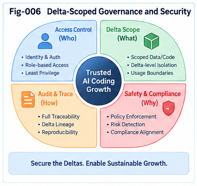

# TACG-SDIG-006 — Delta-Scoped Structural Governance and Security

## Task–Action CallingGraph Structural Delta Intelligence and Growth

**TACG-SDIG**

---

## Abstract

AI coding increases the speed at which software can be generated and modified. That increase creates a corresponding governance problem:

> **How can structural compliance and security analysis scale with rapidly growing code change?**

TACG-SDIG proposes **Delta-Scoped Structural Governance**.

Instead of treating every new version as an entirely new system, the framework begins from a known, reviewed, certified, or otherwise trusted structural baseline and asks:

```text
What structurally changed?
```

Graph Minus isolates the change frontier.

The resulting Task and Action deltas are then analyzed together with:

* Delta Core,
* Delta Halo,
* Task–Action mappings,
* newly introduced or removed paths,
* reachability,
* feasibility,
* policy requirements,
* known risky structures,
* historical counter-evidence,
* and Delta Trajectories.

The canonical governance pattern is:

```text
Reviewed Baseline
      ↓
New TaskCG / ActionCG
      ↓
Graph Minus
      ↓
Governance-Relevant Delta
      ↓
Delta Halo Expansion
      ↓
Task ↔ Action Cross-Audit
      ↓
Reachability / Policy / Security Analysis
      ↓
Counter-Evidence Search
      ↓
Risk-Conditioned Validation
      ↓
Governance Decision
```

This does not claim that delta-scoped analysis can replace whole-system security review, testing, formal verification, or specialist judgment.

Its purpose is different:

> **Use structural change to determine where governance attention should concentrate.**

The result is a scalable structural governance layer for AI coding.

---

# 1. The Governance Problem of AI Coding

AI coding can accelerate:

```text
code generation
refactoring
migration
repair
feature development
test generation
architecture modification
```

But faster code change also means faster production of:

```text
new paths
new dependencies
new privileges
new external calls
new state transitions
new failure modes
new policy interactions
```

The central governance problem is therefore not only:

> Is this code syntactically or locally correct?

It is also:

> **What changed in the system's reachable behavior, and does that change remain consistent with task intent, policy, and security constraints?**

---

# 2. From Whole-System Review to Change-Frontier Review

Suppose version `S0` has already undergone substantial review.

A new version appears:

```text
S0
 ↓
S1
```

One strategy is:

```text
Review all of S1 again
```

Another strategy is:

```text
S0
 ↓
Graph Minus
 ↓
Δ
 ↓
Review the structural consequences of Δ
```

TACG-SDIG develops the second strategy as a governance primitive.

---

# 3. Delta-Scoped Governance

Define:

> **Delta-Scoped Structural Governance is the use of explicit structural change, its affected neighborhood, and its reachable consequences as a primary scope for governance analysis.**

The governing object is not merely:

```text
changed source lines
```

but:

```text
Structural Delta
+
Delta Halo
+
Changed Reachability
+
Task–Action Mapping Effects
+
Policy Effects
```

This distinction is fundamental.

---

# 4. Why Textual Diff Is Not Enough

A textual diff may show:

```text
+ checkPermission(user, resource);
```

But governance reasoning needs to know:

```text
Where is this check located?

Which path reaches it?

Which operations does it guard?

Can another path bypass it?

What Task requirement does it realize?

Does failure terminate or continue?

Was another guard removed elsewhere?
```

Therefore:

```text
Text Diff
≠
Structural Governance Delta
```

Textual change is evidence.

Structural change is the governance object.

---

# 5. The Governance Baseline

Delta-scoped governance depends on a reference state.

Possible baselines include:

```text
Reviewed Baseline

Certified Baseline

Production Baseline

Previously Accepted Version

Policy-Compliant Reference

Known-Safe CallingGraph
```

Let:

```text
B = governance baseline
N = new structure
```

Then:

```text
ΔG = N ⊖ B
```

is the initial governance delta.

---

# 6. Baseline Trust Is Not Absolute Trust

A baseline may be:

```text
reviewed
tested
certified
accepted
historically stable
```

but this does not mean it is perfect.

TACG-SDIG therefore distinguishes:

```text
Baseline Confidence
```

from:

```text
Absolute Safety
```

Delta-scoped governance is strongest when baseline provenance and confidence are explicit.

---

# 7. The Four Structural Planes

Governance operates across the four TACG-SDIG structural planes:

```text
TASK STRUCTURAL PLANE
1A TaskCG
1B Known Task/Job CG Collection
1C One-Step Task/Job Primitives

             ↕
       MAPPING PLANE
1G Task ↔ Action Mapping

             ↕

ACTION STRUCTURAL PLANE
1D Action/Code CG
1E Known Action/Code CG Collection
1F Feasible Action/Code Primitives

             ↕

DELTA STRUCTURAL PLANE
ΔT / ΔA
TADP
Delta Core / Halo
Delta CCC / DNA
Delta Episode
Delta Trajectory
```

Governance can use evidence from all four.

---

# 8. Task-Side Governance

The Task Plane asks:

```text
What behavior was requested?

What behavior is permitted?

What constraints apply?

What behavior should not exist?

What policy-relevant task changed?
```

Examples:

```text
Only owners may modify resources.

Sensitive changes must be audited.

Customer data must not leave approved boundaries.

Administrative operations require elevated authorization.
```

Task-side governance expresses intended behavior.

---

# 9. Action-Side Governance

The Action Plane asks:

```text
What can the implementation actually do?

Which paths are executable?

Which guards exist?

Which guards were removed?

Which external systems can be reached?

Which data can flow through those paths?
```

Action-side governance expresses implementation reality.

---

# 10. Mapping-Side Governance

The Mapping Plane asks:

```text
Does implemented behavior correspond to intended behavior?

Does every significant Task requirement have an Action realization?

Does every significant Action behavior have a Task, policy, infrastructure, or other legitimate explanation?
```

This creates:

> **Task–Action Cross-Plane Governance.**

---

# 11. Delta-Side Governance

The Delta Plane asks:

```text
What changed?

Why did it change?

Which paths changed?

Which mappings changed?

Which policies became relevant?

What historical changes resemble this one?

What happened in those historical cases?
```

This concentrates governance on structural evolution.

---

# 12. The Structural Change Frontier

A new version may contain millions of unchanged structural elements.

The governance-relevant region may be much smaller.

Conceptually:

```text
Whole System
      ↓
Graph Minus
      ↓
Delta Core
      ↓
Delta Halo
      ↓
Changed Reachability
      ↓
Governance Frontier
```

This region is the **Structural Change Frontier**.

---

# 13. Delta Core

The Delta Core contains directly changed structure.

Examples:

```text
added authorization node

removed audit edge

changed API destination

added external call

modified privilege transition

changed failure branch
```

The Core is the first governance target.

---

# 14. Delta Halo

The Delta Halo contains nearby structure whose behavior may be affected.

For example:

```text
         predecessor
             ↓
        [Delta Core]
         ↙       ↘
     branch      branch
       ↓           ↓
 downstream    downstream
```

The Halo may include:

```text
callers
callees
guards
state dependencies
failure paths
data dependencies
policy-relevant neighbors
```

Governance should not stop at the changed node.

---



---

# 15. Why the Halo Matters

Suppose a change adds:

```text
cacheResult()
```

The direct change may appear low-risk.

But its Halo may reveal:

```text
sensitive customer data
shared cache
long retention
cross-user lookup
```

The security meaning exists in the neighborhood.

Thus:

> **Governance scope should follow structural effect, not merely edit location.**

---

# 16. Dynamic Halo Expansion

Not every delta requires the same Halo size.

A rename may need almost none.

A privilege change may require broad analysis.

Therefore:

```text
Delta Risk
      ↓
Halo Expansion Policy
```

For example:

```text
Low Risk
→ Core + immediate neighbors

Medium Risk
→ local calling paths

High Risk
→ extended reachable subgraph

Critical Risk
→ broad structural and specialist review
```

---

# 17. Delta Risk as Governance Dispatch

Delta becomes a dispatch unit for governance effort.

Conceptually:

```text
Delta
 ↓
Risk Classification
 ↓
Governance Depth
```

Possible categories:

```text
Low

Medium

High

Critical
```

The exact classification should be policy-dependent.

---

# 18. Example Risk Dimensions

A Delta Risk Profile may consider:

```text
Privilege Impact

Data Sensitivity

External Reachability

Authentication Impact

Authorization Impact

Audit Impact

State Mutation

Transaction Impact

Cross-Boundary Communication

Historical Failure Evidence

Task–Action Mapping Consistency
```

This creates a structural risk profile rather than one opaque score.

---

# 19. Delta Taxonomy for Governance

Governance requires more than detecting missing structure.

TACG-SDIG can classify several delta types.

```text
Missing Delta

Extra Delta

Changed Delta

Conflicting Delta

Unsafe Delta

Unmapped Delta

Unreachable Delta

Redundant Delta
```

Each has a different governance meaning.

---

# 20. Missing Delta

A required structure is absent.

Example Task:

```text
Authenticate
→ Authorize
→ Modify
```

Action:

```text
Authenticate
→ Modify
```

Governance result:

```text
Missing Delta:
Authorization
```

---

# 21. Extra Delta

Implementation contains behavior beyond the expected structure.

Example Task:

```text
Read Customer Record
```

Action:

```text
Read Customer Record
→ Send Customer Record Externally
```

Result:

```text
Extra Action Delta:
External Data Transfer
```

Extra does not automatically mean wrong.

It means:

> **This behavior requires explanation.**

---

# 22. Changed Delta

A previously known structure has changed.

Example:

```text
Before:
Authorize(role = ADMIN)

After:
Authorize(role = USER)
```

The node remains.

Its semantics changed.

Governance must therefore detect attribute and condition deltas, not only topology.

---

# 23. Conflicting Delta

Task and Action changes disagree.

Example:

```text
ΔT:
Restrict access
```

while:

```text
ΔA:
Broaden allowed role set
```

This produces a cross-plane conflict.

---

# 24. Unsafe Delta

A delta introduces a structure matching a known risky pattern.

Examples:

```text
Guard Removal

Privilege Expansion

Sensitive Data Externalization

Unvalidated Input → Dangerous Operation

Authentication Bypass
```

The system can localize these against known risky Delta CCCs.

---

# 25. Unmapped Delta

An Action change has no meaningful Task, policy, infrastructure, maintenance, or other accepted mapping.

Example:

```text
New Action:
uploadCustomerDataset(externalEndpoint)
```

but no corresponding requirement exists.

The governance question is:

> **Why does this code exist?**

This is especially valuable in legacy systems and AI-generated changes.

---

# 26. Unreachable Delta

A Task requirement may appear implemented structurally but cannot actually be reached.

Example:

```text
AuthorizationCheck
```

exists, but the execution path bypasses it.

Therefore:

```text
Presence
≠
Effective Governance
```

Reachability is essential.

---

# 27. Redundant Delta

A change may duplicate existing governance logic.

For example:

```text
Authorize
→ Authorize Again
```

This may be harmless, costly, inconsistent, or evidence of structural confusion.

Redundancy can therefore be a useful governance signal.

---

# 28. Cross-Plane Consistency

One of the strongest TACG-SDIG governance operations is:

```text
Expected Task Delta
          ↕
Implemented Action Delta
```

The system asks:

```text
Is the intended change implemented?

Is it fully implemented?

Is extra behavior introduced?

Is implementation contradictory?

Is implementation reachable?

Is the mapping explainable?
```

---

# 29. Intent vs Implementation

The canonical governance comparison is:

```text
What We Intended
        ↕
What We Implemented
```

This supports several classifications:

```text
Aligned

Partially Aligned

Over-Implemented

Under-Implemented

Conflicting

Unmapped

Unreachable
```

---

# 30. Requirement-to-Code Compliance

Suppose:

```text
Task Requirement:
Only account owners may delete accounts.
```

Expected TaskCG:

```text
Identify User
→ Load Account
→ Verify Ownership
→ Delete Account
```

Observed ActionCG:

```text
identifyUser()
→ loadAccount()
→ deleteAccount()
```

Graph Minus reveals:

```text
Missing Action Delta:
Ownership Verification
```

This is a structural compliance finding.

---

# 31. Code-to-Requirement Governance

The reverse direction is equally important.

Suppose new code introduces:

```text
sendToThirdParty()
```

Action-to-Task localization searches for:

```text
requirement
policy
infrastructure purpose
approved architectural intent
```

If no credible mapping exists:

```text
Unmapped Action Delta
```

is produced.

This enables:

> **Implementation-to-intent auditing.**

---

# 32. Policy as Structural Expectation

Many policies can be represented as expected structural relations.

Example:

```text
Sensitive Data Access
      ↓
Authentication
      ↓
Authorization
      ↓
Audit
      ↓
Data Access
```

Another:

```text
External Data Transfer
      ↓
Data Classification
      ↓
Policy Check
      ↓
Approved Destination
      ↓
Transfer
```

These become structural policy patterns.

---

# 33. Policy CCC

Repeated policy structures may be folded into:

```text
Policy CCC
```

Examples:

```text
Privileged-Operation Guard CCC

Sensitive-Data Access CCC

External-Transfer Governance CCC

Audited-State-Change CCC
```

A new delta can be localized against these structures.

---

# 34. Policy Delta

Policies themselves can change.

Suppose:

```text
Old Policy:
ADMIN may export data.

New Policy:
ADMIN + explicit approval may export data.
```

This produces a Task/Policy Delta.

The ActionCG can then be checked for the corresponding implementation delta.

Thus governance supports:

```text
Policy Delta
      ↓
Expected Action Delta
      ↓
Implementation Search
```

---

# 35. Policy-to-Code Propagation

A policy change may require changes across many CallingGraphs.

Conceptually:

```text
Policy Delta
      ↓
Task Structural Search
      ↓
Affected TaskCGs
      ↓
Task–Action Mapping
      ↓
Affected ActionCGs
      ↓
Required Implementation Deltas
```

This is an important future application of TACG-SDIG.

---

# 36. Known Risky Calling Paths

Security knowledge may include known risky structures.

Examples:

```text
Untrusted Input
→ Command Execution
```

```text
Unauthenticated Request
→ Privileged Operation
```

```text
Sensitive Data
→ External Destination
```

```text
Credential
→ Logging
```

These can be represented as structural patterns rather than isolated keywords.

---

# 37. Risky-Path Localization

Given a new Action Delta:

```text
ΔA
```

the runtime asks:

```text
Does ΔA create a new path matching
a known risky structure?
```

The search becomes:

```text
Delta
 ↓
Changed Reachability
 ↓
Risky-Path Structural Search
 ↓
Candidate Security Finding
```

---

# 38. New Reachable Paths

A small local change may create a large behavioral effect.

Before:

```text
External Request
      X
Admin Operation
```

After:

```text
External Request
      ↓
New Edge
      ↓
Admin Operation
```

Only one edge changed.

But the governance consequence is:

```text
New Reachable Privileged Path
```

Thus structural governance must analyze path effects.

---

# 39. Removed Protective Paths

A delta may remove protection.

Before:

```text
Request
 ↓
Authenticate
 ↓
Authorize
 ↓
Operation
```

After:

```text
Request
 ↓
Authenticate
 ↓
Operation
```

The governance object is not merely:

```text
deleted node
```

but:

```text
removed authorization barrier
```

This is a semantic structural delta.

---

# 40. Guard Dominance

For some security requirements, it matters whether a guard structurally dominates protected operations.

Conceptually:

```text
          Guard
            ↓
      Protected Action
```

If an alternate path bypasses the guard:

```text
          ┌→ Guard ─┐
Input ────┤         ├→ Protected Action
          └─────────┘
```

then mere presence of the guard is insufficient.

Governance should ask:

> **Do all relevant paths pass through the required protection?**

---

# 41. Path-Based Compliance

This leads naturally to path-oriented policy checks.

For example:

```text
ALL relevant paths to
Sensitive Write

must include:

Authentication
+
Authorization
+
Audit
```

This is stronger than checking whether those functions merely exist somewhere in the program.

---

# 42. TaskCG Security Reasoning

Security is not exclusively an ActionCG problem.

TaskCG may expose problematic intent.

For example:

```text
Receive External Request
→ Reset User Password
```

If TaskCG lacks:

```text
Verify Identity
```

the structural problem exists before code generation.

Thus TACG-SDIG can inspect:

```text
Planning-Time Security
```

as well as implementation-time security.

---

# 43. Security Before Code Generation

Given a planning TaskCG:

```text
User Request
→ Retrieve Sensitive Data
→ Send Response
```

the system can compare it with security Task CCCs.

Graph Minus may identify:

```text
Missing Task Delta:
Authorization
```

The issue can therefore be caught before ActionCG generation.

This is one of the benefits of maintaining both Task and Action planes.

---

# 44. Security After Code Generation

Once ActionCG exists, the system performs:

```text
Task Security Expectation
        ↕
Action Implementation
```

This can reveal:

```text
missing guard
incorrect order
bypass path
unmapped external call
unsafe failure path
```

Thus security analysis occurs on both sides of generation.

---

# 45. Two-Way Security Localization

Security search can proceed:

```text
Task Risk
 ↓
Task Security Memory
 ↓
Task–Action Mapping
 ↓
Expected Action Protection
```

or:

```text
Action Risk
 ↓
Action Security Memory
 ↓
Action–Task Mapping
 ↓
Expected Task / Policy Explanation
```

This is **Two-Way Security Localization**.

---

# 46. Security Delta Memory

Historical security changes form a valuable Delta Memory.

Examples:

```text
Add Authentication

Add Authorization

Remove Bypass

Add Input Validation

Add Audit

Reduce Privilege

Protect Credential

Restrict External Transfer
```

These can be folded into reusable security Delta CCCs.

---

# 47. Security Hardening Delta CCC

Historical cases may fold into:

```text
Security Hardening Delta CCC
{
    riskyBeforePattern,
    protectiveTransformation,
    safeAfterPattern,
    applicabilityContext,
    knownExceptions,
    companionDeltas
}
```

This enables security repair by structural precedent.

---

# 48. Security Regression Delta CCC

Negative experience can also be folded.

Examples:

```text
Remove Guard

Broaden Privilege

Expose Internal Endpoint

Disable Audit

Add Unvalidated External Input Path
```

These may form:

```text
Security Regression Delta CCC
```

A new delta matching such a CCC can receive higher review priority.

---

# 49. Counter-Evidence Search for Governance

Suppose a candidate security fix is:

```text
Add Retry
```

This appears unrelated to security at first.

Historical counter-evidence may reveal:

```text
Retry caused duplicate privileged operation.
```

Thus governance should search not only:

```text
known security fixes
```

but also:

```text
known failure cases
```

around structurally similar changes.

---

# 50. Counter-Evidence as a Governance Primitive

For every candidate governance conclusion:

```text
Candidate Delta Is Safe
```

the system can ask:

> **Where did a similar delta produce a bad outcome?**

Likewise, for:

```text
Candidate Delta Is Unsafe
```

it can ask:

> **Are there contexts in which this structure was valid?**

This helps avoid simplistic rule application.

---

# 51. Security Repair as Delta Search

When a problem is identified, the runtime need not immediately generate a repair.

Instead:

```text
Detected Risk Delta
      ↓
Historical Security Delta Search
      ↓
Known Repair TADPs
      ↓
Candidate Repair Delta
      ↓
Validation
```

Again:

> **Search before generation.**

---

# 52. Example — Missing Authorization

Observed ActionCG:

```text
authenticate()
→ loadAccount()
→ updateAccount()
```

Expected policy structure:

```text
authenticate()
→ authorize()
→ loadAccount()
→ updateAccount()
```

Graph Minus:

```text
Missing Delta:
authorize()
```

Delta Search finds:

```text
Authorization Guard CCC
```

Candidate reconstruction inserts the guard at a structurally valid boundary.

Then reachability checks verify that all protected update paths pass through it.

---

# 53. Example — Audit Added but Ineffective

Task requirement:

```text
Sensitive Update
→ Audit Required
```

ActionCG:

```text
update()
→ return()
```

with another disconnected function:

```text
audit()
```

Simple presence checking may report:

```text
Audit function exists.
```

Structural governance reports:

```text
Required Audit Path Missing
```

because the audit node is not on the relevant reachable path.

---

# 54. Example — New External Data Flow

Before:

```text
Customer Data
→ Internal Processing
```

After:

```text
Customer Data
→ Internal Processing
→ New External API
```

Delta Core:

```text
New External API Edge
```

Delta Halo:

```text
Customer Data Source
External Destination
Authentication
Policy Check
Logging
```

Governance asks:

```text
Was this external transfer requested?

Is the destination approved?

Is sensitive data involved?

Is authorization required?

Is logging required?

Is a policy mapping present?
```

---

# 55. Example — Privilege Expansion

Before:

```text
Allowed Role:
ADMIN
```

After:

```text
Allowed Roles:
ADMIN, USER
```

Topology may be unchanged.

But structural semantics changed.

Delta classification:

```text
Privilege Expansion Delta
```

Risk dispatch:

```text
High
```

The Halo expands to protected operations reachable through the modified guard.

---

# 56. Example — Removed Error Handling

Before:

```text
Remote Call
 ↓
Failure Check
 ↓
Rollback
```

After:

```text
Remote Call
 ↓
Continue
```

The delta may not be categorized as a traditional security bug.

But it can affect:

```text
consistency
integrity
transaction safety
```

Structural governance should therefore extend beyond narrow vulnerability signatures.

---

# 57. Example — Unmapped AI-Generated Behavior

Requirement:

```text
Generate monthly customer report.
```

AI-generated ActionCG includes:

```text
loadCustomerData()
→ generateReport()
→ uploadTrainingDataset()
```

The final action has no Task mapping.

Result:

```text
Unmapped Action Delta
```

The system does not need to conclude automatically that it is malicious.

It can instead require explanation or review.

---

# 58. Why Unmapped Action Is Important for AI Coding

Generative systems may introduce code because it is:

```text
common in examples
statistically plausible
convenient
implicitly assumed
```

But engineering governance asks:

```text
Why is it required here?
```

Task–Action mapping makes this question structural.

This is one of TACG-SDIG's distinctive governance advantages.

---

# 59. Unmapped Task Delta

The reverse is also important.

Suppose TaskCG introduces:

```text
Require audit
```

but no Action mapping exists.

Result:

```text
Unimplemented Task Delta
```

This is a requirement coverage problem.

---

# 60. Mapping Coverage Matrix

A governance runtime can conceptually maintain:

```text
Task Delta       Action Delta       Status
------------------------------------------------
Authentication   authenticate()     Mapped
Authorization    authorize()        Mapped
Audit            —                  Missing
—                externalUpload()   Unmapped
```

This provides a direct compliance view.

---

# 61. Governance TADP

A Task–Action Delta Pair can itself become a governance object.

```text
GovernanceTADP
{
    requiredTaskDelta,
    observedActionDelta,

    mappingStatus,

    policyContext,

    reachabilityStatus,
    feasibilityStatus,

    riskProfile,

    supportingEvidence,
    counterEvidence,

    governanceDecision
}
```

This provides an auditable unit of structural review.

---

# 62. Delta-Scoped Compliance Workflow

The canonical workflow is:

```text
1. Select Baseline

2. Extract New TaskCG / ActionCG

3. Graph Minus

4. Classify Delta

5. Build Delta Core

6. Expand Delta Halo

7. Update Task–Action Mapping

8. Compute Changed Reachability

9. Localize Policy / Risk CCCs

10. Search Historical Delta Memory

11. Search Counter-Evidence

12. Evaluate Candidate Findings

13. Dispatch by Risk

14. Validate

15. Record Governance Outcome

16. Fold Back
```

---

# 63. Changed-Reachability Analysis

One particularly important operation is:

```text
Reachable(New)
⊖
Reachable(Baseline)
```

This can identify:

```text
newly reachable operations
newly reachable data
newly reachable external systems
new privilege paths
new bypasses
```

Likewise:

```text
Reachable(Baseline)
⊖
Reachable(New)
```

may reveal removed safety behavior or broken required paths.

---

# 64. Path Delta

A useful governance object is therefore:

```text
Path Delta
```

Examples:

```text
New Calling Path

Removed Calling Path

Shortened Guarded Path

New Bypass Path

Changed Failure Path

New External Reachability Path
```

Path Delta often has greater governance meaning than an individual node change.

---

# 65. Data-Flow Delta

Governance may also track:

```text
Data Source
      ↓
Transformation
      ↓
Destination
```

A change can produce:

```text
New Data-Flow Delta
```

Examples:

```text
Sensitive Data → Log

Credential → External Service

Customer Record → Shared Cache
```

This can be integrated with CallingGraph reachability.

---

# 66. Privilege Delta

Another first-class governance type is:

```text
Privilege Delta
```

Examples:

```text
role expansion
permission reduction
new privileged operation
guard removal
service-account change
```

Privilege Deltas may trigger stronger review automatically.

---

# 67. Trust-Boundary Delta

Architecture changes may create or cross trust boundaries.

Examples:

```text
Internal Call
→ External API

Local Process
→ Remote Service

Private Network
→ Public Endpoint
```

These are:

```text
Trust-Boundary Deltas
```

and should receive dedicated policy evaluation.

---

# 68. Governance by Delta Type

Different delta classes can dispatch different analyses.

```text
Privilege Delta
→ Authorization Analysis

External-Call Delta
→ Trust-Boundary / Data Policy Analysis

Guard Removal
→ Reachability / Bypass Analysis

Data-Flow Delta
→ Sensitive Data Policy Analysis

Task–Action Conflict
→ Requirement Consistency Review
```

This reduces unnecessary analysis.

---

# 69. Delta-Scoped Governance and Scale

Suppose a mature system contains:

```text
100,000 structural elements
```

and a change affects:

```text
20 direct elements
```

The correct governance scope is not necessarily only 20.

But neither must every analysis begin uniformly across all 100,000.

Instead:

```text
20 Delta-Core Elements
      ↓
Risk-Conditioned Halo
      ↓
Changed Reachability
      ↓
Relevant Policy Structures
```

This creates an adaptive review scope.

---

# 70. Locality with Escape Conditions

Delta-scoped governance must include mechanisms for escaping local analysis.

For example:

```text
Critical privilege change

Global configuration change

Shared authentication library change

Core routing change

Common data-model change
```

may have system-wide effects.

Therefore:

> **Delta scope is a starting point, not a hard boundary.**

---

# 71. Governance Escalation

A runtime may escalate from:

```text
Local Delta Review
```

to:

```text
Extended Subgraph Review
```

to:

```text
System-Wide Review
```

based on:

```text
risk
uncertainty
reachability
shared dependency impact
policy sensitivity
counter-evidence
```

This preserves scalability without assuming locality when locality is unsafe.

---

# 72. Structural Governance Plane

The components can be viewed as a dedicated plane:

```text
                 STRUCTURAL GOVERNANCE PLANE

Policy CCCs
Risky Path CCCs
Security Delta CCCs
Governance TADPs
Counter-Evidence
Risk Dispatch
Reachability Rules
Mapping Consistency
Review Outcomes
```

This plane consumes knowledge from the four TACG-SDIG structural planes.

---

# 73. Governance Plane Is Not a Fifth Knowledge Plane

The Task, Action, Mapping, and Delta planes describe the primary structural knowledge model.

Governance is better understood as:

```text
a cross-cutting operational plane
```

that evaluates those structures.

This distinction keeps the canonical four-plane architecture clean.

---

# 74. Governance as Structural Query

Many compliance questions can be translated into structural queries.

Examples:

```text
Show new paths to privileged operations.

Show Action deltas with no Task mapping.

Show required Task deltas with no Action implementation.

Show new external calls carrying sensitive data.

Show removed guards.

Show changed authorization conditions.

Show deltas matching known security regression CCCs.
```

This makes governance more explicit and inspectable.

---

# 75. AI-Assisted Governance

AI can assist in:

```text
interpreting Task intent

proposing Task–Action mappings

classifying deltas

finding related historical cases

summarizing counter-evidence

explaining structural findings
```

But critical decisions can remain governed by:

```text
explicit policy
deterministic checks
tests
specialist review
human approval
```

TACG-SDIG does not require governance to become an opaque model decision.

---

# 76. Explainable Governance Finding

A structural finding can carry:

```text
Finding:
Missing Authorization Guard

Affected Task:
Modify Account

Affected Action Path:
authenticate()
→ updateAccount()

Expected Structure:
authenticate()
→ authorize()
→ updateAccount()

Historical Delta CCC:
Authorization Guard

Risk:
High

Reason:
Privileged mutation reachable without
required authorization structure.
```

This is more useful than a bare warning.

---

# 77. Evidence Chain

A governance decision should preserve:

```text
Baseline
 ↓
Observed Delta
 ↓
Structural Interpretation
 ↓
Policy Mapping
 ↓
Reachability Evidence
 ↓
Historical Evidence
 ↓
Counter-Evidence
 ↓
Decision
```

This produces an auditable structural reasoning chain.

---

# 78. Governance Outcome Memory

After review, store:

```text
Accepted

Accepted With Conditions

Repair Required

Rejected

Escalated

Unknown
```

along with reasoning and evidence.

These outcomes become part of Delta Memory.

---

# 79. Governance Fold Back

The loop becomes:

```text
New Delta
 ↓
Governance Analysis
 ↓
Decision
 ↓
Runtime Outcome
 ↓
Fold Back
```

Future similar deltas can retrieve:

```text
previous policy interpretation
previous repair
previous rejection
previous failure
```

Thus governance itself learns structurally.

---

# 80. Security Trajectory Intelligence

Security should also be analyzed over time.

Suppose:

```text
S0
Strong Authentication
      ↓
Δ1
Broader Session Lifetime
      ↓
Δ2
Reduced Authorization Check
      ↓
Δ3
Audit Disabled
```

No single delta may fully describe the emerging risk.

The sequence may.

This is:

> **Security Trajectory Intelligence.**

---

# 81. Risk Accumulation

A series of moderate changes may accumulate into a high-risk structure.

Conceptually:

```text
Moderate Δ1
+
Moderate Δ2
+
Moderate Δ3
      ↓
High-Risk Trajectory
```

Therefore governance should inspect:

```text
Current Delta
+
Recent Delta History
```

when appropriate.

---

# 82. Security Hardening Trajectory

Positive trajectories also exist.

Example:

```text
Open Operation
      ↓
Authentication
      ↓
Authorization
      ↓
Audit
      ↓
Least Privilege
      ↓
Continuous Monitoring
```

This may become a reusable security maturation trajectory.

---

# 83. Trajectory-Based Governance Recommendation

Suppose the current system has reached:

```text
Authentication
→ Authorization
```

Historical security trajectories often continue with:

```text
Audit
```

The system may recommend:

```text
Candidate Next Governance Delta:
Add Audit
```

This is not a mandatory conclusion.

It is a trajectory-informed recommendation subject to current policy and context.

---

# 84. Regression Trajectory Detection

A governance runtime may search for patterns such as:

```text
Guard Relaxation
→ Privilege Expansion
→ Audit Reduction
```

If a current history matches the prefix:

```text
Guard Relaxation
→ Privilege Expansion
```

the system can flag the trajectory for deeper review.

This is more powerful than isolated rule checking.

---

# 85. Human Security Review as MET Inspiration

Experienced engineers often review changes by asking:

```text
What changed?

What can reach this now?

What protection did we lose?

What new privilege exists?

Where does the data go?

Why was this added?

Have we seen this fail before?

What else needs to change with it?
```

TACG-SDIG translates this workflow into structural operations:

```text
Graph Minus

Delta Halo

Reachability

Task–Action Mapping

Risk Localization

Counter-Evidence

Companion Delta Search
```

This is a MET-style structuralization of expert practice.

---

# 86. Security Repair Loop

A detected issue can enter the normal TACG-SDIG growth runtime:

```text
Security Finding
      ↓
Required Task Delta
      ↓
Historical Security Delta Search
      ↓
Candidate TADP
      ↓
Action Reconstruction
      ↓
Reachability / Feasibility
      ↓
Policy Validation
      ↓
Test
      ↓
Repair
```

Governance and coding intelligence therefore share the same structural machinery.

---

# 87. Governance and Growth Are Dual Processes

Growth asks:

```text
What should be added or changed?
```

Governance asks:

```text
Is that change acceptable?
```

Both operate on:

```text
Delta
```

This gives TACG-SDIG an important architectural economy.

The same Delta Object supports:

```text
search
coding
growth
review
security
compliance
learning
```

---

# 88. Candidate Delta Before Application

Governance can begin before a candidate is applied.

```text
Proposed Delta
      ↓
Policy Analysis
      ↓
Risk Analysis
      ↓
Counter-Evidence
      ↓
Approval / Revision
```

This supports **pre-change governance**.

---

# 89. Observed Delta After Application

After implementation:

```text
Observed Action Delta
      ↓
Compare with Approved Candidate
      ↓
Detect Implementation Drift
```

This supports **post-change governance**.

---

# 90. Approved vs Observed Delta

Let:

```text
ΔApproved
```

be the reviewed structural change.

Let:

```text
ΔObserved
```

be the actual implementation change.

Then:

```text
ΔDrift
=
ΔObserved
⊖
ΔApproved
```

This creates another useful governance object:

> **Implementation Drift Delta**

---

# 91. Implementation Drift

Examples include:

```text
approved authorization added,
but audit also removed

approved internal refactor,
but external API added

approved one role,
but implementation allows three
```

The approved-vs-observed comparison can detect these discrepancies.

---

# 92. Governance Across the Development Lifecycle

TACG-SDIG can potentially operate at several stages:

```text
Planning
→ TaskCG Governance

Design
→ Task–Action Mapping Governance

Generation
→ Candidate Delta Governance

Implementation
→ ActionCG Governance

Review
→ Baseline Delta Governance

Runtime
→ Outcome / Evidence Collection

Evolution
→ Trajectory Governance
```

This makes governance continuous rather than only a final gate.

---

# 93. Governance at Planning Time

Before code exists:

```text
TaskCG
 ↓
Policy Localization
 ↓
Missing / Conflicting Task Delta
```

This can identify unsafe plans early.

---

# 94. Governance at Generation Time

During AI coding:

```text
Candidate Action Delta
 ↓
Task Mapping
 ↓
Risk Dispatch
 ↓
Policy / Reachability Check
```

This can constrain generation.

---

# 95. Governance at Review Time

After coding:

```text
Baseline
 ↓
Graph Minus
 ↓
Observed Delta
 ↓
Structural Review
```

This concentrates code review.

---

# 96. Governance at Runtime

Runtime evidence may reveal:

```text
unexpected reachability

unexpected failure path

unexpected data flow

policy violation

security incident
```

These observations can be mapped back to structural deltas.

---

# 97. Governance During Evolution

Historical changes become:

```text
Delta Trajectory
```

allowing analysis of:

```text
risk accumulation
security maturation
policy drift
architecture drift
```

Thus governance extends from one patch to system evolution.

---

# 98. Limits of Delta-Scoped Governance

Delta-scoped governance should not be overstated.

It may miss problems when:

```text
the baseline already contains hidden defects

the structural model omits relevant semantics

runtime behavior differs from extracted CG

a local change has unrecognized global effects

policy representation is incomplete

external dependencies change independently

data semantics are unavailable
```

Therefore it complements rather than replaces:

```text
testing
static analysis
dynamic analysis
formal methods
penetration testing
security review
human judgment
```

---

# 99. Why the Limitation Is a Strength

The purpose of TACG-SDIG is not to claim:

```text
Complete Security
```

or:

```text
Universal Compliance
```

Its practical claim is narrower:

> **Structural deltas can provide a systematic, scalable, and explainable focus for governance analysis.**

That is both more defensible and more engineering-useful.

---

# 100. Canonical Governance Pipeline

The full pipeline can be summarized:

```text
KNOWN / REVIEWED BASELINE
          ↓
NEW TASKCG / ACTIONCG
          ↓
GRAPH MINUS
          ↓
ΔT / ΔA / TADP
          ↓
DELTA CLASSIFICATION
          ↓
DELTA CORE
          ↓
RISK-CONDITIONED HALO
          ↓
CHANGED REACHABILITY
          ↓
TASK ↔ ACTION CROSS-AUDIT
          ↓
POLICY / RISK CCC LOCALIZATION
          ↓
HISTORICAL DELTA SEARCH
          ↓
COUNTER-EVIDENCE
          ↓
RISK DISPATCH
          ↓
VALIDATION / REVIEW
          ↓
GOVERNANCE DECISION
          ↓
RUNTIME OUTCOME
          ↓
FOLD BACK
```

---

# 101. Three Governance Questions

A compact governance runtime can begin with three questions.

### Question 1

```text
What changed?
```

Answer:

```text
Graph Minus / Delta
```

### Question 2

```text
What does the change affect?
```

Answer:

```text
Delta Halo / Reachability
```

### Question 3

```text
Is the affected behavior allowed,
required, explainable, and safe enough?
```

Answer:

```text
Task–Action Mapping
+
Policy
+
Historical Evidence
+
Validation
```

---

# 102. Three Governance Directions

The framework supports three complementary directions:

```text
TASK → ACTION

Did implementation satisfy intent?
```

```text
ACTION → TASK

Why does this implementation behavior exist?
```

```text
DELTA → HISTORY

What happened when similar changes occurred before?
```

Together they create a richer governance loop.

---

# 103. From Compliance Checklist to Structural Governance

Traditional governance often contains statements such as:

```text
Authorization required.

Audit required.

External transfer restricted.
```

TACG-SDIG asks how these statements map into:

```text
CallingGraph structures
paths
boundaries
mappings
deltas
```

This moves part of governance from prose-only rules toward executable structural questions.

---

# 104. From Security Finding to Structural Repair

A useful governance system should not stop at:

```text
Problem Found
```

TACG-SDIG can continue:

```text
Problem
 ↓
Missing / Unsafe Delta
 ↓
Historical Repair Search
 ↓
Candidate Repair TADP
 ↓
Validation
 ↓
Structural Growth
```

Thus:

> **Governance can become a direct input to structural growth.**

---

# 105. Governance as a Learning System

Every review can contribute:

```text
new risk pattern
new safe pattern
new counter-example
new policy mapping
new repair delta
new trajectory evidence
```

Fold Back converts governance from a stateless gate into accumulated structural knowledge.

---

# 106. The Three TACG-SDIG Loops

The larger framework now exposes three major loops.

## Experience Loop

```text
Historical Engineering Experience
      ↓
Delta Extraction
      ↓
Delta Folding
      ↓
Delta Memory
```

## Intelligence Loop

```text
Requirement
      ↓
Localization
      ↓
Graph Minus
      ↓
Delta Search
      ↓
Candidate Reconstruction
      ↓
Growth
```

## Governance Loop

```text
Task ↔ Action
      ↓
Delta
      ↓
Reachability
      ↓
Policy / Risk
      ↓
Counter-Evidence
      ↓
Validation
      ↓
Governance Outcome
```

All three feed Fold Back.

---

# 107. A Unified Closed Loop

The three loops converge:

```text
              FOLDED EXPERIENCE
                     ↓
              LOCALIZATION
                     ↓
                 DELTA
              ↙      ↓      ↘
      EXPERIENCE  INTELLIGENCE  GOVERNANCE
          ↓           ↓            ↓
       MEMORY      CANDIDATE      REVIEW
          ↘           ↓            ↙
               VALIDATED GROWTH
                     ↓
                  OUTCOME
                     ↓
                 FOLD BACK
                     ↺
```

This is the larger TACG-SDIG architecture.

---

# 108. Structural Governance and AI Coding

The significance for AI coding is straightforward.

AI can generate code rapidly.

TACG-SDIG adds a structural question before accepting that growth:

> **What structural delta is the AI proposing?**

Then:

> **Does that delta correspond to the intended Task change?**

Then:

> **What new paths, privileges, data flows, and dependencies does it create?**

Then:

> **How have similar changes behaved historically?**

Then:

> **Should this change be accepted, revised, rejected, or escalated?**

This creates a governance layer around structural growth.

---

# 109. Canonical Statements

The governance perspective can be summarized as:

> **Do not govern only the new code; govern the structural change it introduces.**

> **The Delta Core tells us what changed directly; the Delta Halo tells us where consequences may spread.**

> **TaskCG tells us what was intended; ActionCG tells us what was implemented.**

> **Task–Action Mapping allows intent and implementation to audit each other.**

> **Reachability determines whether a protection or risk is structurally real.**

> **Counter-evidence asks where similar changes failed.**

> **Delta history converts past engineering failures into future governance knowledge.**

> **Trajectory analysis reveals risks that isolated change analysis may miss.**

---

# 110. A Central TACG-SDIG Principle

The central governance principle is:

> **Baseline what is already known; isolate what changed; expand only as structural consequences require; escalate when locality is no longer trustworthy.**

This is the core scaling logic of Delta-Scoped Structural Governance.

---

# 111. From Full Rescan to Intelligent Focus

The desired progression is not:

```text
Never inspect the whole system.
```

It is:

```text
Do not begin every governance problem
as if nothing about the system were already known.
```

Instead:

```text
Known Baseline
      ↓
Delta
      ↓
Risk
      ↓
Adaptive Scope
      ↓
Focused Analysis
      ↓
Escalation When Required
```

This makes governance more compatible with continuous AI-assisted software evolution.

---

# 112. Conclusion

TACG-SDIG treats governance and security as first-class consumers of structural delta intelligence.

The key object is not merely the source-code diff.

It is the contextual structural change:

```text
Delta Core
+
Delta Halo
+
Task Meaning
+
Action Realization
+
Mapping
+
Changed Reachability
+
Policy
+
Historical Evidence
+
Counter-Evidence
```

This enables a governance workflow centered on:

```text
Reviewed Baseline
      ↓
Graph Minus
      ↓
Structural Change Frontier
      ↓
Task–Action Cross-Audit
      ↓
Reachability / Policy / Risk
      ↓
Historical Delta Intelligence
      ↓
Adaptive Validation
```

The framework does not promise universal security.

It provides something more concrete:

> **A systematic mechanism for focusing governance attention on meaningful structural change.**

For AI coding, this is particularly important.

As code generation accelerates, governance must become better at answering:

```text
What changed?

Why did it change?

What new behavior became reachable?

Does implementation still match intent?

What protection disappeared?

What policy became relevant?

Have similar changes failed before?

How should this change be repaired or escalated?
```

These questions are naturally expressed through the Task, Action, Mapping, and Delta structures of TACG-SDIG.

The result is a closed relationship between coding intelligence and governance:

```text
STRUCTURAL GROWTH
        ↓
STRUCTURAL DELTA
        ↓
STRUCTURAL GOVERNANCE
        ↓
VALIDATED GROWTH
        ↓
STRUCTURAL MEMORY
```

Thus the same structural delta that enables AI to grow code can also help determine whether that growth should be trusted.

> **Delta is not only a unit of change.**

> **Delta can also become a unit of governance.**

---

## Next Article

**TACG-SDIG-007 — Primitive Forward Walking, Validated Growth, and the Closed-Loop AI Coding Runtime**

The next article completes the canonical TACG-SDIG runtime by integrating one-step Task primitives, feasible Action primitives, residual-delta closure, constrained forward walking, Task–Action two-way validation, runtime evidence, and Fold Back into a complete AI coding growth loop.
