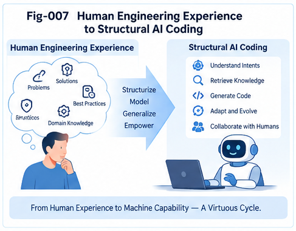

# TACG-SDIG-007 — From Human Engineering Practice to AI Coding Growth

## Task–Action CallingGraph Structural Delta Intelligence and Growth

**TACG-SDIG**

---

## Abstract

Experienced software engineers rarely approach every new coding problem as an unconstrained generation task.

They reuse known structures.

They recognize familiar situations.

They compare the current requirement with previous systems.

They identify what is different.

They search memory for similar changes.

They adapt previous solutions.

They check whether the proposed change can actually fit the current system.

They examine risks, dependencies, and policy constraints.

When precedent is incomplete, they move forward through feasible local steps.

They test the result.

And successful or failed changes become part of future engineering experience.

TACG-SDIG interprets this recurring practice as a structural intelligence process:

```text
Experience
    ↓
Structural Folding
    ↓
Localization
    ↓
Graph Minus
    ↓
Delta
    ↓
Historical Delta Search
    ↓
Candidate Reconstruction
    ↓
Constrained Forward Walking
    ↓
Validation
    ↓
Growth
    ↓
Fold Back
```

The framework therefore does not begin by asking:

> **How can AI generate more code candidates?**

It begins with a different question:

> **How can AI structurally reuse, adapt, validate, and grow from engineering experience?**

This article connects human engineering practice with the complete TACG-SDIG AI coding runtime.

Its central proposition is:

> **The engineering value of experience lies not only in remembering solutions, but in recognizing what is different and knowing how similar differences were crossed before.**

TACG-SDIG attempts to make that process explicit.

---

# 1. Human Engineering Is Not Usually Blank-Slate Generation

Consider a senior engineer receiving a new requirement.

The engineer usually does not think:

```text
There are millions of possible programs.

Let me enumerate them.
```

Instead, the reasoning often resembles:

```text
I know this kind of system.

This requirement is close to something we already have.

Most of the structure is reusable.

This part is different.

We solved a similar difference before.

That old solution almost fits.

But this system has another constraint.

So one additional step is needed.

Now test whether the resulting path actually works.
```

This is structurally very different from broad candidate generation.

---

# 2. The Hidden Object Is Often the Delta

Suppose a system already supports:

```text
Authenticate
→ Load Resource
→ Update Resource
```

A new requirement says:

```text
Only the resource owner may update it.
```

An experienced engineer may immediately focus on:

```text
Add Ownership Verification
```

rather than redesigning the entire system.

The important reasoning object is:

```text
Existing Structure
      ↓
Required Difference
      ↓
Delta
```

Thus:

> **Much engineering intelligence is delta-oriented.**

---

# 3. Human Experts Localize First

Before solving a problem, engineers frequently ask:

```text
Where is this behavior implemented?

Which module owns it?

Which path performs the operation?

What existing flow is closest?

Where is the right insertion point?
```

These are localization questions.

TACG-SDIG expresses them through:

```text
TaskCG Localization

ActionCG Localization

CCC Localization

DNA Dispatch

Calling-Path Localization
```

The first operation is therefore often:

> **Find where we are structurally.**

---

# 4. Humans Compare Against Known Structures

Once the relevant neighborhood is found, the engineer compares:

```text
what exists
```

with:

```text
what is needed.
```

This is the engineering analogue of:

```text
Target CG
⊖
Reference CG
```

or:

```text
Graph Minus
```

The result is a structural difference.

---

# 5. Human Engineering Often Performs Graph Minus Informally

An engineer may say:

```text
Everything is already there except authorization.
```

or:

```text
The old path works,
but now it must also support rollback.
```

or:

```text
This is the same architecture,
except the call is asynchronous.
```

These are informal Delta descriptions.

TACG-SDIG turns them into explicit structural objects.

---

# 6. From Informal Difference to Structural Delta

The transition is:

```text
Human Observation:
"This part is different."

        ↓

Structural Representation:
ΔT / ΔA
```

Then:

```text
ΔT
=
Required Task Change
```

and:

```text
ΔA
=
Required / Observed Action Change
```

Together they may form:

```text
Task–Action Delta Pair
```

or:

```text
TADP
```

---

# 7. Human Experts Remember Changes, Not Only Final Systems

Experienced engineers often remember stories such as:

```text
We had the same problem before.

We added retry,
but then duplicate requests appeared.

So we added idempotency.

Later we added circuit breaking.
```

This memory contains:

```text
State
→ Delta
→ Outcome
→ Next Delta
```

It is not merely memory of final code.

It is memory of engineering evolution.

---

# 8. Engineering Experience as Delta Memory

TACG-SDIG therefore represents experience through:

```text
Structure Memory
Mapping Memory
Delta Memory
Trajectory Memory
```

The correspondence is:

```text
Structure Memory
=
What systems looked like

Mapping Memory
=
How requirements and implementations corresponded

Delta Memory
=
How systems changed

Trajectory Memory
=
How sequences of changes evolved
```

---

# 9. The Seven Original CG Knowledge Structures

The TACG-SDIG runtime begins with seven canonical structural knowledge resources.

## Task Side

```text
1A — Task CG

1B — Collection of Known Task / Job CGs

1C — Common-Sense One-Step Task / Job CGs
```

## Action Side

```text
1D — Action / Code CG

1E — Collection of Known Action / Code CGs

1F — Common-Sense Feasible Action / Code Statements / CGs
```

## Cross-Side Mapping

```text
1G — Two-Way Mapping of
     Task CG Elements
     ↔
     Action / Code CG Elements
```

These seven structures provide the initial knowledge foundation.

---

# 10. Delta Must Be Added to the Original Knowledge Model

The seven structures describe:

```text
tasks
actions
known examples
primitive steps
cross-side mappings
```

But they do not explicitly preserve:

```text
how one structure became another.
```

TACG-SDIG therefore adds a fourth first-class structural plane:

```text
DELTA STRUCTURAL PLANE
```

containing:

```text
ΔT

ΔA

TADP

Delta Core

Delta Halo

Delta Cluster

Delta CCC

Delta DNA

Delta Episode

Delta Trajectory

Delta Policy

Delta Outcome
```

---

# 11. The Four Structural Planes

The resulting architecture is:

```text
┌───────────────────────────────┐
│      TASK STRUCTURAL PLANE    │
│                               │
│ 1A TaskCG                     │
│ 1B Known TaskCG Collection    │
│ 1C Task Primitives            │
└───────────────┬───────────────┘
                │
                ↕
┌───────────────────────────────┐
│         MAPPING PLANE         │
│                               │
│ 1G Task ↔ Action Mapping      │
└───────────────┬───────────────┘
                │
                ↕
┌───────────────────────────────┐
│     ACTION STRUCTURAL PLANE   │
│                               │
│ 1D ActionCG                   │
│ 1E Known ActionCG Collection  │
│ 1F Feasible Action Primitives │
└───────────────┬───────────────┘
                │
                ↕
┌───────────────────────────────┐
│      DELTA STRUCTURAL PLANE   │
│                               │
│ ΔT / ΔA / TADP                │
│ Delta CCC / DNA               │
│ Delta Trajectory / Outcome    │
└───────────────────────────────┘
```

This is the canonical TACG-SDIG knowledge architecture.

---

# 12. Why Delta Is a First-Class Plane

Delta is not merely a temporary result of comparison.

It supports independent operations:

```text
Delta Search

Delta Clustering

Delta Localization

Delta Folding

Delta Ranking

Delta Governance

Delta Trajectory Analysis

Delta Decision

Delta Growth
```

Therefore Delta deserves persistent structural representation.

---

# 13. Human Practice: Search Before Inventing

An experienced engineer often asks:

```text
Have we done this before?

Is there an existing implementation?

Is there another service with the same requirement?

Was there a previous migration like this?
```

This is the human form of:

> **Search before generation.**

TACG-SDIG makes this an explicit runtime principle.

---

# 14. The Search Ladder

The runtime can prefer:

```text
Exact Known Structure
        ↓
Closest Known Structure
        ↓
Exact Historical Delta
        ↓
Closest Historical Delta
        ↓
Delta CCC
        ↓
Historical TADP
        ↓
Historical Delta Trajectory
        ↓
Primitive Forward Walking
        ↓
Open Generation
```

This progressively expands the solution space only when necessary.

---

# 15. Why This Can Reduce Enumeration

Without structural localization:

```text
Requirement
      ↓
Large Program Space
      ↓
Generate Many Candidates
```

With TACG-SDIG:

```text
Requirement
      ↓
TaskCG
      ↓
Localization
      ↓
Closest Structural Neighborhood
      ↓
Graph Minus
      ↓
Small Delta Space
      ↓
Historical Delta Search
```

The search problem becomes more local.

---

# 16. Intelligence Through Candidate Reduction

A useful AI principle follows:

> **Intelligence may come not only from generating better candidates, but from making fewer candidates necessary.**

TACG-SDIG attempts to reduce candidate space through:

```text
representation
localization
delta isolation
structural memory
mapping
constraints
```

before expensive generation.

---

# 17. Human Practice: Adapt Rather Than Copy

Engineers rarely copy an old solution without modification.

They ask:

```text
What is the same?

What is different?

Which assumptions still hold?

What must be adapted?
```

TACG-SDIG represents this as:

```text
Historical TADP
      +
Current Context
      ↓
Candidate Reconstruction
```

---

# 18. Candidate Reconstruction

Suppose history contains:

```text
authenticate
→ authorize
→ delete
```

The current target is:

```text
authenticate
→ ?
→ update
```

The historical delta may be adapted:

```text
Insert Authorization Guard
```

to produce:

```text
authenticate
→ authorize
→ update
```

This is structural reuse rather than textual copying.

---

# 19. Human Practice: Look for Companion Changes

Experienced engineers know that some changes rarely stand alone.

For example:

```text
Introduce Async Messaging
```

may imply:

```text
Idempotency
Retry
Dead-Letter Handling
Observability
```

Similarly:

```text
Add Retry
```

may imply:

```text
Idempotency
```

for certain operations.

TACG-SDIG stores these as:

```text
Companion Deltas
```

---

# 20. Human Practice: Remember Failure

A senior engineer may say:

```text
Don't use that solution here.

We tried it before.

It failed because the operation was not idempotent.
```

This is not positive precedent.

It is:

```text
Counter-Evidence
```

TACG-SDIG preserves such cases in:

```text
Negative Delta Memory
```

---

# 21. Counter-Evidence Is Part of Intelligence

Candidate evaluation therefore asks both:

```text
Where did something similar work?
```

and:

```text
Where did something similar fail?
```

The result is more informative than simple similarity search.

---

# 22. Human Practice: Check Whether the Solution Fits

An old solution may be conceptually correct but impossible in the new system.

For example:

```text
Task:
Verify Ownership
```

Historical Action:

```text
checkOwner()
```

But the current system may not have:

```text
owner information
current user identity
ownership service
```

Therefore the engineer asks:

```text
Can this actually be implemented here?
```

TACG-SDIG calls this:

```text
Feasibility
```

---

# 23. Reachability and Feasibility

Two distinct questions matter.

## Reachability

```text
Can execution structurally reach the candidate?
```

## Feasibility

```text
Does the system contain what the candidate needs
in order to work?
```

A candidate may satisfy one and fail the other.

---

# 24. Human Practice: Fill the Remaining Gap

Sometimes the old solution covers only part of the new requirement.

An engineer may think:

```text
This solves most of it.

One piece is still missing.
```

TACG-SDIG expresses this as:

```text
Residual Delta
=
Target Delta
⊖
Candidate Coverage
```

The residual becomes the next local problem.

---



---

# 25. Residual Delta Enables Incremental Reasoning

Instead of discarding a partially useful candidate:

```text
Candidate
→ incomplete
→ reject
```

the runtime can perform:

```text
Candidate
      ↓
Coverage
      ↓
Residual Delta
      ↓
Search Again
```

This resembles practical engineering adaptation.

---

# 26. When Historical Experience Runs Out

Eventually the system may reach a residual delta for which no strong historical match exists.

At this point TACG-SDIG does not need to jump immediately into unrestricted generation.

It can use:

```text
1C — Task Primitives

1F — Action Primitives
```

to continue locally.

---

# 27. 1C — One-Step Task Primitives

The Task primitive library contains small, reusable task transitions.

Examples:

```text
Verify Identity

Check Permission

Verify Ownership

Request Approval

Record Audit

Validate Input

Handle Failure

Notify User

Rollback State
```

These represent common-sense one-step task moves.

---

# 28. 1F — Feasible Action Primitives

The Action primitive library contains small implementation moves.

Examples:

```text
authenticate()

authorize()

checkOwner()

validate()

logAudit()

retry()

rollback()

emitEvent()
```

The precise primitives are domain- and system-dependent.

The important property is:

```text
known or plausibly feasible local action
```

---

# 29. Why 1C and 1F Were Separated

The primitive structures are intentionally separated from larger known CG collections.

They serve a special purpose:

> **When no complete historical structure solves the residual gap, use the smallest known structural moves to continue forward.**

Thus:

```text
1B / 1E
=
Known Larger Experience

1C / 1F
=
Primitive Growth Space
```

---

# 30. Primitive-Level Forward Walking

Suppose the current Task path is:

```text
Authenticate
      ↓
?
      ↓
Modify Resource
```

and the goal requires:

```text
Owner-Only Modification
```

Candidate Task primitives include:

```text
Check Role

Verify Ownership

Request Approval

Audit
```

The runtime ranks them against the residual delta.

It selects:

```text
Verify Ownership
```

Then the Mapping Plane searches for feasible Action realizations.

---

# 31. Two-Way Primitive Walking

The process can alternate between Task and Action:

```text
Residual Task Delta
      ↓
Task Primitive
      ↓
Task → Action Mapping
      ↓
Action Primitive
      ↓
Action Feasibility
      ↓
Action → Task Consistency
      ↓
Next Residual
```

This is:

> **Two-Way Primitive-Level Constrained Forward Walking.**

---

# 32. Why Forward Walking Is Constrained

The runtime is not free to choose arbitrary next steps.

A candidate move must satisfy some combination of:

```text
Task Goal

Current Structural Boundary

Action Feasibility

Reachability

Dependency Requirements

Policy

Security

Historical Evidence

Counter-Evidence
```

Thus the search space is locally constrained.

---

# 33. Structural Move

This motivates a useful abstraction:

> **A coding step can be represented as a feasible structural move.**

Given state:

```text
S
```

and candidate delta:

```text
Δ
```

the move is:

```text
S --Δ--> S'
```

if the transformation is applicable and validated.

---

# 34. Chess and Go Analogy

The analogy is:

```text
Board State
↔
Current Task / Action Structure

Move
↔
Candidate Delta

Legal Move
↔
Feasible Delta

Move Evaluation
↔
Structural / Policy / Outcome Evaluation

Move History
↔
Delta Trajectory
```

The analogy should not be overstated.

Software engineering is far more open-ended.

But the shared computational idea is valuable:

> **Reason over transitions between structured states rather than enumerate complete futures from scratch.**

---

# 35. Blueprint Analogy

A building designer does not normally regenerate the entire building when one requirement changes.

Instead:

```text
Existing Blueprint
      ↓
New Requirement
      ↓
Affected Region
      ↓
Structural Difference
      ↓
Compatible Modification
      ↓
Validation
```

This resembles:

```text
Localization
→ Graph Minus
→ Delta Search
→ Reconstruction
→ Validation
```

---

# 36. Tailoring Analogy

A tailor may begin with:

```text
Known Pattern
```

then receive:

```text
New Customer Requirement
```

and identify:

```text
Pattern Delta
```

The work focuses on:

```text
where the known pattern must change
```

rather than recreating garment knowledge from zero.

This is another intuitive form of delta intelligence.

---

# 37. War-Game Analogy

Planning systems may similarly reason through:

```text
Current Situation
      ↓
Observed Difference
      ↓
Candidate Move
      ↓
Counter-Move
      ↓
New Situation
```

The useful common structure is:

```text
State
→ Delta
→ Evaluation
→ New State
```

Again, the analogy is structural rather than domain-equivalent.

---

# 38. From Human MET to AI Structural Runtime

TACG-SDIG follows a MET-style methodology:

```text
Observe how experienced humans solve problems
      ↓
Identify recurring operations
      ↓
Express them structurally
      ↓
Build runtime mechanisms
```

The target is not to imitate every human cognitive detail.

The target is to extract useful engineering mechanisms.

---

# 39. Human Operation → TACG-SDIG Operation

A rough mapping is:

```text
"Where is the relevant code?"
→ Localization

"What is different?"
→ Graph Minus

"Have we solved this before?"
→ Delta Search

"That old solution is close."
→ Candidate Retrieval

"It needs adaptation."
→ Candidate Reconstruction

"This usually needs another change."
→ Companion Delta

"That failed last time."
→ Counter-Evidence

"Can it work here?"
→ Feasibility

"Can every path reach it correctly?"
→ Reachability

"One piece is still missing."
→ Residual Delta

"Let's add one small step."
→ Primitive Forward Walking

"Let's test it."
→ Validation

"Remember what happened."
→ Fold Back
```

This is the practical heart of TACG-SDIG.

---

# 40. AI Coding Growth Is More Than Code Generation

A generation-centric view is:

```text
Prompt
 ↓
Code
```

TACG-SDIG proposes a broader loop:

```text
Requirement
      ↓
TaskCG
      ↓
Localization
      ↓
Delta
      ↓
Structural Search
      ↓
Candidate Growth
      ↓
ActionCG
      ↓
Validation
      ↓
Outcome
      ↓
Fold Back
```

The AI participates in system evolution rather than merely emitting code text.

---

# 41. From Code Generation to Structural Growth

The distinction can be stated as:

```text
Code Generation
=
Produce implementation artifact
```

whereas:

```text
Structural Growth
=
Move a known system from one
validated structural state to another
```

TACG-SDIG focuses on the latter.

---

# 42. Growth Requires a Reference State

To speak meaningfully about growth, the runtime needs:

```text
Current State
```

and:

```text
Desired Direction / Target
```

Then:

```text
Current
      ↓
Required Delta
      ↓
Candidate Growth
      ↓
New State
```

Growth is relational, not isolated.

---

# 43. Validated Growth

Not every structural change is growth.

A change may be:

```text
incorrect
unsafe
unreachable
policy-violating
regressive
```

Therefore TACG-SDIG reserves the stronger notion:

```text
Validated Growth
```

for changes that pass appropriate evidence and constraints.

---

# 44. Candidate Growth

Before validation:

```text
S --Δcandidate--> S'
```

is merely:

```text
Candidate Growth
```

After validation:

```text
S --Δvalidated--> S'
```

it can become:

```text
Validated Growth
```

This distinction is important for AI coding.

---

# 45. Validation Stack

Depending on the problem, validation may include:

```text
Structural Consistency

Task–Action Consistency

Reachability

Feasibility

Dependency Validation

Policy Validation

Security Analysis

Static Analysis

Tests

Simulation

Runtime Evidence

Human Review
```

TACG-SDIG does not require one universal validator.

---

# 46. Similarity Finds Candidates

A historical delta may have very high similarity.

That is useful for retrieval.

But:

```text
High Similarity
≠
Valid Growth
```

Therefore:

> **Similarity finds candidates; feasibility decides whether candidates can live inside the target system.**

And policy, security, and runtime evidence may impose additional conditions.

---

# 47. Candidate Growth with Counter-Evidence

Suppose:

```text
Candidate:
Add Retry
```

Positive history says:

```text
Worked for transient read failures.
```

Counter-evidence says:

```text
Caused duplicate non-idempotent mutations.
```

Current context says:

```text
Payment Mutation
```

The candidate should therefore be revised.

Possible result:

```text
Add Idempotency
      +
Add Retry
```

This demonstrates intelligence through experience rather than simple reuse.

---

# 48. Candidate Growth with Companion Delta

The reconstruction becomes:

```text
Primary Candidate Delta
      ↓
Companion Delta Search
      ↓
Composite Candidate Delta
```

Then the composite candidate is validated as a unit.

---

# 49. Growth as Delta Composition

Large changes may consist of:

```text
Δ1 + Δ2 + Δ3 + ...
```

For example:

```text
Service Extraction
=
Define Boundary
+
Extract Interface
+
Separate State
+
Add Remote Call
+
Add Failure Handling
+
Add Observability
```

The growth object may therefore be a:

```text
Composite Delta
```

or:

```text
Delta Trajectory
```

---

# 50. Growth as Trajectory

Some targets cannot be reached safely in one step.

Instead:

```text
S0
 --Δ1-->
S1
 --Δ2-->
S2
 --Δ3-->
S3
```

Each intermediate state matters.

This is a **Structural Growth Trajectory**.

---

# 51. Historical Trajectories Guide Growth

Suppose previous systems evolved:

```text
Direct Remote Call
→ Timeout
→ Retry
→ Idempotency
→ Circuit Breaker
→ Observability
```

A current system at:

```text
Timeout
→ Retry
```

may localize within that historical trajectory.

Candidate future deltas become visible.

This is trajectory-informed growth.

---

# 52. Trajectory Is Not Destiny

Historical trajectory does not imply:

```text
the next historical step must always be taken.
```

Current:

```text
task
constraints
architecture
policy
risk
```

must still be evaluated.

Trajectory Memory provides precedent, not inevitability.

---

# 53. Growth and Structural Evolution Intelligence

When AI can reason over:

```text
Current State

Required Delta

Historical Delta

Candidate Delta

Delta Trajectory

Outcome
```

it begins to operate on system evolution itself.

This is the deeper meaning of:

```text
Structural Evolution Intelligence
```

---

# 54. Engineering Experience Can Become Searchable

A senior engineer's statement:

```text
We have seen this migration pattern before.
```

can become:

```text
Trajectory Localization
```

The statement:

```text
That change normally requires another guard.
```

can become:

```text
Companion Delta Search
```

The statement:

```text
That fix failed under this condition.
```

can become:

```text
Counter-Evidence Retrieval
```

Experience becomes queryable.

---

# 55. Engineering Experience Can Become Foldable

Repeated historical changes:

```text
Δ1
Δ2
Δ3
Δ4
```

may cluster.

Then:

```text
Delta Cluster
      ↓
Delta CCC
      ↓
Delta DNA
```

The system does not need to preserve every experience only as an isolated anecdote.

It can extract recurring transformation structure.

---

# 56. Engineering Experience Can Become Evolvable

New evidence may:

```text
confirm a Delta CCC

refine its applicability

add an exception

split a cluster

merge related clusters

extend a trajectory

create a new trajectory branch
```

Thus the knowledge system itself grows.

---

# 57. Fold Back

After a candidate is implemented and validated:

```text
Before State
      ↓
Applied Delta
      ↓
After State
      ↓
Observed Outcome
```

the episode is folded back into memory.

Potential updates include:

```text
Structure Memory

Mapping Memory

Delta Memory

Trajectory Memory
```

---

# 58. Successful Experience

A successful episode may strengthen:

```text
Delta CCC membership

Task–Action Mapping

Candidate ranking

Trajectory confidence

Companion Delta association
```

Future similar problems can benefit.

---

# 59. Failed Experience

A failed episode may create:

```text
Counter-Evidence

Negative Delta Memory

Constraint Refinement

Cluster Split

Trajectory Warning
```

Failure therefore also produces knowledge.

---

# 60. AI Coding as Continual Structural Learning

The complete loop becomes:

```text
Existing Experience
      ↓
New Requirement
      ↓
Localization
      ↓
Delta
      ↓
Search / Reconstruction
      ↓
Candidate Growth
      ↓
Validation
      ↓
Outcome
      ↓
Fold Back
      ↓
Expanded Experience
      ↺
```

This is continual structural learning.

---

# 61. Local Growth Rather Than Global Retraining

One important engineering possibility is that new experience can often update a local region:

```text
one Delta Cluster

one CCC

one Mapping neighborhood

one Trajectory branch
```

rather than rebuilding all knowledge globally.

This supports:

```text
Localized Structural Growth
```

---

# 62. Senior Engineering Experience as an Evolution Platform

TACG-SDIG can serve as a representation platform for senior engineering experience.

The goal is not merely:

```text
store expert rules
```

but:

```text
store structural states,
structural changes,
reasons,
outcomes,
and evolution paths.
```

This captures more of how expertise develops over time.

---

# 63. Delta History Is a Natural Engineering Trajectory

Consider a long-lived service.

Its history may contain:

```text
Δ1 Add Authentication

Δ2 Add Authorization

Δ3 Add Audit

Δ4 Add Rate Limiting

Δ5 Add Fine-Grained Policy

Δ6 Add Continuous Monitoring
```

This is not merely six patches.

It is:

```text
Security Maturation Trajectory
```

The trajectory itself becomes engineering knowledge.

---

# 64. Human Experts Recognize Trajectories

A senior engineer may recognize:

```text
This system is entering the stage
where observability becomes necessary.
```

That judgment may come from seeing similar evolution repeatedly.

TACG-SDIG can attempt to structuralize this through:

```text
Trajectory Prefix Localization
      ↓
Historical Continuations
      ↓
Candidate Next Delta
```

---

# 65. AI Coding and Structural Prediction

Trajectory Memory may therefore support limited structural prediction.

Given:

```text
Current State
+
Recent Delta Sequence
```

the system can ask:

```text
What historically came next?
```

But the output should be treated as:

```text
candidate structural continuation
```

rather than guaranteed prediction.

---

# 66. From Prediction to Decision

Prediction asks:

```text
What may happen next?
```

Decision asks:

```text
What should we do next?
```

TACG-SDIG combines trajectory evidence with:

```text
goal
constraints
policy
risk
feasibility
```

to move from structural prediction toward structural decision support.

---

# 67. Governance Is Part of Growth

Human engineering does not treat every feasible change as acceptable.

A change may be technically feasible but:

```text
unsafe
noncompliant
unnecessary
unmapped
too risky
```

Therefore governance is integrated into the growth runtime.

---

# 68. Delta-Scoped Governance

Given a known baseline:

```text
Baseline
      ↓
New Structure
      ↓
Graph Minus
      ↓
Delta
```

governance can focus on:

```text
Delta Core

Delta Halo

Changed Reachability

Task–Action Consistency

Policy

Historical Risk
```

This creates:

```text
Delta-Scoped Governance
```

---

# 69. Why Delta Helps Governance Scale

Instead of asking:

```text
Re-evaluate everything equally.
```

the system can ask:

```text
What changed?

What does that change affect?

How risky is it?

How far should review expand?
```

This creates adaptive governance scope.

---

# 70. Delta Is Also a Governance Dispatch Unit

A small internal rename may require little review.

A new external data transfer may require much more.

Therefore:

```text
Delta Type
+
Delta Risk
      ↓
Governance Depth
```

This connects intelligence and governance through the same structural object.

---

# 71. Task–Action Mapping Enables Cross-Audit

A senior reviewer often asks:

```text
Why is this code here?
```

TACG-SDIG can ask structurally:

```text
Action Delta
      ↓
Task Mapping Search
```

If no legitimate mapping is found:

```text
Unmapped Action Delta
```

becomes a review signal.

---

# 72. Reverse Cross-Audit

The reviewer also asks:

```text
Where was this requirement implemented?
```

TACG-SDIG performs:

```text
Task Delta
      ↓
Action Mapping Search
```

If no implementation exists:

```text
Missing Action Delta
```

is produced.

---

# 73. Intent and Implementation Audit Each Other

Thus:

```text
TaskCG
↔
ActionCG
```

supports:

> **What we intended ↔ What we implemented.**

This is one of the strongest reasons for maintaining both structural planes.

---

# 74. AI Coding Runtime Should Preserve Explanation

A candidate should ideally be able to explain:

```text
Which requirement created this delta?

Which known structure was localized?

What did Graph Minus identify?

Which historical deltas were retrieved?

Which candidate was selected?

What counter-evidence was considered?

Why was this candidate feasible?

What policy checks passed?

What residual delta remained?

What runtime evidence validated it?
```

This produces a structural reasoning record.

---

# 75. Structural Audit Trail

The runtime can preserve:

```text
Requirement
 ↓
TaskCG
 ↓
Localization
 ↓
Graph Minus
 ↓
Delta
 ↓
Candidate
 ↓
Validation
 ↓
Code / ActionCG
 ↓
Outcome
```

This is a natural:

```text
Structural Audit Trail
```

for AI-assisted coding.

---

# 76. AI Coding as Human–AI Hybrid Engineering

TACG-SDIG does not require the AI to operate alone.

Human engineers may contribute:

```text
Task definitions

Known TaskCGs

Action patterns

Primitive libraries

Mappings

Policies

Delta labels

Validation

Counter-evidence

Review decisions
```

AI can contribute:

```text
localization

structural search

candidate retrieval

candidate reconstruction

comparison

explanation

trajectory analysis
```

This naturally supports a Human–AI Hybrid workflow.

---

# 77. Senior Engineers as Delta Teachers

A particularly useful role for senior engineers may be:

```text
Identify important Delta Episodes

Explain why they mattered

Mark companion changes

Record failure cases

Define policy-sensitive boundaries

Validate reusable Delta CCCs
```

Instead of labeling enormous quantities of code, experts can help curate high-value structural change knowledge.

---

# 78. AI as Delta Student

The AI can learn from:

```text
Before
→ Change
→ After
→ Outcome
```

rather than only:

```text
Input
→ Output
```

This gives learning a structural evolutionary dimension.

---

# 79. Human–AI Collective Delta Learning

The loop can become:

```text
Human Experience
      ↓
Structuralization
      ↓
Delta Memory
      ↓
AI Localization / Search
      ↓
Candidate Growth
      ↓
Human / Runtime Validation
      ↓
New Experience
      ↓
Fold Back
```

This is a practical form of collective structural learning.

---

# 80. Specialized Brain Units

Different AI coding Brain Units may accumulate different Delta Memories.

Examples:

```text
Security Brain Unit

Database Brain Unit

Distributed-System Brain Unit

API Brain Unit

Testing Brain Unit

Performance Brain Unit
```

Each may maintain specialized:

```text
Delta CCCs

Delta DNA

Counter-Evidence

Trajectories
```

---

# 81. Function-Tunnel Interpretation

Repeated work in a specialized structural domain can deepen a Brain Unit's effective Function Tunnel.

For example:

```text
Distributed-System Brain Unit
```

may accumulate trajectories involving:

```text
timeout
retry
idempotency
circuit breaker
fallback
observability
```

Its expertise becomes partly encoded as folded structural transformation knowledge.

---

# 82. Structural Experience Capital

The value of a specialized engineering intelligence system may therefore depend not only on model parameters but also on accumulated:

```text
validated structures

validated mappings

validated deltas

negative evidence

validated trajectories
```

This can be viewed as a form of structural experience capital.

---

# 83. The Minimal AI Coding Growth Loop

A minimal TACG-SDIG implementation does not need every advanced feature.

It can begin with:

```text
1. TaskCG

2. ActionCG

3. Known Task / Action Examples

4. Task ↔ Action Mapping

5. Graph Minus

6. Delta Search

7. Candidate Reconstruction

8. Reachability / Feasibility

9. Validation

10. Fold Back
```

This provides an incremental MET path.

---

# 84. Adding Primitive Walking

The next stage adds:

```text
1C Task Primitives

1F Action Primitives

Residual Delta

Primitive Forward Walking
```

This allows the runtime to move beyond direct historical reuse.

---

# 85. Adding Delta Folding

The next stage adds:

```text
Delta Clusters

Delta CCC

Delta DNA
```

This improves search scalability.

---

# 86. Adding Trajectory Intelligence

Then add:

```text
Delta Episodes

Delta Trajectories

Trajectory Search

Trajectory Prefix Localization
```

This adds evolution knowledge.

---

# 87. Adding Governance

Then add:

```text
Delta Risk

Policy CCC

Delta Halo

Changed Reachability

Cross-Plane Audit

Counter-Evidence

Governance Outcome
```

This creates a richer production-oriented runtime.

---

# 88. Progressive MET Ladder

The overall implementation ladder can therefore be:

```text
LEVEL 0
TaskCG / ActionCG Representation

LEVEL 1
Known Structural Memory

LEVEL 2
Task ↔ Action Mapping

LEVEL 3
Localization

LEVEL 4
Graph Minus

LEVEL 5
Delta Memory

LEVEL 6
Two-Way Delta Search

LEVEL 7
Candidate Reconstruction

LEVEL 8
Residual Delta

LEVEL 9
Primitive Forward Walking

LEVEL 10
Reachability / Feasibility

LEVEL 11
Delta Folding / CCC / DNA

LEVEL 12
Trajectory Memory

LEVEL 13
Delta-Scoped Governance

LEVEL 14
Validated Growth

LEVEL 15
Continual Fold Back
```

This allows engineering progress without requiring the full vision on day one.

---

# 89. Canonical AI Coding Growth Runtime

The complete runtime is:

```text
NEW REQUIREMENT / CODE CHANGE
              ↓
         TASK / ACTION CG
              ↓
         LOCALIZATION
              ↓
          GRAPH MINUS
              ↓
        ΔT / ΔA / TADP
              ↓
       DELTA DNA DISPATCH
              ↓
     TWO-WAY DELTA SEARCH
              ↓
    HISTORICAL TADP / TRAJECTORY
              ↓
     CANDIDATE RECONSTRUCTION
              ↓
      COMPANION DELTA SEARCH
              ↓
        COUNTER-EVIDENCE
              ↓
     REACHABILITY / FEASIBILITY
              ↓
        POLICY / SECURITY
              ↓
         RESIDUAL DELTA
              ↓
 TASK ↔ ACTION PRIMITIVE WALKING
              ↓
       CANDIDATE GROWTH
              ↓
          VALIDATION
              ↓
        VALIDATED GROWTH
              ↓
            OUTCOME
              ↓
          FOLD BACK
              ↺
```

This is the canonical TACG-SDIG closed loop.

---

# 90. Three Major Loops

The runtime can also be understood through three interacting loops.

## Experience Loop

```text
Human / Historical Engineering
      ↓
Structural Delta Extraction
      ↓
Delta Folding
      ↓
Experience Memory
```

## Intelligence Loop

```text
Requirement
      ↓
Localization
      ↓
Delta
      ↓
Search
      ↓
Reconstruction
      ↓
Growth
```

## Governance Loop

```text
Candidate / Observed Delta
      ↓
Task–Action Cross-Audit
      ↓
Reachability
      ↓
Policy / Security
      ↓
Counter-Evidence
      ↓
Decision
```

All three converge at:

```text
Validation
→ Outcome
→ Fold Back
```

---

# 91. The Three Core Values

TACG-SDIG therefore provides three major engineering values.

## I. Engineering Experience Evolution

```text
Human Experience
→ Delta Memory
→ Delta CCC
→ Delta Trajectory
→ Reusable Evolution Knowledge
```

## II. AI Coding Intelligence

```text
Localization
→ Delta Isolation
→ Small Search Space
→ Historical Reconstruction
→ Constrained Growth
```

## III. Structural Governance

```text
Baseline
→ Delta
→ Adaptive Review Scope
→ Task–Action Cross-Audit
→ Policy / Security Validation
```

These three values share one core object:

```text
Structural Delta
```

---

# 92. Delta as the Common Currency

Delta becomes a common structural unit for:

```text
engineering experience

AI search

candidate reconstruction

coding growth

security analysis

compliance review

trajectory analysis

continual learning
```

This is one of the central unifying ideas of TACG-SDIG.

---

# 93. From Static Knowledge to Evolution Knowledge

Traditional knowledge representation often emphasizes:

```text
facts
objects
relations
states
```

TACG-SDIG emphasizes an additional dimension:

```text
meaningful structural transformation
```

This leads from:

```text
Knowledge of State
```

toward:

```text
Knowledge of Evolution
```

---

# 94. From Pattern Memory to Transformation Memory

A pattern says:

```text
This structure appears repeatedly.
```

A Delta Pattern says:

```text
This transformation appears repeatedly.
```

A trajectory says:

```text
These transformations repeatedly occur
in this structural order.
```

These are increasingly rich forms of engineering knowledge.

---

# 95. From AI Coding to AI Engineering Evolution

At the narrowest level:

```text
TACG-SDIG
=
AI Coding Support
```

At a broader level:

```text
TACG-SDIG
=
Structural Software Evolution Intelligence
```

because it reasons over:

```text
states
changes
histories
constraints
outcomes
```

---

# 96. Relationship to Structural Folding and Unfolding

The relationship can be summarized as:

```text
Historical Engineering Experience
      ↓
FOLD
      ↓
Task / Action / Mapping / Delta Memory
      ↓
LOCALIZE
      ↓
Relevant Structural Neighborhood
      ↓
GRAPH MINUS
      ↓
Required Delta
      ↓
UNFOLD
      ↓
Candidate Growth Path
      ↓
VALIDATE
      ↓
New Structural Experience
      ↓
FOLD BACK
```

TACG-SDIG is therefore a concrete AI coding realization of the broader Fold–Unfold intelligence framework.

---

# 97. Relationship to CallingGraph Unfolding

CallingGraph Unfolding asks how folded structural knowledge can reconstruct useful CallingGraph structures.

TACG-SDIG adds a more focused question:

> **What specifically needs to unfold when most of the target structure is already known?**

The answer is often:

```text
The Delta
```

Thus Delta Intelligence can make CallingGraph Unfolding more localized.

---

# 98. Relationship to Structural Localization

Localization answers:

```text
Where are we in known structural memory?
```

Delta answers:

```text
What is missing or different here?
```

Growth answers:

```text
How can we cross that difference?
```

Therefore:

```text
Localization
→ Delta
→ Growth
```

forms a natural intelligence sequence.

---

# 99. Relationship to Trajectory Intelligence

Trajectory Intelligence asks about ordered structural evolution.

TACG-SDIG provides a concrete local unit:

```text
Delta
```

Therefore:

```text
Delta
→ Delta Sequence
→ Trajectory
```

connects local change intelligence to long-range evolution intelligence.

---

# 100. Relationship to Structural Continual Learning

Structural Continual Learning asks how an AI system can grow structural knowledge over time.

TACG-SDIG provides a concrete learning object:

```text
Validated Structural Delta
```

Fold Back provides the update mechanism.

Thus:

```text
Validated Delta
→ Local Structural Update
→ Expanded Memory
```

is one possible continual-learning mechanism.

---

# 101. A Strong Candidate Learning Unit

This motivates a central proposition:

> **The basic learning unit of AI coding may be not only Code or CallingGraph, but a validated Structural Delta.**

A validated delta contains:

```text
Before State

Required Change

Implemented Change

Task–Action Mapping

Constraints

Evidence

Outcome
```

It therefore carries both structure and experience.

---

# 102. Code Tells Us What the System Is

Code and ActionCG provide:

```text
implementation state
```

TaskCG provides:

```text
intended task state
```

But Delta provides:

```text
transition knowledge
```

Hence:

> **Code tells AI what the system is; Delta tells AI how the system grows.**

---

# 103. Trajectory Tells Us How Growth Evolves

Once deltas are ordered:

```text
Δ1
→ Δ2
→ Δ3
```

the system gains:

```text
evolution knowledge
```

Therefore:

> **Structures describe states. Deltas describe change. Trajectories describe evolution.**

---

# 104. The TACG-SDIG Intelligence Equation

A conceptual expression is:

```text
AI Coding Growth Intelligence
=
Structural Localization
+
Delta Isolation
+
Two-Way Delta Search
+
Candidate Reconstruction
+
Constrained Forward Walking
+
Validation
+
Fold Back
```

This is not intended as a numerical equation.

It is an architectural decomposition.

---

# 105. The TACG-SDIG Experience Equation

Likewise:

```text
Engineering Evolution Memory
=
Structure Memory
+
Mapping Memory
+
Delta Memory
+
Trajectory Memory
```

Together they provide a richer representation of accumulated engineering experience.

---

# 106. The TACG-SDIG Governance Equation

Conceptually:

```text
Structural Governance
=
Baseline
+
Delta
+
Halo
+
Reachability
+
Task–Action Consistency
+
Policy
+
Counter-Evidence
```

Again, this is an architectural expression rather than a scalar formula.

---

# 107. Why the Framework Is AI-Oriented

TACG-SDIG is not merely a software-diff framework.

Its intelligence mechanisms include:

```text
structural localization

metric search

CCC folding

DNA dispatch

two-way semantic mapping

counter-evidence retrieval

candidate ranking

trajectory localization

constrained structural decision

continual Fold Back
```

These operations transform Delta from an engineering artifact into an AI reasoning object.

---

# 108. Why the Framework Remains Engineering-Oriented

At the same time, the framework stays grounded in:

```text
CallingGraphs

requirements

code

reachability

feasibility

tests

policy

runtime outcomes
```

This is deliberate.

The goal is not abstract intelligence detached from software engineering.

The goal is:

> **AI intelligence expressed through executable engineering structure.**

---

# 109. A Practical Design Principle

When faced with a new coding problem, TACG-SDIG should attempt to answer in this order:

```text
1. What do we already know?

2. Where is the closest known structure?

3. What exactly is different?

4. Have we seen this difference before?

5. How was it solved?

6. Did that solution succeed?

7. Does it fit here?

8. What remains missing?

9. What is the smallest feasible next step?

10. Does the resulting structure work?

11. What should we remember from the outcome?
```

This is the operational philosophy of the framework.

---

# 110. The Closed-Loop Principle

The entire repository can be reduced to one loop:

```text
FOLD
 ↓
LOCALIZE
 ↓
DELTA
 ↓
SEARCH
 ↓
UNFOLD
 ↓
VALIDATE
 ↓
GROW
 ↓
FOLD BACK
 ↺
```

Each stage has a distinct role.

---

# 111. Fold

Preserve reusable:

```text
structures
mappings
deltas
trajectories
```

from historical experience.

---

# 112. Localize

Find the closest structural neighborhood for the current problem.

---

# 113. Delta

Use Graph Minus to identify what is meaningfully different.

---

# 114. Search

Search both Task and Action memories for similar transformations and counter-evidence.

---

# 115. Unfold

Reconstruct a candidate Task–Action growth path from folded experience.

---

# 116. Validate

Check:

```text
reachability
feasibility
task consistency
policy
security
runtime evidence
```

as appropriate.

---

# 117. Grow

Move the system into a new validated structural state.

---

# 118. Fold Back

Convert the outcome into new structural experience.

---

# 119. From One Coding Task to Collective Learning

One successful coding episode may appear small.

But repeated episodes create:

```text
Delta Memory
```

Repeated similar deltas create:

```text
Delta CCC
```

Ordered episodes create:

```text
Delta Trajectory
```

Repeated trajectories create:

```text
Evolution Patterns
```

Thus local engineering work can accumulate into collective structural intelligence.

---

# 120. Final Synthesis

TACG-SDIG begins with a simple observation:

> Experienced engineers often solve new problems by understanding what is already known and isolating what is different.

That observation leads to:

```text
TaskCG
ActionCG
Task–Action Mapping
Graph Minus
Structural Delta
```

Once Delta becomes explicit, a much larger architecture follows naturally:

```text
Delta Search
Delta Memory
Delta CCC
Delta DNA
Delta Trajectory
Counter-Evidence
Delta Governance
Primitive Forward Walking
Validated Growth
Fold Back
```

The framework therefore transforms engineering change from a temporary artifact into a persistent AI knowledge object.

Its deepest progression is:

```text
KNOWN STRUCTURE
      ↓
LOCALIZATION
      ↓
STRUCTURAL DIFFERENCE
      ↓
DELTA INTELLIGENCE
      ↓
VALIDATED STRUCTURAL MOVE
      ↓
GROWTH
      ↓
EVOLUTION
      ↓
NEW EXPERIENCE
```

This leads to three complementary interpretations of TACG-SDIG.

### As an AI Coding Framework

```text
Find the relevant structure.
Find the missing delta.
Reuse or reconstruct the smallest feasible change.
Validate it.
```

### As an Engineering Experience Framework

```text
Fold not only what systems look like,
but how systems change.
```

### As a Structural Governance Framework

```text
Govern not only the code,
but the structural change the code introduces.
```

Together they produce the central TACG-SDIG vision:

> **Fold stores engineering experience.**

> **Localization finds where we are.**

> **Graph Minus identifies what is different.**

> **Delta Search finds how similar gaps were crossed before.**

> **Unfolding reconstructs a candidate growth path.**

> **Validation decides whether that path is real for the current system.**

> **Growth changes the system.**

> **Fold Back converts the result into future intelligence.**

And finally:

> **Code captures implementation states. Structural deltas capture engineering change. Delta trajectories capture engineering experience.**

That is the path from **Human Engineering Practice** to **AI Coding Growth**.

---

## Repository-Level Closing Statement

The eight TACG-SDIG core articles together establish a progression from CallingGraph knowledge to structural evolution intelligence:

```text
TACG-SDIG-001
CallingGraph Knowledge
→ Structural Delta Intelligence

TACG-SDIG-002
Seven CG Knowledge Structures
→ Four Structural Planes

TACG-SDIG-003
Graph Minus
→ Delta Isolation

TACG-SDIG-004
Two-Way Delta Search
→ Candidate Reconstruction

TACG-SDIG-005
Delta Memory
→ Structural Evolution Trajectories

TACG-SDIG-006
Delta-Scoped Governance
→ Security and Compliance Intelligence

TACG-SDIG-007
Human Engineering Practice
→ Closed-Loop AI Coding Growth
```

Together:

```text
STRUCTURE
    ↓
DELTA
    ↓
INTELLIGENCE
    ↓
GOVERNANCE
    ↓
GROWTH
    ↓
EVOLUTION
```

This is **Task–Action CallingGraph Structural Delta Intelligence and Growth — TACG-SDIG**.
